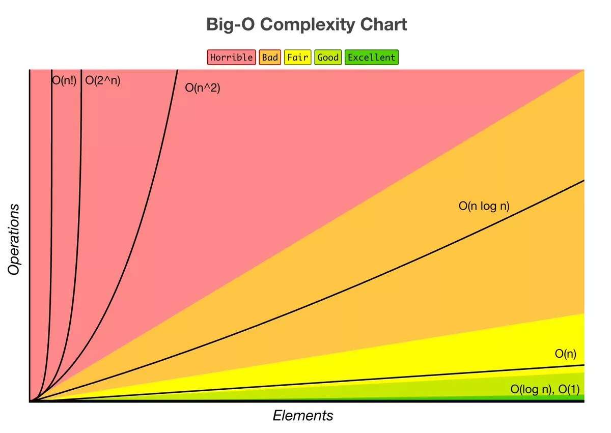

# 시간 복잡도 & 빅오 표기법
## 목차
1. 알고리즘의 시간 복잡도
2. 빅오 표기법
# 1. 알고리즘의 시간 복잡도
* 알고리즘의 소요시간 측정하기
  * 개개인의 컴퓨팅 환경에 따라 **같은 알고리즘이라도 측정 시간이 다르다**.
  * 환경에 영향을 받지 않는 **객관적인 기준**이 필요하다.
  * 객관적인 측정을 위해 알고리즘 내부에서 **기본연산**이 **몇 번** 일어나는지 살펴본다.
  * 성능을 측정할 때는 **입력을 통일**시킨다.
  * 가장 기본연산이 많이 일어나는 **최악의 입력 n개**가 들어온다고 가정한다.

## 시간 복잡도 계산하기
* Sequence if statement
  * 단순 코드 구문(사칙연산, 읽고쓰기, 검증)
  * k
    ```py
    statement 1
    statement 2
    statement 3
    ...
    statement k
    ```
* 조건문
  * Sequence of statement로 구성된 코드 블록 중 하나가 실행됨
  * max(시간(code block1), 시간(code block2))
    ```py
    if (조건)
      code block1
    else:
      code block2
    ```
* 반복문     
  * 일반, 중첩, ...
    * N, N*M, ...
    ```py
    for i in range(N):
      for j in range(M):
        code block1
    ```
# 2. 빅오(Big-O) 표기법
* 입력 n이 **무한대**로 커진다고 가정하고 시간복잡도를 간단하게 표시하는 것
* **최고차항**만 남기고 계수와 상수 제거
* **증가율**에 초점
* 같은 Output을 만드는 알고리즘 이라도  \
시간 복잡도에 따라 **성능**이 달라질 수 있고  \
시험에서 **정답 여부**가 갈리는 포인트가 된다.

|Big-O|종류|
|:--:|:--:
|O(1)|단순 산술 계산(덧셈, 뺄셀, 곱셈, 나눗셈)<br/>단순계산 -> a+b, 100*200|
|O(logN)|크기 N인 리스트를 반절씩 순회/탐색<br/>이진탐색(Binary Search), 분할정복(Divide & Conquer)|
|O(N)|크기 N인 리스트를 순회<br/>1중 for문|
|O(NlogN)|크기 N인 리스트를 반절씩 탐색<sup>*</sup> 순회<br/>높은 성능의 정렬(Merge/Quick/Heap Sort)|
|O(N<sup>2</sup>)|크기 M,N인 2중 리스트를 순회<br/>2중 for문|
|O(N<sup>3</sup>)|3중 리스트를 순회<br/>3중 for문|
|O(2<sup>N</sup>|크기 N 집합의 부분 집합|
|O(N!)|크기 N 리스트의 순열|

  
* 파이썬에서의 시간 복잡도
 * [파이썬 메서드, 내장함수의 시간 복잡도](https://www.ics.uci.edu/~pattis/ICS-33/lectures/complexitypython.txt)
 * [Big-O CheatSheet](https://www.bigocheatsheet.com/)