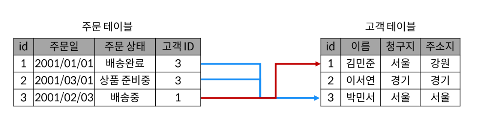
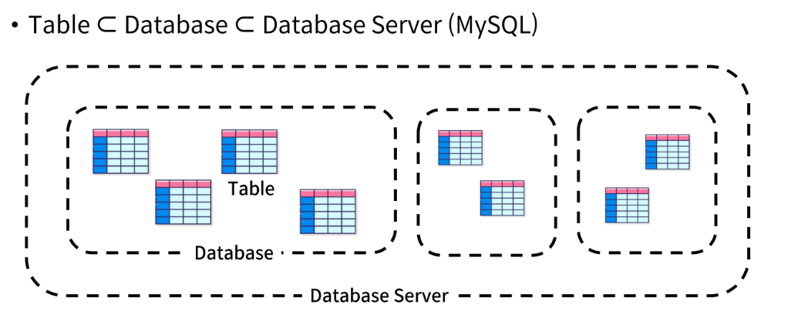

# The Relation

## contents
1. Relational Database
2. RDBMS

## 학습 목표
* 데이터베이스상에서 '관계'가 의미하는 바를 정의할 수 있다.
* 관계형 데이터베이스 용어 중 schema, record, field의 역할과 특징을 설명할 수 있다.
* DBMS의 정의와 역할을 설명할 수 있다.

# 1. Relational Database
* **관계형 데이터베이스**: 데이터 간에 **관계**가 있는 데이터 항목들의 모음
* 테이블, 행, 열의 정보를 구조화하는 방식
* **서로 관련된 데이터 포인트를 저장**하고 이에 대한 **액세스**를 제공

  * 관계: 여러 테이블 간의 (논리적) 연결
* 관계로 인해 할 수 있는 것
  * 두 테이블을 사용하여 데이터를 다양한 형석으로 조회할 수 있음
    * ex) 특정 날짜에 구매한 모든 고객 조회  \
    지난 달에 배송엘이 지연된 고객 조회  \
    ...

## 관계형 데이터베이스 용어
1. Table(Relation)
    * 데이터를 기록하는 곳
2. Field(Column, Attribute)
    * 각 필드에는 고유한 데이터 형식(타입)이 지정됨
3. Record(Row, Tuple)
    * 각 레코드에는 구체적인 데이터 값이 저장됨
4. Database(Schema)
    * 테이블의 집합(Set of tables)
5. Primary Key(기본 키)
    * 각 레코드의 고유한 값
    * 관계형 데이터베이스에서 **레코드의 식별자**로 활용
6. Foreign Key(외래 키)
    * 테이블의 필드 중 다른 테이블의 레코드를 식별할 수 있는 키
    * 각 레코드에서 서로 다른 테이블 간의 **관계를 만드는 데** 사용

# 2. RDBMS
* 관계형 데이터베이스를 관리하는 소프트웨어 프로그램
* 데이터 저장 및 관리를 용이하게 하는 시스템
* 데이터베이스와 사용자 간의 인터페이스 역할
  * 사용자가 데이터 구성, 업데이트, 모니터링, 백업, 복구 등을 할 수 있도록 도움
* 대표적인 RDMS: **MySQL**, PostgreSQL, Oracle Database, MS SQL Server, ...

## MySQL

* 가장 널리 사용되는 오픈 소스 RDBMS
- 특징
  * 다양한 운영체제에서 실행 가능
  * 여러 프로그래밍 언어를 위한 다양한 API 제공
  * MySQL Workbench Tool을 통해 그래픽 인터페이스를 제공(GUI)
* MySQL 구조

- [DMBS Ranking](https://db-engines.com/en/ranking)

# 정리
- Table은 데이터를 기록하는 최종 위치
* 모든 Table에는  \
행에서 고유하게 식별 가능한 **기본 키**라는 속성이 있으며,  \
**외래 키**를 사용하여 각 행에서 서로 다른 테이블 간의 관계를 만들 수 있음
- 데이터는 기본 키 또는 외래 키를 통해  \
결합(join)될 수 있는 여러 테이블에 걸쳐 구조화 됨
* 각 Table은 Database로 그룹핑 됨
- MySQL은 이러한 Database들을 그룹핑하여 관련된 작업을 수행하는 Database Server