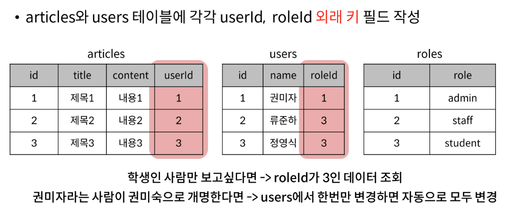
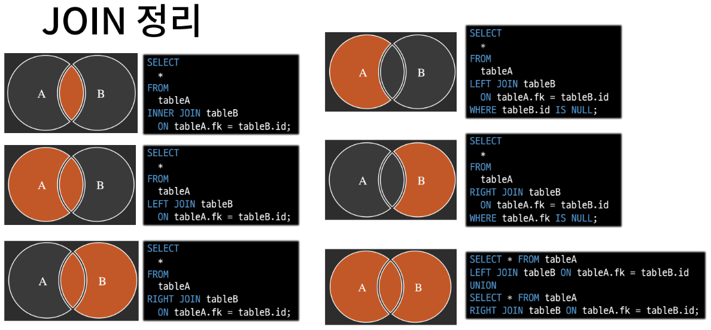

# SQL - Multi Table Queries
## 목차
1. Introduction to Join
2. Joining tables

## 학습 목표
* 관계형 데이터베이스에서 외래 키 필드의 역할을 설명할 수 있다.
* MySQL JOIN 키워드의 유형 각 3가지의 특징을 설명할 수 있다.
* 주어진 예시에 맞추어 적절한 JOIN 키워드 유형을 작성해 정확한 결과를 반환할 수 있다.

# 1. Introduction to Join
* 일반적으로 데이터베이스에서는 하나의 테이블이 아닌 여러 테이블로 나누어 저장하고 결합하여 출력



* 테이블을 분리하면 관리는 용이해질 수 있으나 출력할 때는 테이블 한 개만을 출력할 수 밖에 없어 **다른 테이블과 연결지어 출력**하는 것이 필요

# 2. Joining tables
## JOIN clause
* 둘 이상의 테이블에서 데이터를 검색하는 방법

### JOIN 종류
* INNER JOIN
* OUTER JOIN
  * LEFT JOIN
  * RIGHT JOIN
* CROSS JOIN

## INNER JOIN clause
* 두 테이블에서 값이 일치하는 레코드에 대해서만 결과를 반환
* INNER JOIN syntax
```sql
SELECT
  select_list
FROM
  table1
INNER JOIN table2
  ON table1.fk = table2.pk;
```
  * FROM 절 이후 메인 테이블 지정(table1)
  * INNER JOIN 절 이후 메인 테이블과 조인할 테이블 지정(table2)
  * ON 키워드 이후 조인 조건을 작성
    * 조인 조건은 table1과 table2 간의 레코드를 일치시키는 규칙을 지정

## LEFT JOIN clause
* 오른쪽 테이블의 일치하는 레코드와 함께 왼쪽 테이블의 모든 레코드 반환
* LEFT JOIN syntax
```sql
SELECT
  select_list
FROM
  table1
LEFT [OUTER] JOIN table2
  ON table1.fk = table2.pk;
```
  * FROM 절 이후 왼쪽 왼쪽 테이블 지정(table1)
  * LEFT JOIN 절 이후 오른쪽 테이블 지정(table2)
  * ON 키워드 이후 조인 조건을 작성
    * 왼쪽 테이블의 각 레코드를 오른쪽 테이블의 모든 레코드와 일치시킴
* 특징
  * 왼쪽은 무조건 표시하고, 매치되는 레코드가 없으면 NULL을 표시
  * 왼쪽 테이블 한 개의 레코드에 여러 개의 오른쪽 테이블 레코드가 일치할 경우, 해당 왼쪽 레코드를 여러 번 표시

## RIGHT JOIN clause
* 왼쪽 테이블의 일치하는 레코드와 함께 오른쪽 테이블의 모든 레코드 반환
* RIGHT JOIN syntax
```sql
SELECT
  select_list
FROM
  table1
RIGHT [OUTER] JOIN  table2
  ON table1.fk = table2.pk;
```
  * FROM 절 이후 왼쪽 테이블 지정(table1)
  * RIGHT JOIN 절 이후 오른쪽 테이블 지정(table2)
  * ON 키워드 이후 조인 조건을 작성
    * 오른쪽 테이블의 각 레코드를 왼쪽 테이블의 모든 레코드와 일치 시킴

# JOIN 정리

[SQL Joins Visualizer](https://sql-joins.leopard.in.ua/)

# 99. 기타
* FULL OUTER JOIN
* USING
* NATURAL JOIN