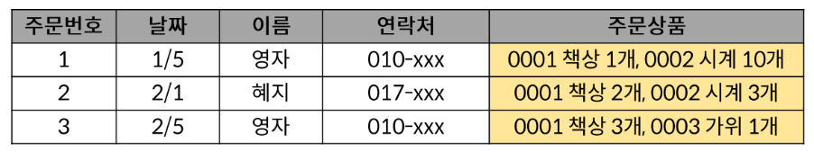
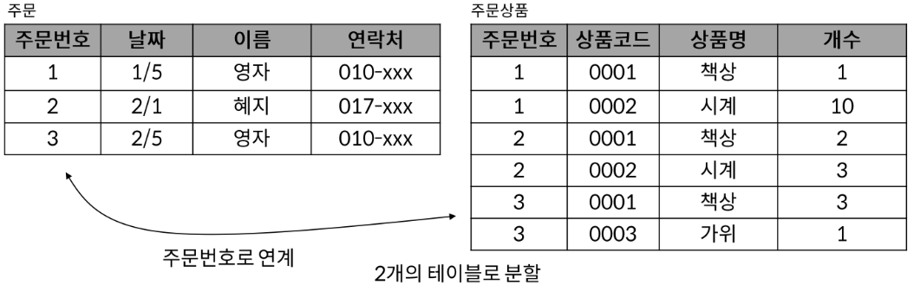
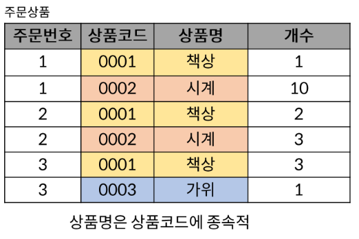
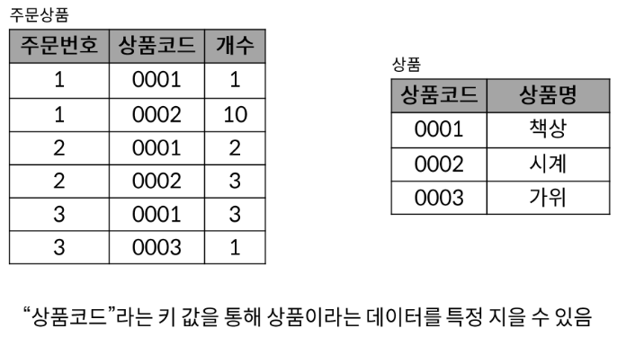
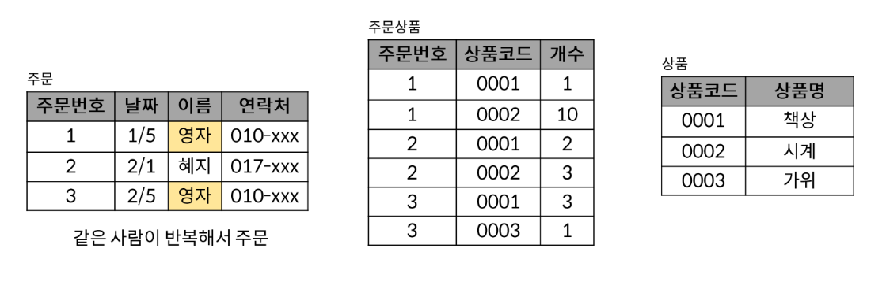
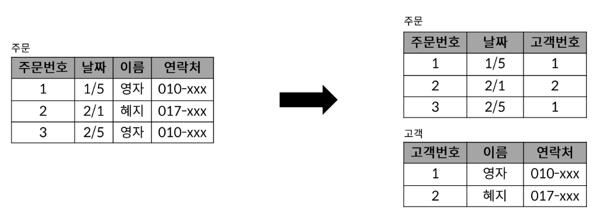
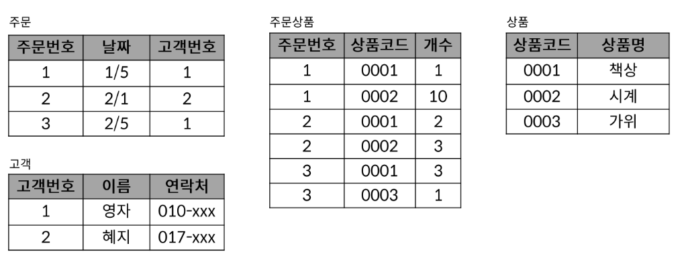
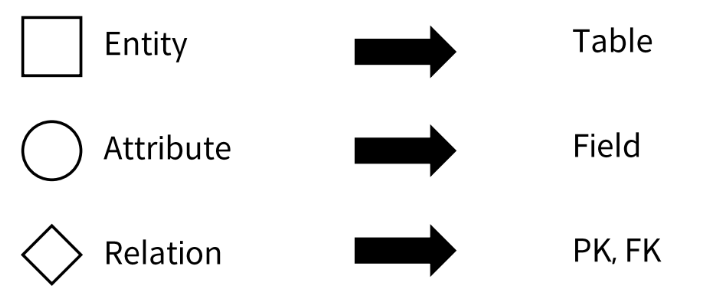
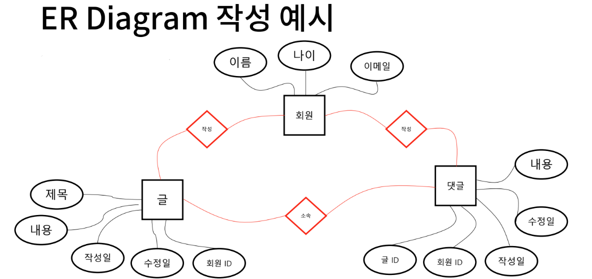
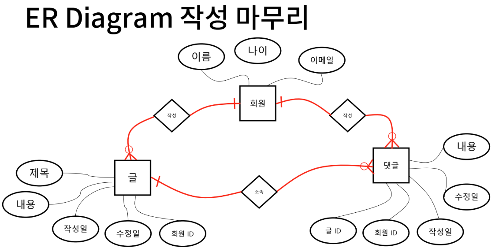

# SQL - Advanced
## 목차
1. Normalization
2. Data Modeling
## 학습 목표
* 데이터 모델링을 위한 기본 용어와 개념을 이해한다.
* 정규화의 개념을 이해하고 이를 실제로 적용할 수 있다.
* Entity-Relationship 모델과 관계형 데이터 모델 등의 데이터 모델링 방법을 이해하고 작성한다.

# 1. Normalization
* **정규화**
* RDB 설계 단계에서 중복을 최소화 하여 데이터를 구조화하는 과정
  * 구조화: 크고, 제대로 조직되지 않은 테이블들과 관계들을 작고 잘 조직된 테이블과 관계들로 나누는 것

## 제 1 정규화
* 데이터베이스의 각 필드에는 하나의 값만 저장해야 함
* 유사하게 정보를 저장하는 두 개의 필드가 있어서는 안됨
  * 반복되는 부분을 찾아 테이블을 분할하고 기본키가 될 필드를 작성
  

## 제 2 정규화
* 키 값을 이용해 데이터를 특정 지을 수 있는것(함수 종속성)을 찾아 테이블을 분할

## 제 3 정규화
* 기본 키 이외의 부분에서 중복이 없는 지를 조사하여 테이블을 분할

## 정규화 결과

# 2. Data Modeling
* 데이터베이스 시스템을 시각적으로 표현하는 프로세스
  * for 데이터 유형, 데이터 간의 관계 및 분석 등을 통해 비즈니스 요구사항을 만들어 낼 수 있도록 도움

## ER(Entity-Relationship) Diagram
* 다이어그램을 사용하여 데이터베이스의 Entity간 관계를 나타네는 방법

### Relationship 표현 방법
* Cardinality(기수): 1:1, N:1, N:M
* Optionality(선택 가능성): 필수 & 선택
* Cardinality와 Optionality을 조합

* 회원과 글의 관계는 **1:N**이며  \
글은 **필수적**으로 회원과 연결되어야 하지만  \
회원은 **선택적**으로 글과 연결될 수 있는 관계

> "하나의 회원은 여러 개의 글을 작성할 수 있고,  \
> 하나의 글은 한 명의 회원이 작성할 수 있다."

## 데이터 모델링의 중요성
* 데이터베이스 소프트웨어 개발 오류 감소
* 데이터베이스 설계 및 생성 속도와 효율성 촉진
* 조직 전체에서 데이터 문서화 및 시스템 설계의 일관성 조성
* 데이터 엔지니어와 비즈니스 팀 간의 커뮤니케이션 촉진

# 99. 참고
* ERD 작성 사이트
  * [app.diagrams.net](https://app.diagrams.net/)
  * [erdcloud.com](https://www.erdcloud.com/)
  * [aquerytool](https://aquerytool.com/)