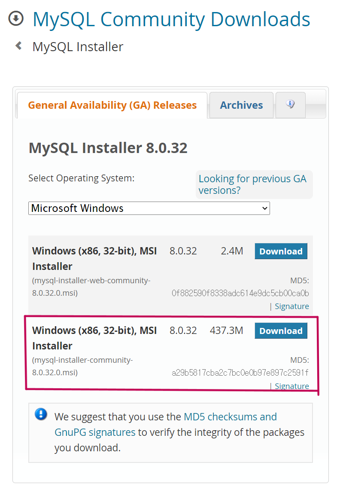
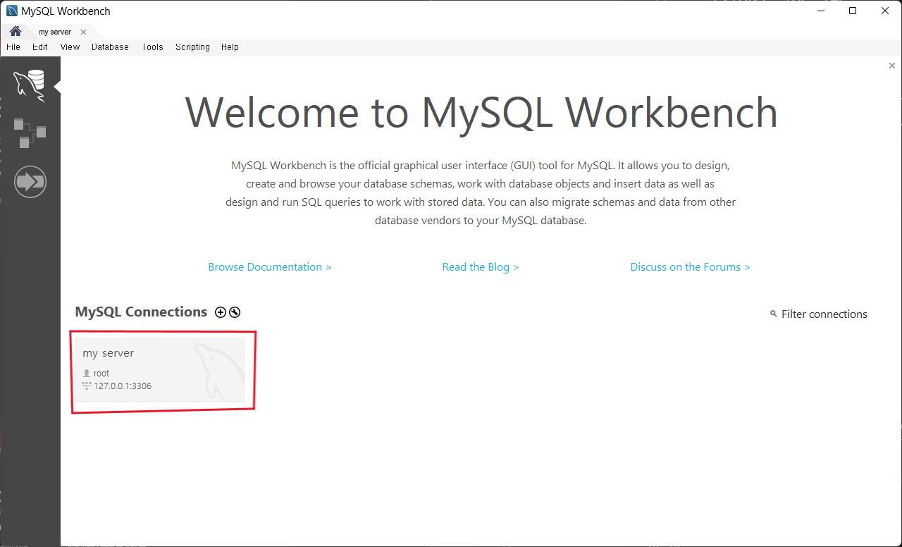

# MySQL Workbench 활용 가이드
* Windows 기준
## 설치
<!-- {: width="30" height="60"} -->


[MySQL Community Downloads](https://dev.mysql.com/downloads/installer/)

* 위 링크에서 정상적으로 설치하면
  * MySQL Shell: CLI 형식
  * MySQL Workbench: GUI 형식
* 두가지가 설치 된다.

## 초기 설정
* Edit - Preferences
  * Query Editor
    * Use UPPERCASE keywords on complition 체크 ✅
    * Change keywords to UPPER CASE 체크 ✅

## MySQL Workbench
1. Workbench 활용 MySQL



* 클릭 후 password 입력

2. 실습 데이터베이스에 대한 쿼리(Query)문 작성 및 쿼리문 실행 방법

* 실습 데이터베이스 파일 다운로드
  * 확장자: `.sql`
* 좌측 Administration - Data Import/Restore
  * Import from Self-Contained File 체크 ✅  \
  \- `...` 클릭   \
  \- 다운받은 `.sql` 파일 선택  \
  \- `Start Import` 클릭
- `classicmodels` 데이터베이스 선택(더블 클릭)
  * Query 에디터 클릭
  * 쿼리문 입력
  ```
  SELECT * FROM customers;
  ```
  * 쿼리 실행⚡
  * 출력 확인
- 한글 입력 설정
