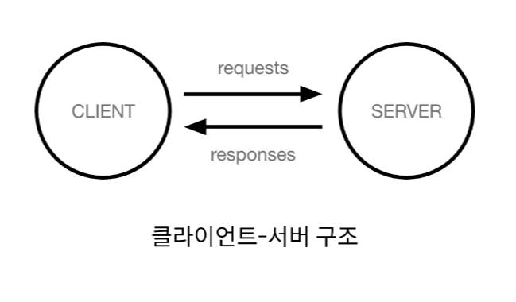

# Understanding Django and framework
## 목차
1. 개요
2. Framework
3. django
4. 클라이언트와 서버
5. django 프로젝트 및 가상환경
## 학습 목표
* django 프레임워크의 개념과 특징을 이해할 수 있다.
* 가상환경을 생성하고, django를 설치할 수 있다.
* django 프로젝트를 생성하고, 프로젝트 구조를 이해할 수 있다.

# 1. 개요
## '웹 서비스 개발'에는 무엇이 필요할까?
* 로그인, 로그아웃, 회원관리, 데이터베이스, 보안등.. 너무 많은 기술들이 필요
* 하지만 모든 걸 직접 만들 필요가 없음
* 잘 만들어진 것들을 가져와 좋은 환경에서 잘 사용하기만 하면 되는 세상

# 2. Framework
* 웹 애플리케이션을 빠르게 개발할 수 있도록 도와주는 도구
  * (개발에 필요한 기본 구조, 규칙, 라이브러리 등을 제공)
* 왜 프레임 워크를 사용할까?
  * 기본적인 구조와 규칙을 제공하기 때문에 필수적인 개발에만 집중할 수 있음
  * 여러가지 라이브러리를 제공해 개발 속도를 빠르게 할 수 있음
  * 유지보수와 확장에 용이해 소프트웨어의 품질을 높임

# 3. django
* Python 기반의 대표적인 웹 프레임워크

# 4. 클라이언트와 서버
## 웹의 동작 방식


* Client
  * 서비스를 요청하는 주체
  * (웹 사용자의 인터넷이 연결된 장치, 웹 브라우저)
* Server
  * 클라이언트의 요청에 응답하는 주체
  * (웹 페이지, 앱을 저장하는 컴퓨터)

- 우리가 웹 페이지를 보게되는 과정
1. 웹 브라우저(Client)에서 'google.com'을 입력
2. 브라우저는 인터넷에 연결된 전세계 어딘가에 있는 구글 컴퓨터(Server)에게 'Google홈페이지.html'파일을 달라고 요청
3. 요청을 받은 구글 컴퓨터는 데이터베이스에서 'Google홈페이지.html'파일을 찾아 우리 컴퓨터에게 응답
4. 전달받은 Google홈페이지.html파일을 웹 브라우저가 사람이 볼 수 있도록 해석해주면서 구글의 메인 페이지를 보게됨
> django를 사용해서 서버(Server)를 구현

# 5. django 프로젝트 및 가상환경
## django 프로젝트 생성 전 루틴
1. 가상환경 생성
2. 가상환경 활성화
3. django 설치
4. 의존성 파일 생성 (패키지 설치마다 진행)

```console
# 1. 가상환경(venv) 생성
$ python -m venv venv

# 2. 가상환경 활성화
$ source ven/Scripts/activate

# 3. django 설치
$ pip install django==3.2.18

# 4. 의존성 파일 생성
$ pip freeze > requirement.txt
```
  * 버전을 명시하지 않으면 4.0버전이 설치되니 주의
    * 2023/3/20 기준 LTS: 3.2

## django 프로젝트 생성
* firstpjt 라는 이름의 프로젝트 생성
  ```console
  $ django-admin startproject firstpjt .
  ```
* django 서버 실행
  ```console
  $ python manage.py runserver
  ```
    * manage.py와 동일한 경로에서 명령어 진행

* http://127.0.0.1:8000/ 접속 후 확인

# 99. 참고
## django 프로젝트 생성 루틴 정리
1. 가상환경 생성
2. 가상환경 활성화(windows) (VScode - python interpreter)
3. django 설치
4. 의존성 파일 생성 (패키지 설치시마다 진행)
5. (git 저장소 생성)
6. (.gitignore 파일 생성)
7. django 프로젝트 생성

```console
$ python -m venv venv
$ source venv/Srcripts/activate
$ pip install django==3.2.18
$ pip freeze > requirements.txt

$ git init
$ .gitignore 

$ django-admin startproject firstpjt .
```
99. 패키지 목록 설치

  ```console
  $ pip install -r requirements.txt
  ```

## 서버

* 서버 실행
  ```console
  $ python manage.py runserver
  ```

* 서버 종료

  ```console
  $ deactivate
  ```

  * `ctrl + c`


## 가상환경을 사용하는 이유
* 의존성 관리
  * 라이브러리 및 패키지를 각 프로젝트마다 독립적으로 사용 가능
* 팀 프로젝트 협업
  * 모든 팀원이 동일한 환경과 의존성 위에서 작업하여 버전간 충돌을 방지

## LTS(Long-Term Support)
* 프레임워크나 라이브러리 등의 소프트웨어에서 장기간 지원되는 안정적인 버전을 의미할 때 사용
* 기업이나 대규모 프로젝트에서는 소프트웨어 업그레이드에 많은 비용과 시간이 필요하기 때문에 안정적이고 장기간 지원되는 버전이 필요

## gitignore 설정 서비스
* gitignore.io
  * [https://www.toptal.com/developers/gitignore/](https://www.toptal.com/developers/gitignore/)