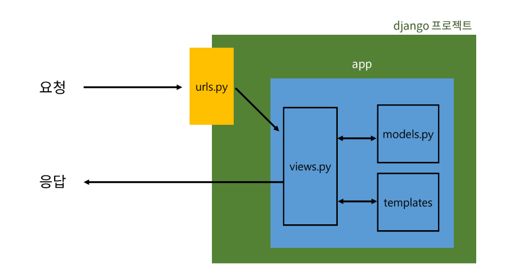
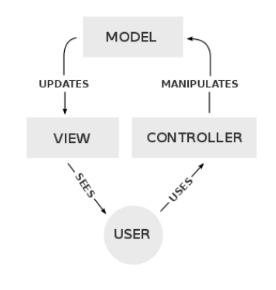
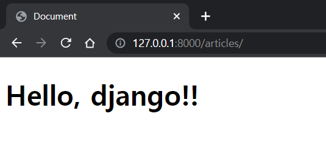
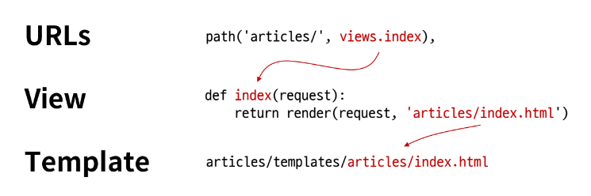

# Django design pattern
## 목차
1. django 프로젝트와 앱
2. django 디자인 패턴
3. 요청과 응답
## 학습 목표
* Django MTV 디자인 패턴의 개념과 구조를 이해할 수 있다.
* Django URL 매핑을 이해하고 작성할 수 있다.
* View 계층을 이해하고 HTTP 요청과 응답을 처리하는 뷰 함수를 구현할 수 있다.
* Template 계층을 이해하고 템플릿을 작성하고 출력할 수 있다.

# 1. django 프로젝트와 앱

* django project
  * 애플리케이션의 집합
  * (DB 설정, URL 연결, 전체 앱 설정 등을 처리)
* django application
  * 독립적으로 작동하는 기능 단위 모듈
  * (각자 특정한 기능을 담당하며 다른 앱들과 함께 하나의 프로젝트를 구성)
  * MTV 패턴에 해당하는 파일 및 폴더를 담당
* 만약 블로그를 만든다면
  * 프로젝트 - 블로그(전체 설정 담당)
  * 앱 - 게시글, 댓글, 카테고리 회원 관리 등(DB, 로직, 화면)
* 앱 생성
  ```console
  $ python manage.py startapp articles
  ```
    * 앱의 이름은 '복수형'으로 지정하는 것을 권장
* 앱 등록
  ```py
  # firstpjt/settings.py

  INSTALLED_APPS = [
    # 앱 등록 권장 순서
    # 1. local app
    'articles',
    
    # 2. 3rd party app (설치를 통해 추가하는 앱)

    # 3. 기본 django app
    'django.contrib.admin',
    'django.contrib.auth',
    'django.contrib.contenttypes',
    'django.contrib.sessions',
    'django.contrib.messages',
    'django.contrib.staticfiles',
  ]
  ```
  * 반드시 앱을 생성한 후에 등록해야 함
    * (반대로 등록 후 생성은 불가능)
# 2. django 디자인 패턴
* (소프트웨어)디자인 패턴
  * 소프트웨어 설계에서 발생하는 문제를 해결하기 위한 일반적인 해결책
  * (공통적인 문제를 해결하는데 쓰이는 형식화 된 관행)
## MVC 디자인 패턴


* Model - View - Controller
* 애플리케이션을 구조화하는 대표적인 패턴
* (데이터, 사용자 인터페이스, 비즈니스 로직을 분리)
* 시각적 요소와 뒤에서 실행되는 로직을 서로 영향 없이, 독립적이고 쉽게 유지보수할 수 있는 애플리케이션을 만들기 위해

## MTV 디자인 패턴
* django에서 애플리케이션을 구조화하는 패턴
* (기존 MVC 패턴과 동일하나 명칭을 다르게 정의)
  * View -> Template
  * Controller -> View

## django 프로젝트 구조
* tree
  ```
  manage.py
  firstpjt
   │  asgi.py
   │  settings.py
   │  urls.py
   │  wsgi.py
   │  __init__.py
  ```
* **`settings.py`**
  * 프로젝트의 모든 설정을 관리
* **`urls.py`**
  * URL과 이에 해당하는 적절한 views를 연결
- 현재 단계에서 별도로 수정하지 않는 파일
  * ~~`__init__.py`~~
    * 해당 폴더를 패키지로 인식하도록 설정
  * ~~`asgi.py`~~
    * 비동기식 웹 서버와의 연결 관련 설정
  * ~~`wsgi.py`~~
    * 웹 서버와의 연결 관련 설정
  * ~~`manage.py`~~
    * Django 프로젝트와 다양한 방법으로 상호작용 하는 커맨드라인 유틸리티

## django 앱 구조
* tree
  ```
  articles
  │  admin.py
  │  apps.py
  │  models.py
  │  tests.py
  │  views.py
  │  __init__.py
  │  
  ├─migrations
  ```
* **`admin.py`**
  * 관리자용 페이지 설정
* **`models.py`**
  * DB와 관련된 Model을 정의
  * MTV 패턴의 M
* **`views.py`**
  * HTTP 요청을 처리하고 해당 요청에 대한 응답을 반환
    * (url, mode, template과 연계)
  * MTV 패턴의 V
- 현재 단계에서 별도로 수정하지 않는 파일
  * ~~`apps.py`~~
    * 앱의 정보가 작성된 곳
  * ~~`tests.py`~~
    * 프로젝트 테스트 코드를 작성하는 곳

# 3. 요청과 응답
## URLs
```py django
# firstpjt/urls.py

from django.contrib import admin
from django.urls import path
# urls.py 입장에서는
# articles라는 패키지에서
# view라는 모듈을 가져오는 것
from articles import views ## 직접 작성

urlpatterns = [
    path('admin/', admin.site.urls),
    path('articles/', views.index), ##
]
```
* http://128.0.0.1:8000/article/ 로 요청이 왔을 때  \
**views** 모듈의 **index** 뷰 함수를 호출한다는 뜻

## View
```py
# apps/views.py

from django.shortcuts import render

# Create your views here.
# 특정 기능을 수행하는 view 함수들을 작성
# 모든 view 함수는 첫번째 인자로 요청 객체를 필수적으로 받는다
##
def index(request):
    return render(request, 'articles/index.html')
```
* 특정 경로에 있는 **template**과 **request 객체**를 결합해  \
응답 객체를 반환하는 index 뷰 함수 정의

## Template
* articles 앱 폴더안에 templates 폴더 생성
  ```
  articles
  ├─ templates
  │  ├─ articles
  │     │ index.html
  ```
    * 반드시 `templates` 폴더명이여야 하며 개발자가 직접 생성해야함

* templates 폴더 안에 템플릿 페이지 작성
  ```html
  <!-- articles/index.html -->
  
  <!DOCTYPE html>
  <html lang="en">
  <head>
    <title>Document</title>
  </head>
  <body>
    <h1>Hello, django!!</h1>
  </body>
  </html>
  ```

## django에서 template을 인식하는 경로 규칙
* django는 **"articles/templates/"** 지점까지 기본 경로로 인식하기 때문에 이후의 경로를 작성해야함

  * **articles/templates/** `articles/index.html`

  * **apps/templates/** `example.html`

## 페이지 확인
http://127.0.0.1:8000/articles/




## 데이터 흐름에 따른 코드 작성
* URLs -> View -> Template



# 99. 참고
## render함수
* 주어진 템플릿을 주어진 컨텍스트 데이터와 결합하고 렌더링 된 텍스트와 함께 HttpResponse(응답) 객체를 반환하는 함수
  ```py
  render(request, template_name, context)
  ```
  * request
    * 응답을 생성하는 데 사용되는 요청 객체
  * template_name
    * 템플릿 이름의 경로
  * context
    * 템플릿에서 사용할 데이터 (딕셔너리 타입으로 작성)
## 왜 django는 MTV라고 부를까?
* [django-faq](https://docs.djangoproject.com/ko/4.1/faq/)
* [django-faq-why call mtv](https://docs.djangoproject.com/ko/4.1/faq/general/#faq-mtv)
* [stackoverflow-what is view](https://stackoverflow.com/questions/20382934/django-since-it-is-not-strictly-mvc-but-mtv-what-is-view)