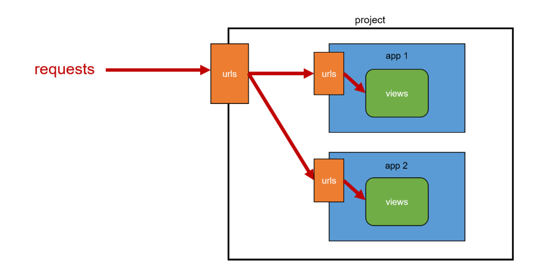
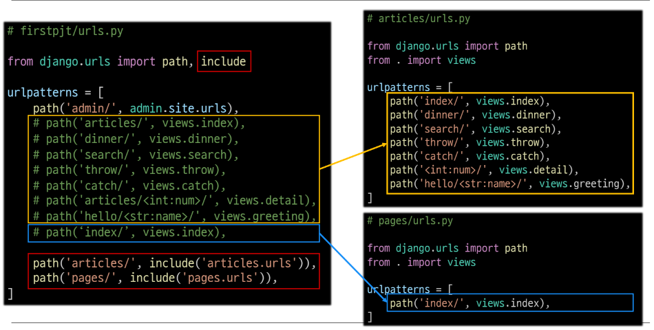

a# Django URLs
## 목차
1. 개요
2. 변수와 URL
3. App의 URL
4. URL 이름 지정
5. URL Namespace
## 학습 목표
* Dispatcher로서의 django URL을 정의하고 어떻게 작동하는지 이해할 수 있다.
* URL 패턴 작성 방법을 이해하고, URL의 변수를 추출하는 방법을 사용할 수 있다.
* URL에 이름을 붙여 별칭을 사용하여 쉽게 참조할 수 있다.

# 1. 개요
## URL dispatcher
* URL 패턴을 정의하고 해당 패턴이 일치하는 요청을 처리할 view 함수를 연결(매핑)

# 2. 변수와 URL
## Variable Routing
* URL 일부에 변수를 포함시키는 것
  * (변수는 view 함수의 인자로 전달할 수 있음)
* Variable routing 작성법
  ```py
  path('articles/<int:num>/', views.hello)
  path('hello/<str:name>/', views.greeting)
  ```
  * `<path_converter:variable_name>`
* Path converters
  * URL 변수의 타입을 지정
  * (str, int, slug, uuid, path)

#### 실습

# 3. App의 URL
## App URL mapping


* 각 앱에 URL을 정의하는 것
  * 프로젝트와 각각의 앱이 URL을 나누어 관리하여 주소 관리를 편하게 하기 위함
  * URL을 각자 app에서 관리하자
  
* `include()`
  * 다른 URL들을 참조할 수 있도록 돕는 함수
  * (URL의 그 시점까지 일치하는 부분을 잘라내고, 남은 문자열 부분을 후속 처리를 위해 include된 URL로 전달)

  

# 4. URL 이름 지정
## Naming URL patterns
* URL에 이름을 지정하는 것
  * (path 함수의 name 인자를 정의해서 사용)
  ```py
  # urls.py

  urlpatterns = [
    path('index/', views.index, name='index')
    path('mypage/<int:num>/<str:name>/', views.mypage, name='myurl')
  ]
  ```
* 'url' tag
  ```django
  <!-- index.html -->

  <a href=">link</a>
  ```

# 5. URL Namespace
## app_name
* app_name 속성 지정
  ```py
  # articles/urls.py

  app_name = 'articles'
  urlpatterns = [
    ...
  ]
  ```
* URL tag의 변화
  ```django
  
  ```

# 99. 참고
## Trailing Slashes
* django는 URL 끝에 '/'가 없다면 자동으로 붙임
* django의 url 설계 철학
  * "기술적인 측면에서, `foo.com/bar` 와 `foo.com/bar/`는 서로 다른 URL이다"
* 검색 엔진 로봇이나 웹 트래픽 분석 도구에서는 이 두 주소를 서로 다른 페이지로 봄
* 그래서 django는 검색 엔진이 혼동하지 않게 하기 위해 사용
* 그러나 모든 프레임워크가 이렇게 동작하는 것은 아님 