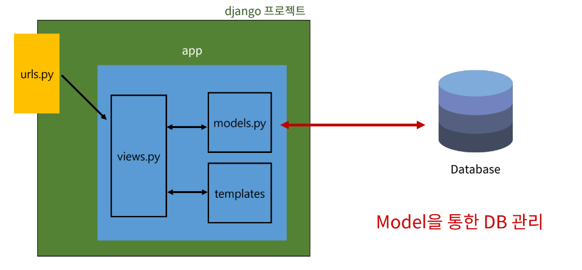
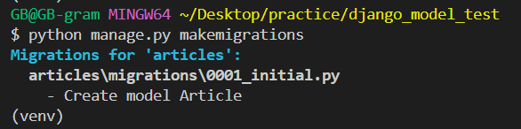
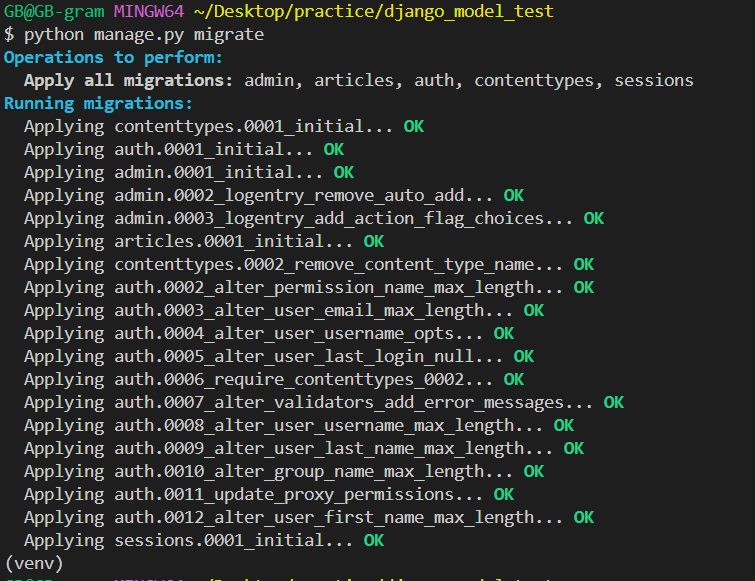
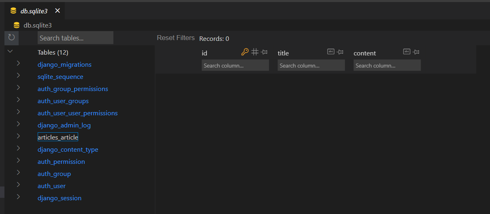
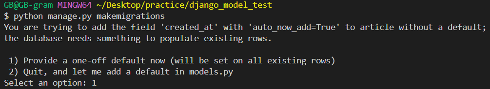
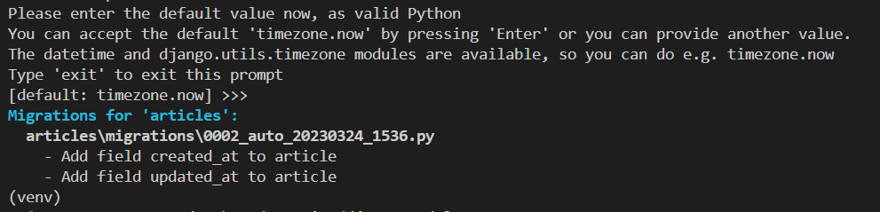
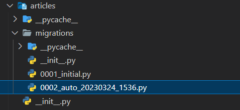
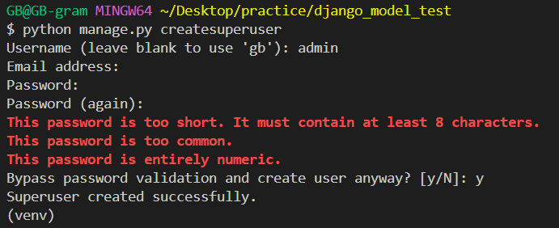
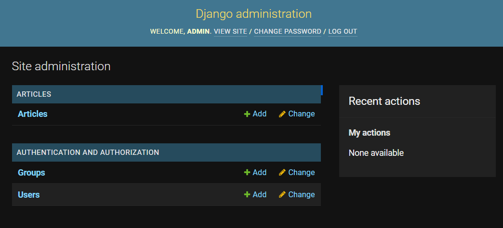

# Django Model
## 목차
1. 개요
2. Model
3. Migrations
4. Admin site

## 학습 목표
* Model 클래스를 정의하고, 데이터베이스에 테이블을 생성하는 방법을 익힐 수 있다.
* django의 Model에서 제공하는 다양한 필드 타입을 이해하고, 각각의 필드 타입을 적절히 사용할 수 있다.
* Migration 작동 방식을 이해하고, Migration을 적용하여 데이터베이스 스키마를 관리할 수 있다.
* Migration 파일을 생성하여 변경사항을 데이터베이스에 적용할 수 있다.

# 1. 개요

## SQLite
* 오픈소스 RDBMS 중 하나이며 django의 기본 DB로 사용됨
  * (DB가 파일로 존재하며 가볍고 호환성이 좋음)

# 2. Model
## django Model
* DB의 테이블을 정의하고 데이터를 조작할 수 있는 기능들을 제공
  * 테이블 구조를 설계하는 '청사진(blueprint)'
* `article/models.py`에 model class 작성
  ```py
  # article/models.py

  from django.db import models

  class Article(models.Model):
      '''
      필드 이름(변수명) / 데이터 타입(모델 필드 클래스) / 제약조건(모델 필드 클래스의 키워드 인자)
      '''
      title = models.CharField(max_length=10) # 길이 제한
      content = models.TextField() # 길이 제한 없음
  ```
  * id 필드는 자동 생성
  * '모델 클래스' == '테이블 스키마'
  * django.db.models 모듈의 Model이라는 부모 클래스를 상속 받아 작성
* [테이블 필드의 데이터 타입](https://docs.djangoproject.com/en/3.2/ref/models/fields/)
* 개발자는 테이블 구조를 어떻게 설계할 지에 대한 코드만 작성하도록 하기 위함

# 3. Migrations
* model 클래스의 변경사향(필드 생성, 추가 수정 등)을 DB에 최종 반영하는 방법

|model class|➡️|migration 파일|➡️|db.sqlite3|
|:-:|:-:|:-:|:-:|:-:|
|(설계도 초안)|`$ makemigrations`|(최종 설계도)|`$ migrate`||

* model class를 기반으로 설계도(migration) 작성
  ```console
  $ python manage.py makemigrations
  ```
  * `articles\migrations\0001_initial.py` 파일 생성

  

* 만들어진 설계도를 DB에 전달하여 반영
  ```console
  $ python manage.py migrate
  ```
  

* `./db.aqlite3` 파일 확인

  

## 모델 필드 추가
* 이미 생성된 테이블에 필드를 추가할 경우
* model class에 추가 필드 작성
  ```py
  # article/models.py

  class Article(models.Model):
    ...
    created_at = models.DateTimeField(auto_now_add=True)
    updated_at = models.DateTimeField(auto_now=True)
  ```
  * DateTimeField의 선택인자
    * `auto_now`: 데이터가 저장될 때마다 자동으로 현재 날짜시간을 저장
    * `auto_now_add`: 데이터가 처음 생성될 때만 자동으로 현재 날짜 시간을 저장
* makemigrations
  ```console
  $ python manage.py makemigrations
  ```
* default옵션 선택

  

  * 1: 직접 기본 값 (default=)을 입력하는 옵션을 선택했을 때
    
    
    * terminal에 기본값 입력
    * 날짜 데이터인 경우 아무것도 입력하지 않고 enter를 누르면 django가 제안하는 기본 값(`timezone.now`)으로 설정
  * 2: 현재 대화에서 나간 후 models.py에 기본 값 관련 설정
* migration 파일이 생성됨

  

* migrate
* DB확인
> model class에 변경사항이 생겼다면, 반드시 새로운 설계도를 생성하고, 이를 DB에 반영해야한다.
1. model class 작성 및 수정
2. makemigrations
3. migrate

# 4. Admin site
## Automatic admin interface
* django는 추가 설치 및 설정없이 자동으로 관리자 인터페이스를 제공
  * 데이터 관련 테스트 및 확인을 하기에 매우 유용

## admin 계정 생성
* admin 계정 생성
  ```console
  $ python manage.py createsuperuser
  ```
  
  * email은 선택사항이기 때문에 입력하지 않고 진행 가능
  * 비밀번호 생성 시 보안상 터미널에 출력되지 않으니 무시하고 입력을 이어가도록 함
* DB에 생성된 admin 계정 확인

## admin에 모델 클래스 등록
* admin에 모델 클래스 등록
  ```py
  # articles/admin.py

  from django.contrib import admin
  from .models import Article

  admin.site.register(Article)
  ```
  * admin.py에 등록하지 않으면 admin site에서 확인 할 수 없음

## 관리자 페이지 접속
* http://127.0.0.1:8000/admin/ 에 접속해서 CRUD 확인 
  

# 99. 참고
## 데이터베이스 초기화
* 중요한 데이터가 없을 경우
1. migration 파일(들) 삭제
2. db.sqlite3 파일 삭제
* <u>migrations 폴더를 지우지 않도록 주의</u>

## Migrations 기타 명령어
* showmigrations
  ```console
  $ python manage.py showmigrations
  ```
  * migrations 파일들의 migrate 여부 확인
  * \[X\] 표시가 있으면 migrate가 완료되었음을 의미
* sqlmigrate
  ```console
  $ python manage.py sqlmigrate articles 0001
  ```
  * 해당 migrations 파일이 SQL 문으로 어떻게 해석되어 DB에 전달되는지 확인하는 용도

## 첫 migrate 시 출력 내용이 많은 이유는?
* 기본적으로 Django 프로젝트가 동작하기 위해 작성되어있는 기본 내장 app들에 대한 migration 파일들이 함께 migrate 되기 때문