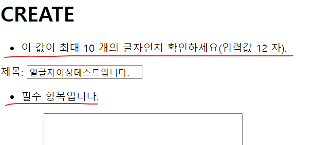

# Form
## 목차
1. 개요
2. Django Form
3. Widgets
4. Django ModelForm
## 학습 목표
* Django Form과 ModelForm을 사용하여 사용자 입력 데이터를 수집하고 처리하는 방법을 이해할 수 있다.
* Django Form과 ModelForm의 개념과 차이점을 설명할 수 있다.
* ModelForm을 사용하여 데이터를 데이터베이스 모델과 연결하고 저장하는 방법을 작성할 수 있다.
* Form과 ModelForm에서 사용할 수 있는 다양한 필드 타입과 욥션을 활용할 수 있다.

# 1. 개요
## HTML form
* 사용자로부터 form 요소를 통해 데이터를 받고 있으나 빗정상적 혹은 악의적인 요청을 확인하지 않고 모두 수용중
  * 우리가 원하는 데이터 형식이 맞는지에 대한 '유효성 검증'필요
## 유효성 검사
* 수집한 데이터가 정확하고 유효한지 확인하는 과정
* 유효성 검증에는 입력 값, 형식, 중복, 범위, 보안 등 부가적인 많은 것들을 고려해야 함
* 이런 과정과 기능을 제공해주는 **도구**가 필요

# 2. Django Form
* 사용자 입력 데이터를 수집하고, 처리 및 유효성 검증을 수행하기 위한 도구
  * 유효성 검사를 단순화하고 자동화 할 수 있는 기능을 제공

## 2-1. 실습
### 2-1-1. **Form class 선언**
```py
# articles/forms.py

class ArticleForm(forms.Form):
  title = forms.CharField(max_length=10)
  content = forms.CharField()
```
### 2-1-2. **Form class를 적용한 new 로직** (views.py, new.html)
```py
# articles/views.py

from .forms import ArticleForm

def new(request):
  form = ArticleForm()
  context = {
    'form': form,
  }
  return render(request, 'articles/new.html', context)
```
```django
<!-- aricle/new.html -->

...
<form action="" method="POST">
  
  {{ form }}
  <input type="submit">
</form>
...
```
* Form rendering options
  * `{{ form.as_p }}`
    * 요소마다 p tag를 붙여줌

# 3. Widgets
* [Widgets 공식문서](https://docs.djangoproject.com/ko/3.2/ref/forms/widgets/#built-in-widgets)
* HTML 'input' element의 표현을 담당
  * Widget은 단순히 input 요소의 속성 및 출력되는 부분을 변경하는 것
  
```py
# articles/forms.py

class ArticleForm(forms.Form):
  title = forms.CharField(max_length=10)
  content = forms.CharField(widget=forms.Textarea) # 수정된 부분
```

# 4. Django ModelForm
| Form | ModelForm |
|:-:|:-:|
| 사용자 입력 데이터를 <br/>DB에 저장하지 않을 때 <br/>(ex. 로그인) | 사용자 입력 데이터를 <br/>DB에 저장해야 할 때 <br/>(ex. 회원가입) |

## 4-1. 실습
### 4-1-1. **ModelForm class 선언**
  * 기존 ArticleForm 클래스 수정
```py
# articles/forms.py

from django import forms
from .models import Article

class ArticleForm(forms.ModelForm):
  class Meta:
    model = Article
    fields = '__all__'
```
  * *개발자도구를 열어서 rendering 확인*
  
    
  
  * `Meta` class : ModelForm의 정보를 작성하는 곳
    * `fields`
    * `exclude`: 모델에서 포함하지 않을 필드를 지정할 수도 있음

### 4-1-2. ModelForm을 적용한 create 로직
```py
# articles/views.py

from .forms import ArticleForm

def create(request):
  form = ArticleForm(request.POST)
  if form.is_valid():
    article = form.save()
    return redirect('article:detail', article.pk)
  context = {
    'form': form,
  }
  return render(request, 'articles/new.html', context)
```
* `is_valid()`
  * 여러 유효성 검사를 실행하고, 데이터가 유효한지 여부를 boolean으로 반환
  * 제목 input에 공백 값을 입력 후 에러 메시지 확인 (유효성 검사 결과)
    

### 4-1-3. ModelForm을 적용한 edit 로직
```py
# articles/views.py

def edit(request, pk):
  article = Article.objects.get(pk=pk)
  form = ArticleForm(instance=article)
  context = {
    'article': article,
    'form': form,
  }
  return render(request, 'articles/edit.html', context)
```
```django
<!-- articles/edit.html -->

<h1>EDIT</h1>
<form action="" method="POST">
  
  {{ form.as_p }}
  <input type="submit">
</form>
```

### 4-1-4. ModelForm을 적용한 update로직
```py
# articles/views.py

def update(request, pk):
  article = Article.objects.get(pk=pk)
  form = ArticleForm(request.POST, instance=article)
  if form.is_valid():
    form.save()
    return redirect('articles:detail', article.pk)
  context = {
      'form': form,
  }
  return render(request, 'articles/update.html', context)
```

* `save()`
  * 데이터베이스 객체를 만들고 저장
  * 키워드 인자 instance 여부를 통해 생성할 지, 수정할 지를 결정
  ```py
  # CREATE
  form = ArticleForm(request.POST)
  form.save()

  # UPDATE
  form = ArticleForm(request.POST, instance=article)
  form.save()
  ```

# 99. 참고
## 추가 학습 URL
* [Django ModelForm](https://docs.djangoproject.com/en/3.2/topics/forms/modelforms/)
* [Django Forms](https://docs.djangoproject.com/en/3.2/topics/forms/)
* [Django Forms Widgets](https://docs.djangoproject.com/en/3.2/ref/forms/widgets/)
## Widget 응용
```py
# articles/forms.py

class ArticleForm(forms.ModelForm):
    title = forms.CharField(
        label='제목', 
        widget=forms.TextInput(
            attrs={
                'class': 'my-title',
                'placeholder': '제목을 입력해주세요.',
            }
        )
    )
    content = forms.CharField(
        label='내용',
        widget=forms.Textarea(
            attrs={
                'class': 'my-content',
                'placeholder': 'Enter the content',
                'rows': 5,
                'cols': 50,
            }
        ),
        error_messages={'required': '내용을 입력해주세요.'},
    )
    class Meta:
        model = Article
        fields = '__all__'
```
* `attrs`: 태그 속성 설정
* `error_messages`: 에러메세지 설정

## Meta class ?
* 단순히 모델 정보를 Meta라는 이름의 내부 클래스로 작성하도록 ModelForm의 설계가 이렇게 되어있을 뿐
* 우리는 **ModelForm의 역할과 사용법을 숙지하는데 집중**할 것
* Python의 내부 클래스(Inner class, Nested class)와 유사점이 있지만 동일한 개념이 아님
*  Meta 클래스는 Django 프레임워크 내에서 특정한 목적을 가지고 있음

## ModelForm 키워드 인자 data와 instance 살펴보기

* https://github.com/django/django/blob/main/django/forms/models.py#L333