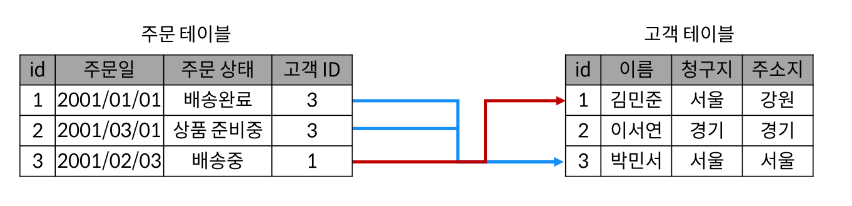
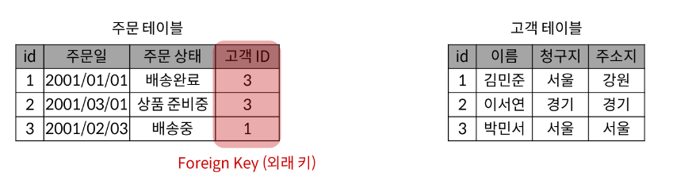
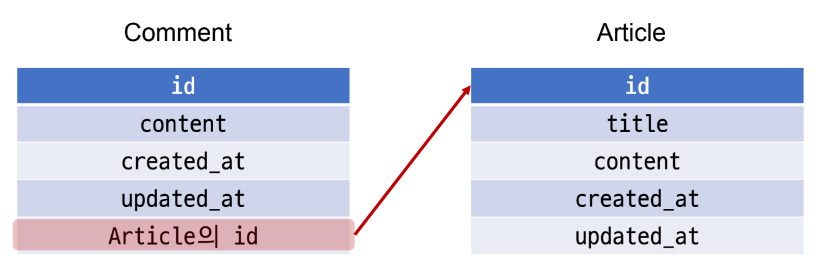

# Many to one relationships 1
## 목차
1. 개요
2. Comment & Article
  1. 댓글 모델 구현
  2. 관계 모델 참조
  3. 댓글 기능 구현
## 학습 목표
* django ForeignKey 필드를 사용하여 Many-to-One 관계를 만들 수 있다.
* Many-to-One 관계에서 역참조를 하는 방법을 이해하고 이를 데이터 조작에서 활용할 수 있다.
* Many-to-One 관계에서 관련된 객체를 추가, 수정 및 삭제할 수 있다.

# 1. 개요
## 관계형 데이터베이스의 N:1 관계



* Foreign Key
  * 테이블의 필드 중 다른 테이블의 레코드를 식별할 수 있는 키
  * 각 레코드에서 서로 다른 테이블간의 '관계'를 만드는 데 사용

# 2. Comment & Article
## 2-1. 모델 관계 설정
* Many to one relationships
  * N:1 or 1:N
  * 한 테이블의 0개ㅐ 이상의 레코드가 다른 테이블의 레코드 한 개와 관련된 관계
* Comment(N) - Article(1)
  * '0개 이상의 댓글은 1개의 게시글에 작성될 수 있다.'
* 두 모델의 관계



### Comment 모델 정의
```python
# article/models.py

class Comment(models.Model):
  article = models.ForeignKey(Article, on_delete=models.CASCADE)
  content = models.CharField(max_length=200)
  created_at = models.DateTimeField(auto_now_add=True)
  updated_at = models.DateTimeField(auto_now=True)
```
* `ForeignKey()`
  * django에서 N:1 관계 설정 모델 필드
  * ForeignKey() 클래스의 인스턴스 이름은 참조하는 모델 클래스 이름의 단수형(소문자)으로 작성하는 것을 권장
  * ForeignKey 클래스를 작성하는 위치와 관계없이 필드 마지막에 생성됨
* Migration 진행 후 Comment테이블(DB) 확인
  * article_id 필드 확인
  * 참조하는 클래스 이름의 소문자(단수형)로 작성하는 것이 권장되었던 이유
### ForeignKey(to, on_delete)
* to
  * "참조하는 모델 class 이름"
* on_delete
  * "참조하는 모델 class가 삭제될 때 연결된 하위 객체의 동작을 결정"
  * 외래 키가 참조하는 객체(1)가 사라졌을 때, 외래 키를 가진 객체(N)를 어떻게 처리할 지를 정의하는 설정
  * **<u>데이터 무결성</u>**
  * https://docs.djangoproject.com/en/3.2/ref/models/fields/#arguments
    * CASCADE, PROTECT, RESTRICT, SET_NULL, ...
  * `CASCADE`
    * 부모 객체(참조 된 객체)가 삭제됐을 때 이를 참조하는 객체도 삭제
### 댓글 생성 연습하기
* shell_plus 실행 및 게시글 작성
```python
# 
```

## 2-2. 관계 모델 참조
* 역참조
  * 나를 참조하는 테이블(나를 외래 키로 지정한)을 참조하는 것
    * N:1 관계에서는 1이 N을 참조하는 상황
    * Article에는 Comment를 참조할 어떠한 필드도 없는 상황
* `article.comment_set.all()`

  article|comment_set|all()
  :-:|:-:|:-:
  모델 인스턴스|related manager|QuerySet API

### related manager
* N:1 혹은 M:N 관계에서 역참조 시에 사용하는 manager
* (objects라는 매니저를 통해 queryset api를 사용했던 것 처럼, related manager를 통해 queryset api를 사용할 수 있게 됨)
* related manager가 필요한 이유
  * article.comment 형식으로는 댓글 객체를 참조할 수 없음
  * 실제 Article 클래스에는 Comment와의 어떠한 관계도 작성되어 있지않기 때문
  * 대신 Django가 역참조 할 수 있는 'comment_set'manager를 자동으로 생성해 article.comment_set 형태로 댓글 객체를 참조할 수 있음
  * N:1 관계에서 생성되는 Related manager의 이름은 참조하는 "<모델명>_set" 이름 규칙으로 만들어 짐
### Related manager 연습하기
* shell_plus 실행 및 게시글 조회
```python
#
```

## 2-3. 댓글 기능 구현
### Commment CREATE
* 사용자로부터 댓글 데이터를 입력받기 위한 CommentForm 작성
```python
# articles/forms.py

from .models import Article, Comment

class CommentForm(forms.ModelForm):
  class Meta:
    model = Comment
    fields = '__all__'
```
* detail 페이지에서 CommentForm 출력(view 함수)
```python
# articles/views.py

from .forms mport ArticleForm, CommentForm

def detail(request, pk):
  article = Article.objects.get(pk=pk)
  comment_form = CommentForm() ##
  context = {
    'article': article, 
    'comment_form': comment_form, ##
  }
  return render(request, 'articles/detail.html', context)
```
* detail 페이지에서 CommentForm 출력(템플릿)
```django
<!-- articles/detail.html -->

<form action="#" method="POST">
  
  {{ comment_form }}
  <input type="submit">
</form>
```
* commentForm 출력 확인
  * 외래 키 필드(article)이 출력되는 현상
  * 외래 키 필드는 <u>사용자의 입력으로 받는 것이 아니라 view 함수 내에서 받아 별도로 처리되어 저장</u>되어야 함
* forms의 field 변경
```python
# articles/forms.py

form .models import Article, Comment

class CommentForm(forms.ModelForm):
  class Meta:
    model = Comment
    fields = ('content',) ##
```
### 외래 키 받아오기
* 출력에서 제외된 외래 키 데이터 받아오기(어디서?)
* path('\<int:pk>/', views.detail, name='detail')
  * detail 페이지의 url을 살펴보면 에 해당 게시글의 pk값이 사용되고 있음
* 댓글의 외래 키 데이터에 필요한 정보가 바로 게시글의 pk 값
```python
# articles/url.py

urlpatterns = [
  ...,
  path('<int:pk>/comments/', views.comments_create, name='comments_create'),
]
```
```python
# articles/views.py

def comments_create(request, pk):
  article = Article.objects.get(pk=pk)
  comment_form = CommentForm(request.POST)
  if commnet_form.is_valid():
    # article 객체는 언제 저장?
    comment_form.save()
    return redirect('articles:detail', article.pk)
  context = {
    'article': article,
    'comment_form': comment_form,
  }
  return render(request, 'articles/detail.html', context)
```
```django
<!-- articles/detail.html -->

<form action="" method="POST">
  
  {{ comment_form }}
  <input type="submit">
</form>
```
* `save(commit=False)`
  * "Create, but don't save the new instance."
  * (DB에 저장하지 않고 인스턴스만 반환)
  * https://docs.djangoproject.com/en/3.2/topics/forms/modelforms/#the-save-method
```python
# articles/views.py

def comments_create(request, pk):
  ...
  if comment_form.is_valid():
    comment = comment_form.save(commit=False) ##
    comment.article = article ##
    comment_form.save()
    return redirect('articles:detail', article.pk)
  ...
```
* 댓글 작성 후 테이블(DB)확인

### Comment READ
* 전체 댓글 출력(view 함수)
```python
# articles/views.py

form .models import Article, Comment

def detail(request, pk):
  article = Article.objects.get(pk=pk)
  comment_form = CommentForm()
  comments = article.comment_set.all() ##
  context = {
    'article': article,
    'comment_form': comment_form,
    'comments': comments, ##
  }
  return render(request, 'articles/detail.html', context)
```
* 전체 댓글 출력(템플릿)
```django
<!-- articles/detail.html -->

<h4>댓글 목록</h4>
<ul>
  
    <li>{{ comment.content }}</li>
  
</ul>
```
* 전체 댓글 출력 확인

### Comment DELETE
* 댓글 삭제 url 작성
```python
# articles/urls.py

app_name = 'articles'
urlpatterns = [
  ...,
  path(
    '<int:article_pk>/comments/<int:comment_pk>/delete/',
    views.comments_delete,
    name='comments_delelt
  ),
]
```
* 댓글 삭제 view 함수 작성
```python
# drticles/views.py

def comments_delete(request, article_pk, comment_pk):
  comment = Comment.objects.get(pk=comment_pk)
  comment.delete()
  return redirect('articles:detail', article_pk)
```
* 댓글 삭제 버튼 작성
```django
<!-- articles/detail.html -->

<ul>
  
    <li>
      {{ comment.content }}
      <form action="" method="POST">
        
        <input type="submit" value="DELETE">
      </form>
    </li>
  
</ul>
```

# 99. 참고
## 댓글 개수 출력하기
* DTL filter - length 사용
```django
{{ comments|length }}

{{ article.comment_set.all|length }}
```
* Query API - count() 사용
```django
{{ article.comment_set.count }}
```
* https://docs.djangoproject.com/en/3.2/ref/models/querysets/#count

## 댓글이 없는 경우 대체 컨텐츠 출력
* DTL tag - for empty 사용
```django
<!-- articles/detail.html -->

<ul>
  
  ...
  
    <p>댓글이 없어요..</p>
  
</ul>
```

## comment 수정
* 일반적으로 댓글 수정은 수정 페이지로 이동없이 현재 페이지가 유지된 상태로 댓글 작성 Form 부분만 변경되어 수정할 수 있도록 함
* 이처럼 페이지의 일부 내용만 업데이트하는 것은 JavaScript의 영역이기 때문에 JavaScript를 사용해 도전해 볼 수 있도록 함

## admin site 등록
* 새로 작성한 Comment 모델을 admin site에 등록하기
```python
# articles/admin.py

form .models import Article, Comment

admin.site.register(Article)
admin.site.register(Comment)
```

## admin Integraion
* admin-history
  * https://django-simple-history.readthedocs.io/en/latest/admin.html