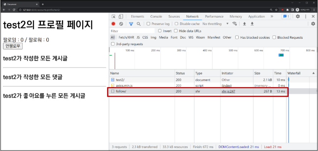

s# django with Ajax
## 목차
1. 개요
2. 비동기 요청
3. 팔로우 with Ajax
4. 좋아요 with Ajax
## 학습 목표
* JS의 비동기 특성과 Ajax의 개념과 동작 방식을 이해할 수 있다.
* axios 라이브러리를 활용하여 JS로 HTTP 요청을 보내고 응답을 받을 수 있다.
* Django에서 Ajax를 사용하여 동적으로 HTML 요소를 업데이트하는 코드를 작성할 수 있다.

# 1. 개요
## 비동기(Asynchronous)
* 작업을 시작한 후 결과를 기다리지 않고 다음 작업을 처리하는 것(병렬적 수행)
* 시간이 필요한 작업들은 요청을 보낸 뒤 응답이 빨리 오는 작업부터 처리
### 비동기 예시
```js
function slowRequest(callback) {
  console.log('1. 오래 걸리는 작업 시작 ...')
  setTimeout(function () {
    callBack()
  }, 3000)
}

function myCallBack() {
  console.log('2. 콜백함수 실행됨')
}

slowRequest(myCallBack)
console.log('3. 다른 작업 진행')

// 출력 결과
// 1. 오래 걸리는 작업 시작 ...
// 2. 다른 작업 실행
// 3. 콜백함수 실행됨
```
## Ajax
* Asynchromous Java Script And XML
* 비동기적인 웹 애플리케이션 개발을 위한 프로그래밍 기술명
* **<u>사용자의 요청에 대한 즉각적인 반응을 제공하면서, 페이지 전체를 다시 로드하지 않고 필요한 부분만 업데이트하는 것을 목표</u>**
### 응답의 변화

| | 기존 | Ajax
:-:|:-:|:-:
요청 | HTTP requset | XMLHttpRequest(XHR)객체
응답 | HTML Document | XMLHttpRequest(XHR)객체

## XMLHttpRequest
* JavaScript 객체
* 클라이언트와 서버간에 데이터를 비동기적으로 주고받을 수 있도록 해주는 객체
* **<u>JavaScript 코드에서 서버에 요청을 보내고, 서버로부터 응답을 받을 수 있음</u>**

# 2. 비동기 요청
## Axios
* JacaScript에서 HTTP 요청을 보내는 라이브러리
* 주로 프론트엔드 프레임워크에서 사용

## Axios 기본 문법
```js
<script src="https://cdn.jsdelivr.net/npm/axios/dist/axios.min.js"></script>
<script>
  axios({
    method: 'HTTP 메서드',
    url: '요청 URL',
  })
    .then(성공하면 수행할 콜백함수)
    .catch(실패하면 수행할 콜백함수)
</script>
```
* get, post 등 여러 method 사용가능
* then을 이용해서 성공하면 수행할 로직을 작성
* catch를 이용해서 실패하면 수행할 로직을 작성

## 고양이 사진 가져오기(Python)
```py
# cat_api.py

import requests

print('고양이는 야옹')

cat_image_search_url = 'https://api.thecatapi.com/v1/images/search'
response = requests.get(cat_image_search_url)

if response.status_code == 200:
    print(response.json())
else:
    print('실패했다옹')
  
print('야옹야옹')

# 고양이는 야옹
# [{"id":"3cf","url":"https://cdn2.thecatapi.com/images/3cf.jpg","width":612,"height":612}]
# 야옹야옹
```
## 고양이 사진 가져오기 (JavaScript)
```js
<script src="https://cdn.jsdelivr.net/npm/axios/dist/axios.min.js"></script>
<script>
  console.log('고양이는 야옹')
  const catImageSearchURL = 'https://api.thecatapi.com/v1/images/search'

  axios({
    method: 'get',
    url: catImageSearchURL,
  })
    .then((response) => {
      console.log(response.data)
    })
    .catch((error) => {
      console.log('실패했다옹')
    })
  console.log('야옹야옹')
</script>
// 고양이는 야옹
// 야옹야옹
// [{"id":"3cf","url":"https://cdn2.thecatapi.com/images/3cf.jpg","width":612,"height":612}]
```
* 고양이 사진 가져오기 (결과 비교)
* 동기식 코드(python)는 위에서부터 순서대로 처리가 되기때문에 첫번째 print가 출력되고 이미지를 가져오는 처리를 기다렸다가 다음 print가 출력되는 반면
* 비동기식 코드(JavaScript)는 바로 처리가 가능한 작업(console.log)은 바로 처리하고, 오래 걸리는 작업인 이미지를 요청하고 가져오는 일은 요청을 보내 놓고 기다리지 않고 다음 코드로 진행 후 완료가 된 시점에 결과 출력이 진행됨
## 고양이 사진 가져오기 (완성하기)
```html
<button>야옹이 버튼</button>

<script src="https://cdn.jsdelivr.net/npm/axios/dist/axios.min.js"></script>
<script>
  const catImageSearchUrl = 'https://api.thecatapi.com/v1/images/search'
  const btn = document.querySelector('button')

  btn.addEventListener('click', function () {
    axios({
      method: 'get',
      url: catImageSearchURL,
    })
      .then((response) => {
        imgElem = document.createElement('img')
        imgElem.setAttribute('src', response.data[0].url)
        document.body.appendChild(imgElem)
      })
      .catch((error) => {
        console.log('실패했다옹')
      })
  })
</script>
```

# 3. 팔로우 with ajax
## 단계별
### 3-1. axios CDN 작성
```django
<!-- accounts/profile.html -->

<script src="https://cdn.jsdelivr.net/npm/axios/dist/axios.min.js"></script>
<script>

</script>
```

### 3-2. form 요소 선택을 위해 id 속성 지정 및 선택
* 불필요해진 action과 method 속성은 삭제(axios로 대체)
```django
<!-- accounts/profile.html -->

<form id="follow-form">
  ...
</form>
<script>
  const form = document.querySelector('#follow-form')
</script>
```

### 3-3. axios 요청 준비
```django
<!-- accounts/profile.html -->

<form id="follow-form">
  ...
</form>
<script>
  const form = document.querySelector('#follow-form')
  form.addEventListener('submit', function (event) {
    event.preventDefault()
    axios({
      method: 'post',
      url: `/account/${???}/follow/`,
    })
  })
</script>
```

### 3-4. axios로 POST 요청을 보낼 데이터 준비
#### 1. url에 작성할 user pk 가져오기 (HTML -> JavaScript)
```django
<!-- accounts/profile.html -->

<form id="follow-form" data-user-id="{{ person.pk }}"> <!-- 작성 -->
  ...
</form>
<script>
  const form = document.querySelector('#follow-form')
  form.addEventListener('submit', function (event) {
    event.preventDefault()
    const userId = event.target.dataset.userId //// 작성
    axios({
      method: 'post',
      url: `/account/${userId}/follow/`, //// 작성
    })
  })
</script>
```
* `data-*` attributes
  * 사용자 지정 데이터 특성을 만들어 임의의 데이터를 HTML과 DOM사이에서 교환할 수 있는 방법
  ```html
  <!-- 예시 -->

  <div data-my-id="my-data"></div>
  <script>
    const myId = event.target.dataset.myId
  </script>
  ```
  * https://developer.mozilla.org/ko/docs/Web/HTML/Global_attributes/data-*

#### 2. csrftoken 가져오기
* hidden 타입으로 숨어있는 csrf 값을 가진 input 태그를 선택해야 함
  * https://docs.djangoproject.com/en/3.2/ref/csrf/
  * 개발자 도구 확인
* AJAX로 csrftoken을 보내는 방법
  * https://docs.djangoproject.com/en/3.2/ref/csrf/#setting-the-token-on-the-ajax-request
```django
<!-- accounts/profile.html -->

<script>
  const form = document.querySelector('#follow-form')
  const csrftoken = document.querySelector('[name=csrfmiddlewaretoken]').value //// 작성

  form.addEventListener('submit', function (event) {
    event.preventDefault()
    // console.log(event.target)
    // console.log(event.target.dataset.userId)

    const userId = event.target.dataset.userId 

    axios({
      method: 'post',
      url: `/account/${userId}/follow/`,
      headers: {'X-CSRFToken': csrftoken}, //// 작성
    })
      .then(
        // console.log(response)
      )
  })
</script>
```

### 3-5. 팔로우 관계를 확인하기 위한 is_followed 변수 작성 및 JSON 응답
* 팔로우 버튼을 토글하기 위해서는 현재 팔로우가 된 상태인지 여부 확인이 필요
* axios 요청을 통해 받는 response 객체를 활용해 view 함수를 통해서 팔로우 관계 여부를 파악할 수 있는 변수를 담아 JSON 타입으로 응답하기
```python
# accounts/views.py

from django.http import JsonResponse

@login_required
def follow(request, user_pk):
    me = request.user
    if person != me:
        if me in person.followers.all():
            you.followers.remove(me)
            is_followed = False     ##
        else:
            you.followers.add(me)
            is_followed = True      ##
        context = {   ##
            'is_followed': is_followed,
        }
        return JsonResponse(context) ##
    return redirect('accounts:profile', person.username)
```
### 3-6. view 함수에서 응답한 is_followed를 사용해 버튼 토글하기
```django
<!-- accounts/profile.html -->

<script>
...
    .then((response) => {
      const isFollowed = response.data.is_followed
      const followBtn = document.querySelector('#follow-form > input[type=submit]')
      if (ifFollewed === true) {
        followBtn.value = '언팔로우'
      } else {
        followBtn.value = '팔로우'
      }
    })
</script>
```
### 3-7. 결과 확인(개발자 도구 - Network)


## 팔로잉 & 팔로워 수 비동기 적용
### 3-8. 해당 요소를 선택할 수 있도록 span 태그와 id 속성 작성
```django
{# accounts/profile.html #}

<div>
  팔로잉 : <span id="followings-count">{{ person.followings.all|length }}</span> / 
  팔로워 : <span id="followers-count>{{ person.followers.all|length }}</span>
</div>
```

### 3-9. span 태그를 각각 선택
```html
<!-- accounts/profile.html-->

<script>
  ... 
    .then((response) => {
      const isFollowed = response.data.is_followed
      const followBtn = document.queryselector('#follow-fom > input[type=submit]')
      if (isFollowed === true) {
        followBtn.value = '언팔로우'
      } else {
        followBtn.value = '팔로우'
      }
      const followingCountTag = document.querySelector('#followings-count') //// 작성
      const followerCountTag = document.querySelector('#followers-count') //// 작성
    })
  })
</script>
```

### 3-10. view 함수에서 연산 결과를 응답으로 전달
```py
# accounts/views.py

@login_required
def follow(request, user_pk)
    ...
        context = {
          'is_followed': is_followed,
          'followings_count': you.followings.count(), ## 작성
          'followers_count': you.followers.count(), ## 작성
        }
        return JsonResponse(context)
    return redirect('accounts:profile', you.username)
```

### 3-11. view 함수에서 계산된 결과를 응답에서 찾아 적용
```html
<!-- accounts/profile.html -->

<script>
  ...
    .then((response) => {
      ...
      const followingsCountTag = document.querySelector('#followings-count')
      const followersCountTag = document.querySelector('#followers-count')
      ////
      const followingsCountData = response.data.followings_count
      const followersCountData = response.data.followers_count
      followingsCountTag.textContent = followingsCountData
      followersCountTag.textContent = followersCountData
    })
  })
</script>
```

## 최종 코드
### Django-HTML
```django
<!-- accounts/profile.html -->

<div>
  팔로잉 : <span id="followings-count">{{ person.followings.all|length }}</span> / 
  팔로워 : <span id="followers-count">{{ person.followers.all|length }}</span>
<div>


  <div>
    <form id="follow-form" data-user-id="{{ person.pk }}">
      
      
        <input type="submit" value="언팔로우">
      
        <input type="submit" value="팔로우">
      
    </form>
  </div>

```
### View
```python

from django.http import JsonResponse

@login_required
def follow(request, user_pk):
    User = get_user_model()
    you = User.objects.get(pk=user_pk)
    me = request.user

    if you != me:
        if me in you.followers.all():
            you.followers.remove(me)
            is_followed = False
        else:
            you.followers.add(me)
            is_followed = True
        context = {
            'is_followed': is_followed,
            'followings_count': you.followings.count(),
            'followers_count': you.followers.count(),
        }
        return JsonResponse(context)
    return redirect('accounts:profile', you.username)
```

### JS
```js
// acounts/profile.html

const form = document.querySelector('#follow-from')
const csrftoken = document.querySelector('[name=csrfmiddlewaretoken]').value
form.addEventListener('submit', function (event) {
  event.preventDefault()
  const userId = event.target.dataset.userId
  axios({
    method: 'post',
    url: `/accounts/${userId}/follow/`,
    headers: {'X-CSRFToken': csrftoken, },
  })
    .then((response) => {
      const isFollowed = response.data.is_followed
      const followBtn = document.querySelector('#follow-form > input[type=submit]')
      if (isFollowed == true) {
        followBtn.value = '언팔로우'
      } else {
        followBtn.value = '팔로우'
      }
      const followingsCountTag = document.querySelector('#followings-count')
      const followersCountTag = document.querySelector('#followers-count')
      const followingsCountData = response.data.followings_count
      const followersCountData = response.data.followers_count
      followingsCountTag.textContent = followingCountData
      followersCountTag.textContent = followersCountData
    })
})
```

# 4. 좋아요 with ajax
## 좋아요 비동기 적용
* 팔로우와 동일한 흐름 + forEach() + querySelectorAll()
  * index 페이지 각각 게시글에 각각 좋아요 버튼이 있기 때문
  * 반복 + 목록 선택
## 최종 코드
### Django-HTML
```django
<!-- articles/index.html -->

<form class="like-forms" data-article-id="{{ article.pk }}">
  
  
    <input type="submit" value="좋아요 취소" id="like-{{ article.pk }}">
  
    <input type="submit" value="좋아요" id="like-{{ article.pk }}">
  
</form>
```

### View
```python
# articles/views.py

from django.http import JsonResponse


@login_required
def likes(request, article_pk):
    article = Article.objects.get(pk=article_pk)

    if request.user in article.like_users.all():
        article.like_users.remove(request.user)
        is_liked = False
    else:
        article.like_users.add(requset.user)
        is_liked = True
    context = {
        'is_liked': is_liked,
    }
    return JsonResponse(context)
```

### JS
```js
// articles/index.html

const forms = document.querySelectorAll('.like-forms')
const csrftoken = document.querySelector('[name=csrfmiddlewaretoken]').value

forms.forEach((form) => {
  form.addEventListener('submit', function (event) {
    const articleId = event.target.dataset.articleId
    axios({
      method: 'post',
      url: `/articles/${articleId}/likes/`,
      headers: {
        'X-CSRFToken': csrftoken,
      },
    })
      .then((response) => {
        const isLiked = response.data.is_liked
        const likeBtn = document.querySelector(`#like-${articleId}`)
        if (isLiked === true) {
          likeBtn.value = '좋아요 취소'
        } else {
          likeBtn.value = '좋아요'
        }
      })
      .catch((error) => {
        console.log(error.response)
      })
  })
})
```

# 99. 참고
## 비동기를 사용하는 이유
**$$ "사용자 경험" $$**
* 예를 들어 아주 큰 데이터를 불러온 뒤 실행되는 앱이 있을 때, 동기로 처리한다면 데이터를 모두 불러온 뒤에야 앱을 실행 로직이 수생되므로 사용자들은 마치 앱이 멈춘 것과 같은 경험을 겪게 됨
* 즉, 동기식 처리는 특정 로직이 실행되는 동안 다른 로직 실행을 차단하기 때문에 마치 프로그램이 응답하지 않는 듯한 사용자 경험을 만들게 됨
* 비동기로 처리한다면 먼저 처리되는 부분부터 보여줄 수 있으므로, 사용자 경험에 긍정적인 효과를 볼 수 있음

  => 이와 같은 이유로 많은 웹 기능은 비동기 로직을 사용해서 구현되어 있음

## 참고 사이트
* [Axios](https://axios-http.com/kr/docs/intro)
* [[MDN]data-*](https://developer.mozilla.org/ko/docs/Web/HTML/Global_attributes/data-%2A)
* [[Django]csfr](https://docs.djangoproject.com/en/3.2/ref/csrf/)
* [catAPI](https://api.thecatapi.com/v1/images/search) (https://api.thecatapi.com/v1/images/search)
