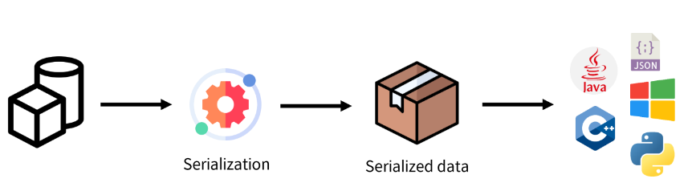
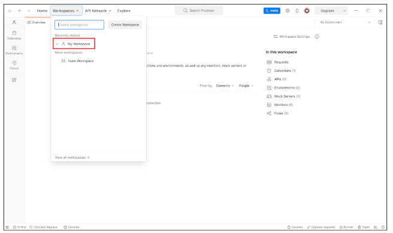
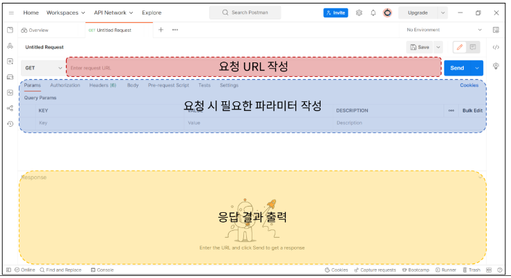

# Rest Framework
## 목차
1. 개요
2. REST API
3. Response JSON
4. Serialization
5. DRF - Single Model
## 학습 목표
* Django Rest Framework를 사용하여 프론트엔드와 백엔드를 분리하고, API를 통한 데이터 통신을 구현할 수 있다.
* Django Rest Framework를 사용하여 RESTful API를 구현할 수 있다.
* Django Rest Framework의 Serializer를 이용하여 데이터 직렬화를 수행해 제공할 수 있다.

# 1. 개요
## HTTP Request Methods
* 리소스(resource, 자원)에 대한 행위(수행하고자 하는 동작)를 정의
* HTTP verbs라고도 함

## 대표 HTTP Request Methods
### 1. GET
* 서버에 리소스의 표현을 요청
* GET을 사용하는 요청은 데이터만 검색해야 함

### 2. POST
* 데이터를 지정된 리소스에 제출
* 서버의 상태를 변경

### 3. PUT
* 요청한 주소의 리소스를 수정

### 4. DELETE
* 지정된 리소스를 삭제

## HTTP response status codes
* 특정 HTTP 요청이 성공적으로 완료되었는지 여부를 나타냄
* 응답은 5개의 그룹으로 나뉨
  1. Informational responses(100-199)
  2. Successful responses(200-299)
  3. Redirection message(300-399)
  4. Clien error responses(400-499)
  5. server error responses(500-599)
* https://http.cat/

# 2. REST API
## API
* Application Programming Interface
* 애플리케이션과 프로그래밍으로 소통하는 방법
* API는 복잡한 코드를 추상화하여 대신 사용할 수 있는 몇가지 더 쉬운 구문을 제공
  * 예를 들어 집의 가전 제품에 전기를 공급해야 한다고 가정해보자
  * 우리는 그저 가전 제품의 플러그를 소켓에 꽃으면 제품이 작동함
  * 중요한 것은 우리가 가전 제품에 전기를 공급하기 위해 **직접 배선을 하지 않는다는 것**
  * 이는 매우 위험하면서도 비효율적인 일

## Web API
* 웹 서버 또는 웹 브라우저를 위한 API
* 현재 웹 개발은 모든 것을 하나부터 열까지 직접 개발하기보다 여러 Open API를 활용하는 추세
* 대표적인 Third Party Open API 서비스 목록
  * Youtube API
  * Naver Papago API
  * Kakao Map API
* API는 다양한 타입의 데이터를 응답
  * HTML, JSON 등

## REST(Representational State Transfer)
* API Server를 개발하기 위한 일종의 소프트웨어 설계 방법론
  * 2000년 로이 필딩의 박사학위 논문에서 처음으로 소개된 후 네트워킹 문화에 널리 퍼짐
* '소프트웨어 아키텍쳐 디자인 제약 모음'
  * (a group of software architecture design constraints)
* REST 원리를 따르는 시스템을 RESTful 하다고 부름
* <u>**"자원을 정의"**</u>하고 <u>**"자원에 대한 주소를 지정"**</u>하는 전반적인 방법을 서술

### REST에서 자원을 정의하고 주소를 지정하는 방법
1. 자원의 식별
  * URI
2. 자원의 행위
  * HTTP Methods
3. 자원의 표현
  * 궁극적으로 표현되는 결과물
  * JSON으로 표현된 데이터를 제공

## REST API
* REST 라는 API 디자인 아키텍처를 지켜 구현한 API
* REST API 예시
  * 카카오 로그인
  * 네이버웍스

# 3. Response JSON
## 서버가 응답하는 것
* 지금까지 Django로 작성한 서버는 사용자에게 페이지(html)만 응답하고 있었음
* 하지만 사실 서버가 응답할 수 있는 것은 페이지 뿐만 아니라 다양한 데이터 타입을 응답할 수 있음
  * html
  * JSON
  * ...
* Django는 더 이상 Template 부분에 대한 역할을 담당하지 않게 되며 Front-end와 Back-end가 분리되어 구성됨

### 실습 사전 준비
* 사전 제공된 99_json_response 프로젝트 준비(21-ex_1-)
* 가상 환경 생성, 활성화 및 패키지 설치
* migrate 진행
  ```console
  $ python manage.py migrate
  ```
* 준비된 fixtures 파일을 load하여 실습용 초기 데이터 입력
  ```console
  $ python manage.py loaddata articles.json
  ```
* https://127.0.0.1:8000/api/v1/articles 요청 테스트

## Django REST framework (DRF)
* Django에서 Restful API 서버를 쉽게 구축할 수 있도록 도와주는 오픈소스 라이브러리
  * https://www.django-rest-framework.org/
* python에서 json 응답 받아보기
* 준비된 python_sample.py 확인
```python
import requests
from pprint import pprint


response = requests.get('http://127.0.0.1:8000/api/v1/articles/')

# json을 python 타입으로 변환
result = response.json()

print(type(result))
# pprint(result)
# pprint(result[0])
# pprint(result[0].get('title'))
```
* 준비된 python_sample.py 실행
```
<class 'list'>
...
```

# 4. Serialization
* "직렬화"
* 여러 시스템에서 활용하기 위해 데이터 구조나 객체 상태를 나중에 재구성할 수 있는 포맷으로 변환하는 과정
  * 즉, 어떠한 언어나 환경에서도 <u>**"나중에 다시 쉽게 사용할 수 있는 포맷으로 변환하는 과정"**</u>



# 5. DRF - Single Model
> 단일 모델의 data를 Serialization하여 JSON으로 변환하는 방법에 대한 학습
### 사전 준비
* 사전 제공된 drf 프로젝트 준비
* 가상 환경 생성, 활성화 및 패키지 설치(pip install djangorestframework)
* migrate 진행
  ```console
  $ python manage.py migrate
  ```
* 준비된 fixtures 파일을 load하여 실습용 초기 데이터 입력
  ```console
  $ python manage.py loaddata articles.json
  ```
* Postman 설치
  * https://www.postman.com/downloads/
* Postman
  * API를 구축하고 사용하기 위한 플랫폼
  * API를 빠르게 만들 수 있는 여러 도구 및 기능을 제공

  
  
  * 화면 구성

  

## ModelSerializer 작성
* articles/serializers.py
  * *serializers.py의 위치나 파일명은 자유롭게 작성 가능
```python
# articles/serializer.py

from rest_framework import serializers
from .models import Article

class ArticleListSerializer(serializers.ModelSerializer):

    class Meta:
        model = Article
        fields = ('id', 'title', 'content')
```
* 모델 필드에 해당하는 필드가 있는 Serializer 클래스를 자동으로 만듦
    1. Model 정보에 맞춰 자동으로 필드 생성
    2. serializer에 대한 유효성 검사기를 자동으로 생성
    3. .create 및 .update()의 기본 구현 메서드가 포함됨
## URL과 HTTP request methods 설계
| | GET | POST | PUT | DELETE |
|:-:|:-:|:-:|:-:|:-:|
| articles/ | 전체 글 조회 | 글 작성 | . | . |
| articles/1/ | 1번 글 조회 | . | 1번 글 수정 | 1번 글 삭제 |

## 5-1. GET - List
* 게시글 데이터 목록 조회하기
```python
# articles/urls.py

urlpatterns = [
    path('articles/', views.article_list),
]
```
```python
# articles/views.py

from rest_framework.response import Response
from rest_framework.decorators import api_view

from .models import Article
from .serializers import ArticleListSerializer


# 4. 해당 VIEW 함수가 어떤 HTTP 요청 메서드를 허용하는지 
# 결정하는 데코레이터 작성(DRF의 VIEW함수에서 필수)
@api_view(['GET'])
def article_list(request):
    # 1. 제공할 게시글 목록 조회
    articles = Article.objects.all()

    # 2. 게시글 목록 데이터를 직렬화(serialization)
    serializer = ArticleListSerializer(articles, many=True)

    # 3. 직렬화된 데이터를 json 데이터로 응답
    return Response(serializer.data)
```

* 응답 확인
  * [GET] http://127.0.0.1:8000/api/v1/articles/
  * postman

## `'api_view'` decorator
* DRF view 함수가 응답해야 하는 HTTP 메서드 목록을 받음
* 기본적으로 GET 메서드만 허용되며 다른 메서드 요청에 대해서는 405 Method Not Allowed로 응답
* DRF view 함수에서는 필수로 작성

## 5-2. GET - Detail
* 단일 게시글 데이터 조회하기
* 각 데이터의 상세 정보를 제공하는 ArticleSerializer 정의
```python
# articles/serializers.py

class ArticleSerializer(serializers.ModelSerializer):

    class Meta:
        model = Article
        fields = '__all__'
```
* url 및 view 함수 작성
```python
# articles/urls.py

urlpatterns = [
    ...
    path('articles/<int:article_pk>/', views.article_detail),
]
```

```python
# articles/views.py

from .serializers import ArticleListSerializer, ArticleSerializer

@api_view(['GET'])
def article_detail(request, article_pk):
    article = Article.objects.get(pk=article_pk)
    serializer = ArticleSerializer(article)
    return Response(serializer.data)
```
* 응답 확인
  * [GET] http://127.0.0.1:8000/api/v1/articles/1/

## 5-3. POST
* 게시글 데이터 생성하기
* 요청에 대한 데이터 생성이 성공했을 경우는 `201 Created`상태 코드를 응답
* 실패했을 경우는 `400 Bad request`를 응답
* view 함수 작성
```python
# articles/view.py

from rest_framework import status   ##

@api_view(['GET', 'POST'])      ##
def article_list(request):
    if request.method == 'GET':     ##
        articles = Article.objects.all()
        serializer = ArticleListSerializer(articles, many=True)
        return Response(serializer.data)

    ##
    elif request.method == 'POST':
        # 사용자 데이터를 받아서 serializer로 직렬화
        serializer = ArticleSerializer(data=request.data)
        # 유효성 검사
        if serializer.is_valid():
            serializer.save()
            # 생성 성공 시 201 응답
            return Response(serializer.data, status=status.HTTP_201_CREATED)
        # 생성 실패 시 400 응답
        return Response(serializer.errors, status.HTTP_400_BAD_REQUEST)
```
* 응답 확인
  * postman > [POST] http://127.0.0.1:8000/api/v1/articles/ > body > form-data > 데이터 입력
  * 데이터 확인

## 5-4. DELETE
* 게시글 데이터 삭제하기
* 요청에 대한 데이터 삭제가 성공했을 경우는 `204 No Content` 상태 코드 응답
```python
@api_view(['GET', 'DELETE'])        ##
def article_detail(request, article_pk):
    article = Article.objects.get(pk=article_pk)
    if request.method == 'GET':     ##
        serializer = ArticleSerializer(article)
        return Response(serializer.data)

    ##
    elif request.method == 'DELETE':
        article.delete()
        return Response(status=status.HTTP_204_NO_CONTENT)
```
* 응답 확인
  * [DELETE] http://127.0.0.1:8000/api/v1/articles/21/

## 5-5. PUT
* 게시글 데이터 수정하기
* 요청에 대한 데이터 수정이 성공했을 경우는 `200 OK` 상태코드 응답
```python
# articles/views.py

@api_view(['GET', 'DELETE', 'PUT']) ##
def article_detail(request, article_pk):
    article = Article.objects.get(pk=article_pk)
    ...
    ##
    elif request.method == 'PUT':
        # 사용자 데이터를 받아서 serializer로 직렬화 + 기존 데이터
        serializer = ArticleSerializer(article, data=request.data)
        # serializer = ArticleSerializer(instance=article, data=request.data)
        if serializer.is_valid():
            serializer.save()
            return Response(serializer.data)
        return Response(serializer.errors, status=status.HTTP_400_BAD_REQUEST)
```
* 응답 확인
  * [PUT] http://127.0.0.1:8000/api/v1/articles/1/
  * 수정된 데이터 확인

# 99. 참고
## `raise_exception`
* is_valid()는 유효성 검사 오류가 있는 경우 ValidationError 예외를 발생시키는 선택적 raise_exception 인자를 사용할 수 있음
* DRF에서 제공하는 기본 예외 처리기에 의해 자동으로 처리되며 기본적으로 HTTP 400 응답을 반환(return 400 생략)
* create, put
```python
# articles/views.py

...
    ...
        if serializer.is_valid(raise_exception=True):
            serializer.save()
            return Response(serializer.data, status=status.HTTP_201_CREATED)
            # return Response(serializer.data)
        # return Response(serializer.eorrors, status=status.HTTP_400_BAD_REQUEST)
```
