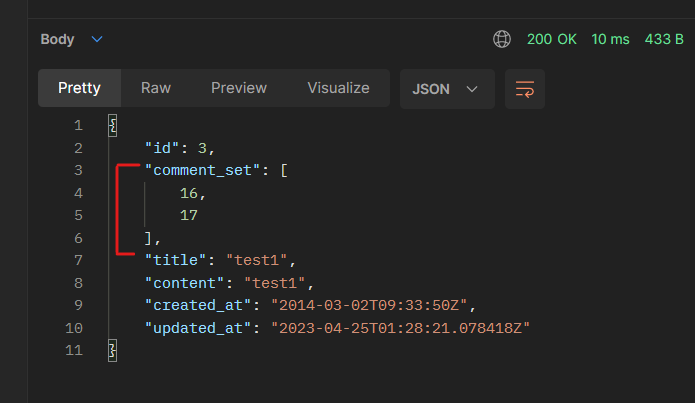
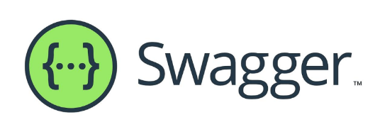

# Djagno rest framework 2
## 목차
1. N:1 Relation
2. N:1 - 역참조 데이터 조회
3. API 문서화

# 1. N:1 Relation
### 사전 준비
* Comment 모델 작성 및 데이터베이스 초기화
```python
# articles/model.py

class Comment(models.Model):
    article = models.ForeignKey(Article, on_delete=models.CASCADE)
    content = models.TextField()
    created_at = models.DateTimeField(auto_now_add=True)
    updated_at = models.DateTimeField(auto_now=True)
```
* Migration 및 features 데이터 로드
```console
$ python manage.py makemigrations
$ python manage.py migrate
$ python manage.py loaddata articles.json comments.json
```
## 1-1. GET -List
* 댓글 데이터 목록 조회하기
```python
# articles/serializers.py

from .models import Article, Comment

class CommentSerializer(serializers.ModelSerializer):

    class Meta:
        model = Comment
        fields = '__all__'
```
```python
# articles/urls.py

urlpatterns = [
    ...,
    path('comments/', views.comment_list),
]
```
```python
# articles/views.py

from .models import Article, Comment
from .serializers import ArticleListSerializer, ArticleSerializer, CommentSerializer


@api_view(['GET'])
def comment_list(request):
    comments = Comment.objects.all()
    serializer = CommentSerializer(comments, many=True)
    return Response(serializer.data)
```
* 응답 확인
  * [GET] http://127.0.0.1:8000/api/v1/comments/

## 1-2. GET - Detail
* 단일 댓글 데이터 조회하기
```python
# articles/urls.py

urlpatterns = [
  ...,
  path('commnets/<int:comment_pk>/', views.comment_detail),
]
```
```python
# articles/views.py

@api_view(['GET'])
def comment_detail(request, comment_pk):
    comment = Comment.objects.get(pk=comment_pk)
    serializer = CommentSerializer(comment)
    return Response(serializer.data)
```
* 응답 확인
  * [GET] http://127.0.0.1:8000/api/v1/comments/1/

## 1-3. POST
* 단일 댓글 데이터 생성하기
```python
# articles/urls.py

urlpatterns = [
  ...,
  path('articles/<int:article_pk>/comments/', views.comment_create),
]
```
```python
# articles/views.py

@api_view(['POST'])
def comment_create(request, article_pk):
    article = Article.objects.get(pk=article_pk)
    serializer = CommentSerializer(data=request.data)
    if serializer.is_valid(raise_exception=True):
        serializer.save()
        return Response(serializer.data, status=status.HTTP_201_CREATED)
```
* save() 메서드는 특정 Serializer 인스턴스를 저장하는 과정에서 추가적인 데이터를 받을 수 있음
* CommentSerializer를 통해 Serialize되는 과정에서 Parameter로 넘어온 article_pk에 해당하는 article 객체를 추가적인 데이터를 넘겨 저장
```python
# articles/views.py

@api_view(['POST'])
def comment_create(request, article_pk):
    ...
        serializer.save(article=article)      ##
        ...
```
* 응답 확인
  * ~~[POST] http://127.0.0.1:8000/api/v1/articles/1/comments/~~
  * 400 Bad Request 에러 발생
    ```
    "article": ["This field is required."]
    ```
    * CommentSerializer에서 article field 또한 사용자로부터 입력 받도록 설정되어 있기 때문
### 읽기 전용 필드 설정
* `read_only_fields`를 사용해 외래 키 필드를 '읽기 전용 필드'로 서렁
* 읽기 전용 필드는 데이터를 전송하는 시점에 **'해당 필드를 유효성 검사에서 제외시키고, 데이터 조회 시에는 출력'**하도록 함
```python
# articles/serializers.py

class CommentSerializer(serializers.ModelSerializer):

    class Meta:
        models = Comment
        fields = '__all__'
        read_only_fields = ('article')
```
* 응답 재확인
  * [POST] http://127.0.0.1:8000/api/v1/articles/1/comments/

## 1-4. DELETE & PUT
```python
@api_view(['GET', 'DELETE', 'PUT'])
def comment_detail(request, comment_pk):
    comment = Comment.objects.get(pk=comment_pk)
    if request.method == 'GET':
        serializer = CommentSerializer(comment)
        return Response(serializer.data)
    elif request.method == 'DELETE':
        comment.delete()
        return Response(status=status.HTTP_204_NO_CONTENT)
    elif request.method == 'PUT':
        serializer = CommentSerializer(comment, data=request.data)
        if serializer.is_valid(raise_exception=True):
            serializer.save()
            return Response(serializer.data)
```
* 응답 확인
  * [DELETE] http://127.0.0.1:8000/api/v1/comments/21/
  * [PUT] http://127.0.0.1:8000/api/v1/comments/22/

# 2. N:1 - 역참조 데이터 조회
## 역참조 상황 2가지
1. 특정 게시글에 작성된 댓글 목록 출력하기
    * 기존 필드 override
      1. PrimaryKeyRelatedField()
      2. Nested relationships
2. 특정 게시글에 작성된 댓글의 개수 출력하기
    * 새로운 필드 추가

## 2-1. 특정 게시글에 작성된 댓글 목록 출력하기
### 2-1-1. PrimaryKeyRelatedField()
* "게시글 조회 시 해당 게시글의 댓글 목록(pk)까지 함께 출력하기"
* Serializer는 기존 필드를 override 하거나 추가적인 필드를 구성할 수 있음
```python
# articles/serializers.py

class ArticleSerializer(serializers.ModelSerializer):
    comment_set = serializers.PrimaryKeyRelatedField(many=True, read_only=True) ##

    class Meta:
        model = Article
        fields = '__all__'
```
* 게시글 detail 조회 시 추가 댓글 데이터 응답 확인



* models.py에서 related_name을 통해 역참조 매니저명 변경 가능
```python
# articles/models.py

class Comment(models.Model):
    article = models.ForeginKey(Article, on_delete=models.CASCADE, related_name='comments')
    ...
```

### 2-1-2. Nested relationships
* 순서 변경 후 중첩
```python
# articles/serializer.py

class CommentSerializer(serializers.ModelSerializer):
    ...


class ArticleSerializer(serializers.ModelSerializer):
    comment_set = CommentSerializer(many=True, read_only=True)  ##
    ...
```
* 모델 관계상으로 참조된 대상은 참조하는 대상의 표현에 포함되거나 중첩(nested)될 수 있음
* 이러한 중첩된 관계는 serializers를 필드로 사용하여 표현 가능
* 모든 필드를 커스텀하지 못하는 문제 발생
  * serializer를 하나 더 만들어서 커스텀해서 중첩시키자!

### 2-2. 특정 게시글에 작성된 댓글의 개수 출력하기
* 새로운 필드 추가 - Article Detail
  * "게시글 조회 시 해당 게시글의 댓글 개수까지 함께 출력하기"
* `source`
  * 필드를 채우는 데 사용할 속성의 이름
  * 점 표기법(dotted notaion)을 사용하여 속성을 탐색할 수 있음

```python
# articles/serializers.py

class ArticleSerializer(serializers.ModelSerializer):
    comment_set = CommentSerializer(many=Ture, read_only=True)
    comment_count = serializers.IntegerField(source='comment_set.count', read_only=True) ##

    class Meta:
        model = Article
        fields = '__all__'
```
* 댓글이 있는 게시글 응답


#### [주의] 읽기 전용 필드 지정 이슈
* 특정 필드를 override 혹은 추가한 경우 read_only_field가 동작하지 않음
```python
## 사용 불가능

class ArticleSerializer(serializers.ModelSerializer):
    comment_set = CommentSerializer(many=Ture, read_only=True)
    comment_count = serializers.IntegerField(source='comment_set.count', read_only=True) ##

    class Meta:
        model = Article
        fields = '__all__'
        read_only_fields = ('comment_set', 'comment_count') ## 사용 불가능
```

* 필요한 Serializer는 내부에서 추가 선언 가능
```python
# articles/serializers.py

class CommentSerializer(serializers.ModelSerializer):

    class ArticleTitleSerializer(serializers.ModelSerializer):
        class Meta:
            model = Aricle
            fields = ('title',)
    
    article = ArticleTitleSerializer(read_only=True)

    class Meta:
        model = Comment
        fields = '__all__'
```

# 3. API 문서화
* API 구조를 안내하는 문서 만들기
## Swagger


* REST 웹 서비스를 설계, 빌드, 문서화 등을 도와주는 오픈 소스 소프트웨어 프레임워크
* 설치 및 등록 https://drf-yasg.readthedocs.io/en/stable/
```console
$ pip install drf-yasg
```
```python
# settings.py

INSTALLED_APPS = [
    ...,
    'drf_yasg',
    ...
]
```
```python
# pjt/urls.py

from rest_framework import permissions
from drf_yasg.views import get_schema_view
from drf_yasg import openapi

schema_view = get_schema_view(
   openapi.Info(
      title="Snippets API",
      default_version='v1',
      description="Test description",
      terms_of_service="https://www.google.com/policies/terms/",
      contact=openapi.Contact(email="contact@snippets.local"),
      license=openapi.License(name="BSD License"),
   ),
   public=True,
   permission_classes=[permissions.AllowAny],
)

urlpatterns = [
    ...,
    path('swagger/', schema_view.with_ui('swagger')),
]
```
* 페이지 확인
  * http://127.0.0.1:8000/swagger/
* 커스텀 해보기

# 99. 참고
## Django shortcuts functions
* render()
* redirect()
* `get_list_or_404()`
  * 모델 manager objects에서 filter()의 결과를 반환하고 해당 객체 목록이 없을 땐 Http404(Not Found)를 raise 함 
* `get_object_or_404()`
  * 모델 manager objects에서 get()을 호출하지만, 해당 객체가 없을 땐 기존 500 DoesNotExist 예외 대신 Http404를 raise 함
```python
# articles/views.py

from django.shortcut import get_object_or_404, get_list_or_404

# before
articles = Article.objects.all()
comments = Comment.objects.all()

article = Article.objects.get(pk=article_pk)
comment = Comment.objects.get(pk=comment_pk)

# after
articles = get_list_or_404(Article)
comments = get_list_or_404(Comment)

article = get_object_or_404(Article, pk=article_pk)
comment = get_object_or_404(Comment, pk=comment_pk)
```
* 적용 전/후 비교
  * 존재하지 않는 게시글 조회시 이전에는 500 DoesNotExist 상태코드를 응답했지만 현재는 404 Not Found 상태코드를 응답

### 왜 사용해야 할까?
* 클라이언트 입장에서 "서버에 오류가 발생하여 요청을 수행할 수 없다(500)"라는 원인이 정확하지 않은 에러를 마주하기 보다는, 서버가 적절한 예외 처리를 하고 클라이언트에게 올바른 에러를 전달하는 것 또한 중요한 요소이기 때문
