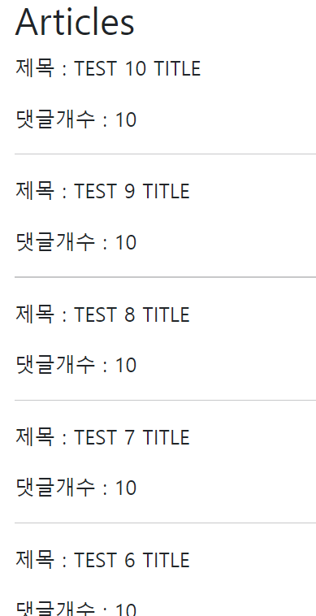
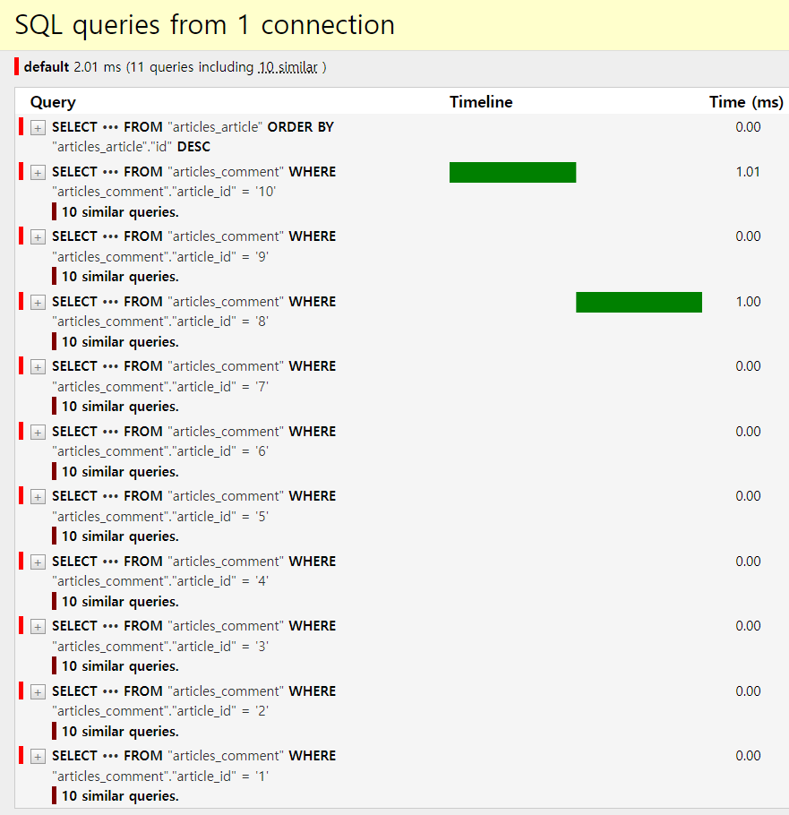
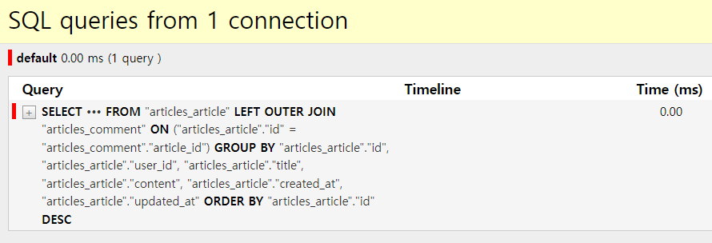
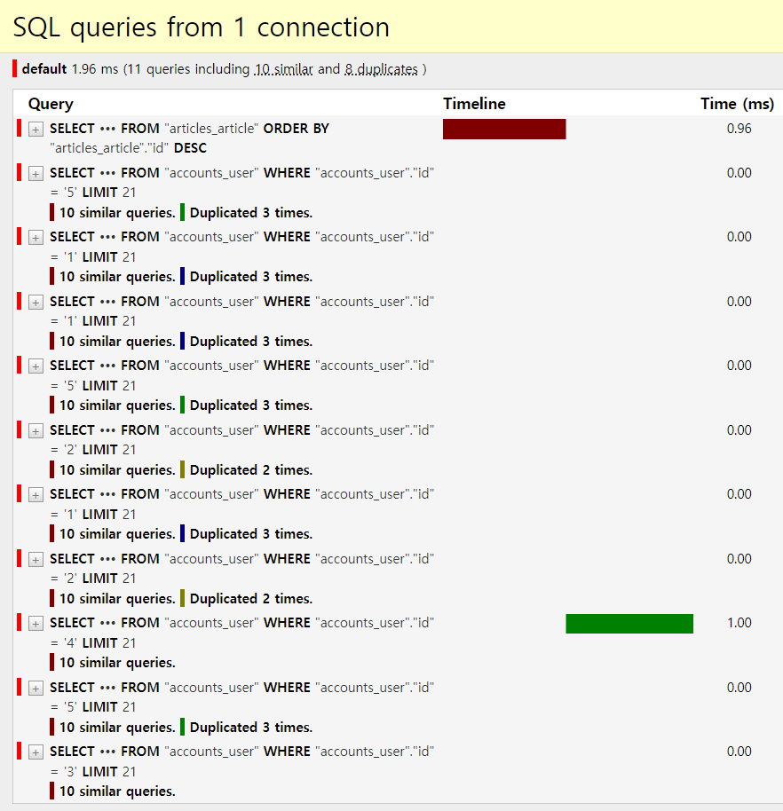
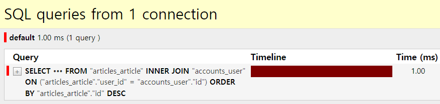
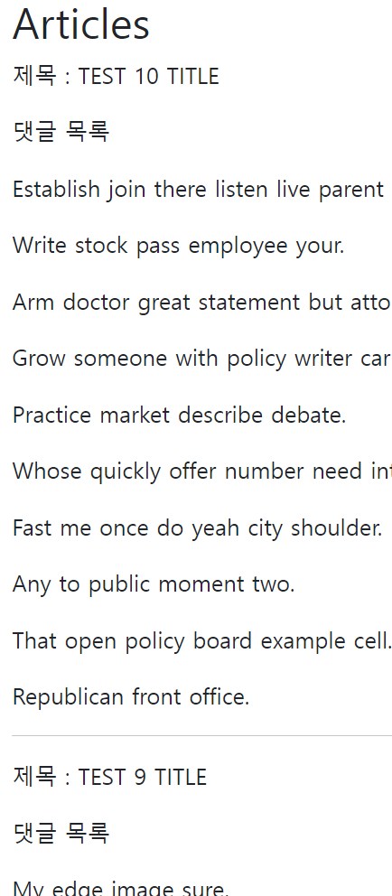
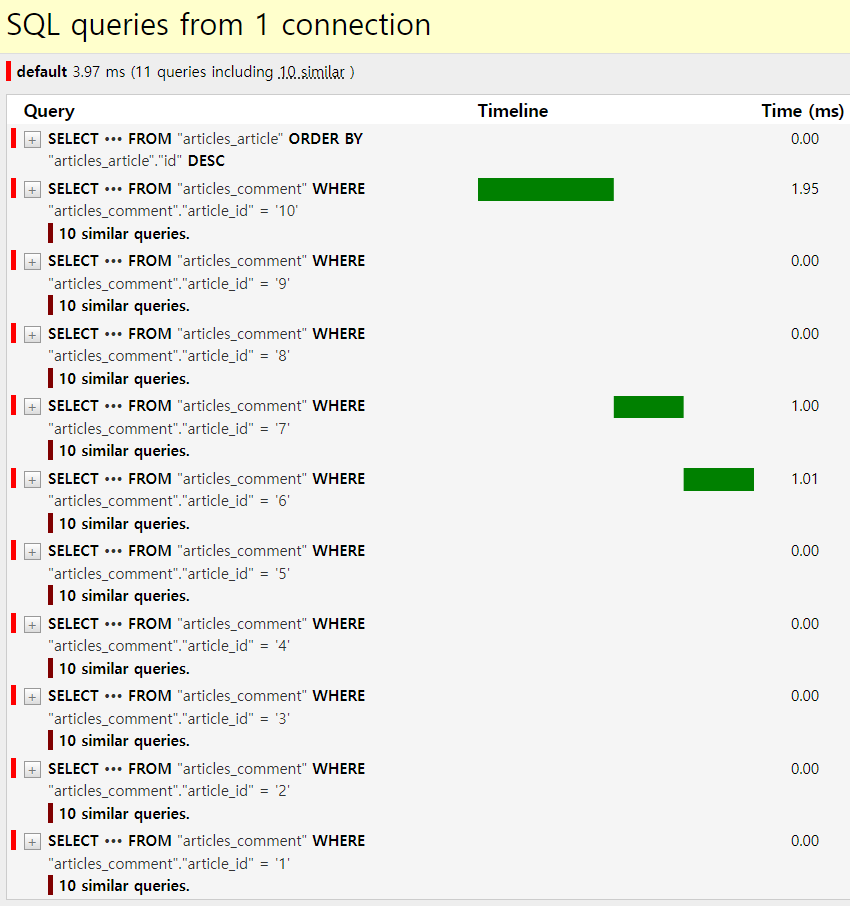
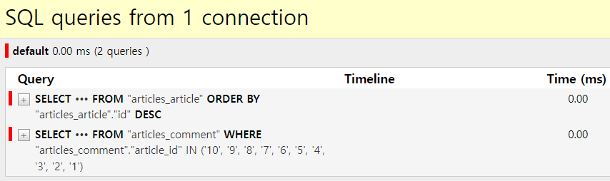
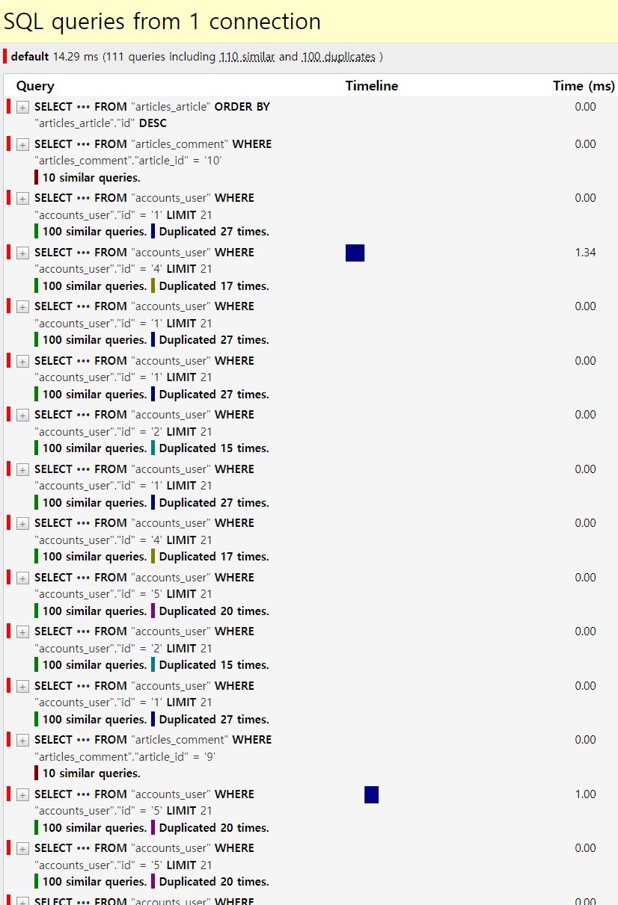
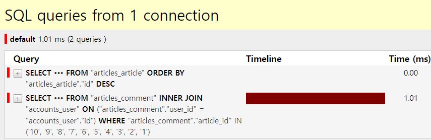

# Improve query
> django-debug-toolbar
# **같은 결과에 대한 쿼리 개수를 줄여 조회하기**

## 사전 준비
* migrate 및 fixtures 데이터 load
```console
$ python manage.py migrate
$ python manage.py loaddata users.json articles.json comments.json

Installed 115 object(s) from 3 fixture(s)
```
* 데이터 현황
  * 게시글 10개
  * 댓글 100개
  * 유저 5개
* 모델 관계
  * N:1 - Article:User / Comment:Article / Comment:Article
  * N:M - Article:User

# 1. annotate
## 1-1. 상황
> http://127.0.0.1:8000/articles/index-1/



* 각 게시글 별 댓글 개수를 반복 평가
## 1-2. 해결
### `.annotate()`
* SQL의 GROUP BY 절을 활용
* 첫 조회 시 댓글 개수까지 한번에 조회
  ```python
  # articles/views.py # index_1()


  # before
  articles = Article.objects.order_by('-pk')

  # after
  articles = Article.objects.annotate(Count('comment')).order_by('-pk')
  ```
  ```django
  {# articles/index_1.html #}


  {# before #}
  <p>댓글개수 : {{ article.comment_set.count }}</p>

  {# after #}
  <p>댓글개수 : {{ article.comment__count }}</p>
  ```
## 1-3. 개선
* "11 query including 10 similar" => "1 query"





# 2. select_related
## 2-1. 상황
> http://127.0.0.1:8000/articles/index-2/


* 각 게시글 출력 후 게시글을 작성한 유저의 이름까지 반복 평가
## 2-2. 해결
### `select_related()`
* **1:1 또는 N:1 참조 관계에서 사용**
* SQL의 INNER JOIN 절을 활용
* article을 조회하면서 user까지 한번에 조회
  ```python
  # articles/views.py # index_2()


  # before
  articles = Article.objects.order_by('-pk')

  # after
  articles = Article.objects.select_related('user').order_by('-pk')
  ```
  ```django
  {# articles/index_2.html #}


  
    <h3>작성자 : {{ article.user.username }}</h3>
    <p>제목 : {{ article.title }}</p>
    <hr>
  
  ```
## 2-3. 개선
* "11 queries including 10 similar and 8 duplicates" => "1 query"





# 3. prefetch_related
## 3-1. 상황
> http://127.0.0.1:8000/articles/index-3/


* 각 게시글 출력 후 각 게시글의 댓글 목록을 개별적으로 모두 조회
## 3-2. 개선
### `prefetch_related()`
* **M:N 또는 N:1 역참조 관계에서 사용**
* SQL이 아닌 Python을 사용한 JOIN이 진행됨
* article을 조회하면서 comment까지 한번에 조회
  ```python
  # articles/views.py # index_3()


  # before
  articles = Article.objects.order_by('-pk')

  # after
  articles = Article.objects.prefetch_related('comment_set').order_by('-pk')
  ```
  ```django
  {# articles/index_3.html #}


  
    <p>제목 : {{ article.title }}</p>
    <p>댓글 목록</p>
    
      <p>{{ comment.content }}</p>
    
    <hr>
  
  ```
## 3-3. 변화
* "11 queries including 10 similar" => "2 queries"





# 4. select_related & profetch_related
## 4-1. 상황
> http://127.0.0.1:8000/articles/index-4/


* 게시글 출력 + 각 게시글의 댓글 목록 + 댓글의 작성자를 단계적으로 평가
## 4-2. 개선
### `select_related` & `profetch_related`
* 게시글 출력 + 각 게시글의 댓글 목록 + 댓글의 작성자를 **한번에** 조회
  ```python
  # articles/views.py # index_4()


  # before
  articles = Article.objects.order_by('-pk')

  # after 1
  articles = Article.objects.prefetch_related('comment_set').order_by('-pk')

  # after 2
  articles = Article.objects.prefetch_related(
      Prefetch('comment_set', queryset=Comment.objects.select_related('user'))
  ).order_by('-pk')
  ```
  ```django
  {# articles/index_4.html #}


  
    <p>제목 : {{ article.title }}</p>
    <p>댓글 목록</p>
    
      <p>{{ comment.user.username }} : {{ comment.content }}</p>
    
    <hr>
  
  ```
## 4-3. 변화
* "111 queries including 110 similar and 100 duplicates" => "2 queries"





# 99. 섣부른 최적화를 하지 말자
> "작은 효율성(small efficiency)에 대해서는 잊어버려라. <br>
> 섣부른 최적화(premature optimization)는 모든 악의 근원이다."
> - 

> 도널드 커누스(Donald E. Knuth)

* 현재 수준에서는 참고만 하고 나중에 효율을 따져야 할 시기에 사용