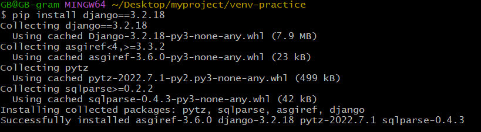

# Django Setting
## 1. 가상환경 생성
- ```console
  $ python -m venv venv
  ```
  * 가상환경 이름: `venv`

## 2. 가상환경 활성화
* ```console
  $ source venv/Srcripts/activate 
  ```
  * 비활성화: `$ deactivate`
* MacOS
  ```console
  $ source venv/bin/activate
  ```

* vscode
  * `Ctrl + Shift + P` > `Python: Select Interpreter` > 알맞은 환경 경로 선택

* 현재 설치된 패키지 확인
  ```console
  $ pip list
  ```

## 3. django 설치
* ```console
  $ pip install django==3.2.18  
  ```
  * 2023/03/20 기준 LTS: 3.2
  
* 설치 완료 화면
  
  
  

## 4. 의존성 파일 생성
* ```console
  $ pip freeze > requirements.txt
  ```
  * 패키지 설치마다 진행
  * `requirements.txt` 파일 생성

* 새로운 환경 혹은 환경 재설정 시 패키지 목록 설치
  ```console
  $ pip install -r requirments.txt
  ```

## 5. django 프로젝트 생성
* ```console
  $ django-admin startproject firstpjt .
  ```
  * `firstpjt` 이름의 프로젝트 생성

## 6. django 서버 실행
* gitbash 또는 vscode terminal에서 실행
* ```console
  $ python manage.py runserver
  ```
  * `manage.py`와 동일한 경로에서 명령어 진행
  * `db.sqlite3`파일 생성
  * 서버 실행 화면(VS code)

  
    * *(아직 작성한 것이 없어서 빨간글씨가 나옴)*
  
  * http://127.0.0.1:8000/ 접속 후 로켓 발사 화면 확인
    
* 서버 중지
  * `Ctrl + c`

## git 초기설정
* gitignore 작성
  * [gitignore.io](https://www.toptal.com/developers/gitignore/) 활용


* `.gitignore` 파일 생성

## Directory Tree
```
│  db.sqlite3
│  manage.py
│  requirements.txt
│  tree.txt
│  
├─firstpjt
│  │  asgi.py
│  │  settings.py
│  │  urls.py
│  │  wsgi.py
│  │  __init__.py
│  │  
│  └─__pycache__
└─venv
    │  pyvenv.cfg
    │  
    ├─Include
    ├─Lib
    │  └─site-packages
    │                  
    └─Scripts
        │  activate
        │  activate.bat
        │  Activate.ps1
        │  deactivate.bat
        │  django-admin.exe
        │  django-admin.py
        │  pip.exe
        │  pip3.10.exe
        │  pip3.11.exe
        │  pip3.exe
        │  python.exe
        │  pythonw.exe
        │  sqlformat.exe
        │  
        └─__pycache__
```
* 일부 생략