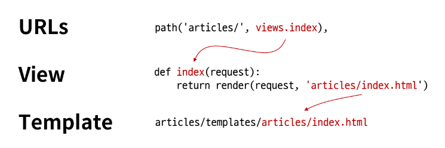

# 요청과 응답
## URLs
```py django
# firstpjt/urls.py

from django.contrib import admin
from django.urls import path
# urls.py 입장에서는
# articles라는 패키지에서
# view라는 모듈을 가져오는 것
from articles import views ## 직접 작성

urlpatterns = [
    path('admin/', admin.site.urls),
    path('articles/', views.index), ##
]
```
* http://128.0.0.1:8000/article/ 로 요청이 왔을 때  \
**views** 모듈의 **index** 뷰 함수를 호출한다는 뜻

## View
```py
# apps/views.py

from django.shortcuts import render

# Create your views here.
# 특정 기능을 수행하는 view 함수들을 작성
# 모든 view 함수는 첫번째 인자로 요청 객체를 필수적으로 받는다
##
def index(request):
    return render(request, 'articles/index.html')
```
* 특정 경로에 있는 **template**과 **request 객체**를 결합해  \
응답 객체를 반환하는 index 뷰 함수 정의

## Template
* articles 앱 폴더안에 templates 폴더 생성
  ```
  articles
  ├─ templates
  │  ├─ articles
  │     │ index.html
  ```
    * 반드시 `templates` 폴더명이여야 하며 개발자가 직접 생성해야함

## 데이터 흐름에 따른 코드 작성
* URLs -> View -> Template

