# Model Guide
* 앱 등록을 안했으면 등록 후 마이그레이션을 진행해야 함
### 앱 생성 및 등록
* 앱 생성
  ```console
  $ python manage.py startapp articles
  ```
* 앱 등록
  ```py
  # mypjt/settings.py

  INSTALLED_APPS = [
    'articles',
    ...
  ]
  ```

# 모델 마이그레이션
* [테이블 필드의 데이터 타입](https://docs.djangoproject.com/en/3.2/ref/models/fields/)
* `article/models.py`에 model class 작성
  ```py
  # article/models.py

  from django.db import models

  class Article(models.Model):
      '''
      필드 이름(변수명) / 데이터 타입(모델 필드 클래스) / 제약조건(모델 필드 클래스의 키워드 인자)
      '''
      title = models.CharField(max_length=10) # 길이 제한
      content = models.TextField() # 길이 제한 없음
  ```
- model class를 기반으로 설계도(migration) 작성
  ```console
  $ python manage.py makemigrations
  ```
  * `articles\migrations\0001_initial.py` 파일 생성

  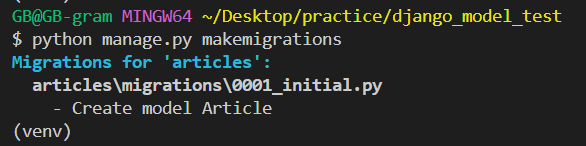

* 만들어진 설계도를 DB에 전달하여 반영
  ```console
  $ python manage.py migrate
  ```
  * 첫 migrate는 결과가 길다.

  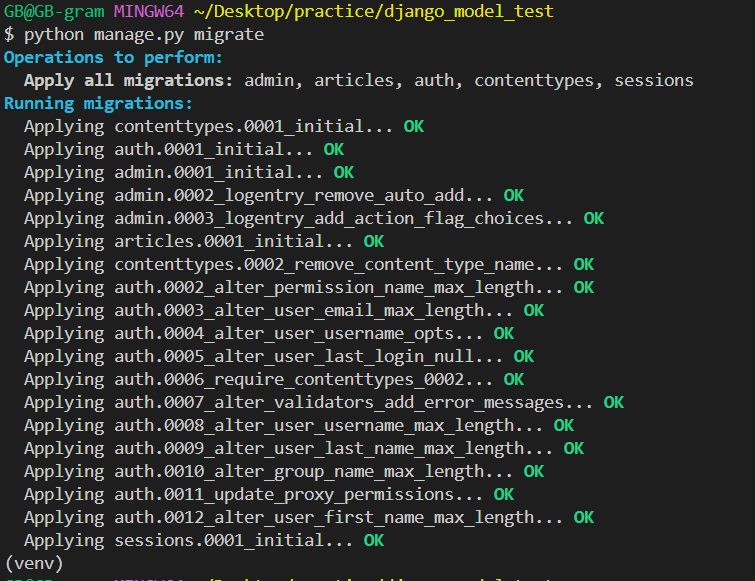

* `./db.aqlite3` 파일 확인

  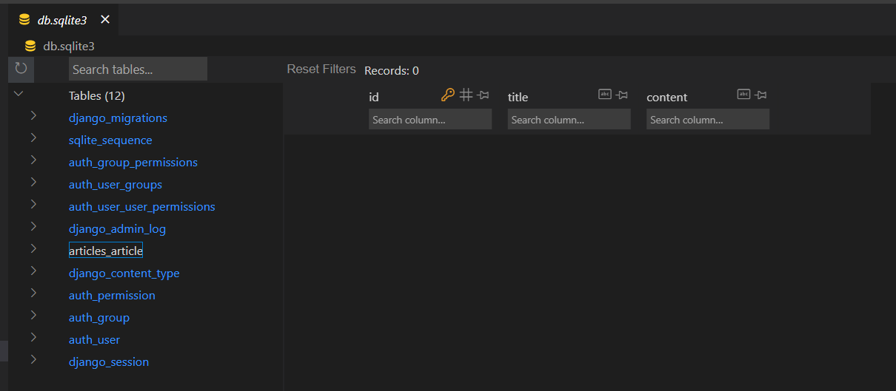

# 모델 필드 추가
* 이미 생성된 테이블에 필드를 추가할 경우
* model class에 추가 필드 작성
  ```py
  # article/models.py

  class Article(models.Model):
    ...
    created_at = models.DateTimeField(auto_now_add=True)
    updated_at = models.DateTimeField(auto_now=True)
  ```
* makemigrations
  ```console
  $ python manage.py makemigrations
  ```
* default옵션 선택

  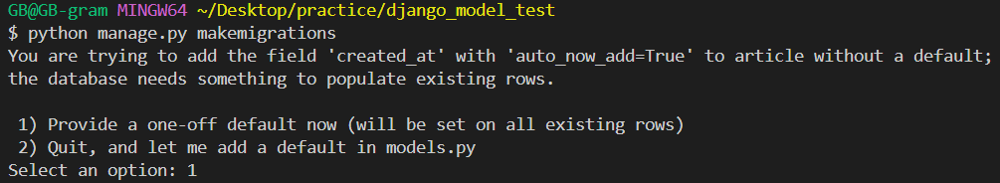

  * 1: 직접 기본 값 (default=)을 입력하는 옵션을 선택했을 때
    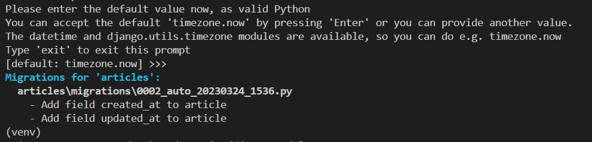
    * terminal에 기본값 입력
    * 날짜 데이터인 경우 아무것도 입력하지 않고 enter를 누르면 django가 제안하는 기본 값(`timezone.now`)으로 설정
  * 2: 현재 대화에서 나간 후 models.py에 기본 값 관련 설정
* migration 파일이 생성됨

  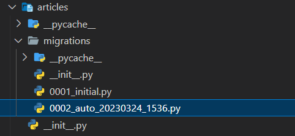

* migrate
  ```console
  $ python manage.py migrate
  ```
  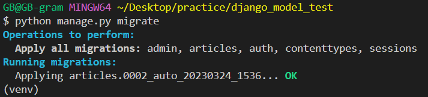
* `./db.aqlite3` 파일 확인

  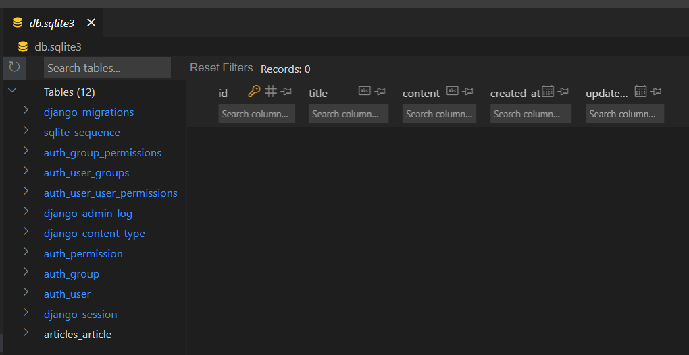

# 관리자 계정 생성
* 마이그레이션을 진행 후 계정을 생성해야 함
* admin 계정 생성
  ```console
  $ python manage.py createsuperuser
  ```
  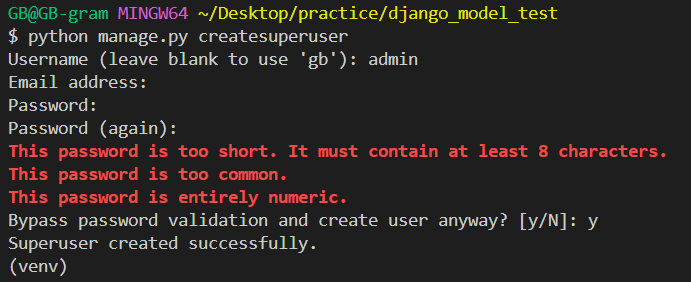
  * email은 선택사항이기 때문에 입력하지 않고 진행 가능
  * 비밀번호 생성 시 보안상 터미널에 출력되지 않으니 무시하고 입력을 이어가도록 함

# 관리자 페이지 모델 등록
* admin에 모델 클래스 등록
  ```py
  # articles/admin.py

  from django.contrib import admin
  from .models import Article

  admin.site.register(Article)
  ```

# 관리자 페이지 접속
* http://127.0.0.1:8000/admin/
  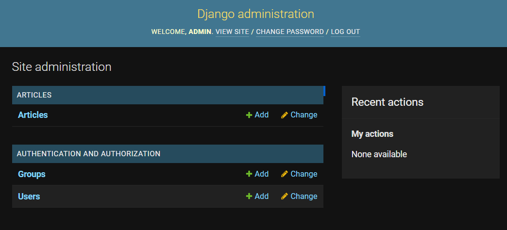
  * CRUD 가능

# 데이터베이스 파일 접근
* `./db.aqlite3` 파일 확인

  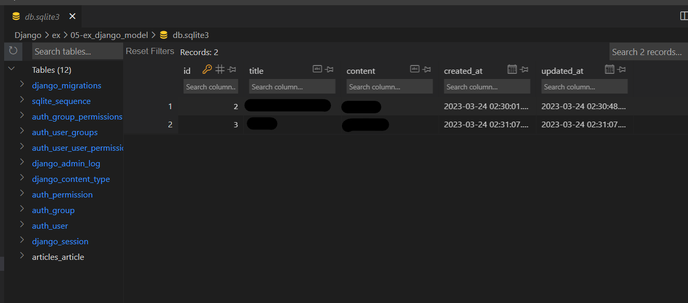

