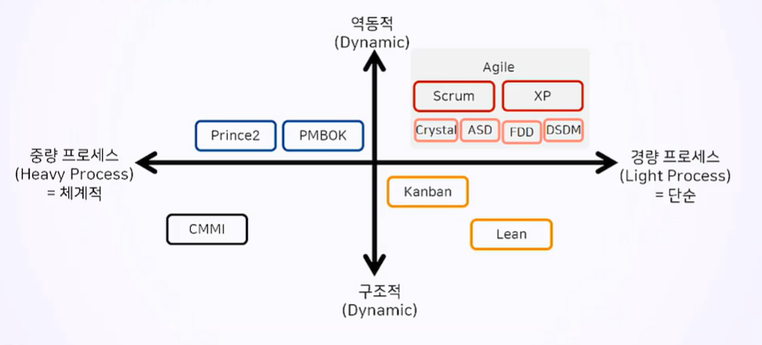

# 프로젝트 관리 방법론 소개
## 목차
1. 프로젝트 관리 지식 개요
2. 애자일 지식의 발전 과정
## 학습 목표
* 전통적 프로젝트 관리 지식의 발전 과정과 애자일 프로젝트 관리 지식의 등장 배경을 이해합니다.
* 초기에 애자일 프로젝트 관리 지식은 전통적 프로젝트 관리 지식에 대항하는 관점으로 발전하였습니다.
* 애자일은 여러 종류가 있으나 스크럼이 가장 대표적인 방법론입니다.
* 현재는 PMBOK와 Prince2를 통해서 강화되고 기존 방법론을 보완하는 지식으로 인정받고 있습니다.

# 1. 프로젝트 관리 지식 개요
## 간트 차트
## PERT, CPM(Critical Path Method)
* 프로세스 관리
## 역사
* 1969년 Project Management Institute(PMI) 설립됨
* 1984년 Microsoft가 Microsoft Project를 출시함
* 1996년 PMI(Project Management Institute)가 Project Management Body of Knowledge(PMBOK) 1st Edition을 출간함(현재는 6th)
## 방법론이란?
* 프로젝트를 성공적으로 관리하기 위한 검증된 지식 체계
  * 가치를 창출하기 위한 일련의 **프로세스(Process)와 도구(Tools) 및 기법(Techniques)**
  * 프로젝트의 **산출물(Deliverable)** 목록과 관리 체계
  * 업무 수행과 통제를 위한 **지침(Guideline)**
## 프로젝트 관리 방법론(Project Management Methodology)

* agile은 **역동적**이고 **경량 프로세스**

### PMBOK(Project Management Body of Knowledge)
* 프로젝트 관리 지식 체계
* 전세계적으로 가장 많이 알려진 방법론의 Global Standard임
* 2012년 9월 ISO(international Organization for Standardization, 국제표준화기구)에 ISO 21500 인증을 받았음
* 모든 프로젝트에 적용할 수 있는 가장 일반화된 지식이며, 프로젝트 관리자에게 필요한 **최소한의 기본지식**을 소개함
* **애자일(Agile), 예측형(Predictive), 하이브리드(Hybrid)** 등 다양한 방법론을 유연하게 적용하여 프로젝트를 성공적으로 완수할 수 있는 가장 포괄적인 지식 체계를 제공함
* 프로젝트 관리자(PM)에게 필요한 전문성을 획기적으로 강화할 수 있음
  * 전략과 비즈니스 관리
  * 기술적 프로젝트 관리 지식
  * 리더십
* 범위(Scope), 일정(Schedule), **리스크(Risk)** 관리
### PRINCE2(PRoject IN Controlled Enviroments)
* 통제된 환경에서의 프로젝트

## 예측형(Waterfall)과 애자일(Agile)
### 예측형
* 범위가 명확할 때
### 애자일
* 기능(Features)에 우선순위를 정하고 자원(Resources)과 시간(Time)내에 진행
  * 모든 기능을 구현x
  * **변경 가능성, 불확실성**

# 2. 애자일 지식의 발전 과정

# 99. Summary
* 프로젝트 범위의 변경 가능성과 불확실성이 크고 창의적인 구현을 필요로 할 때 적용함.
* 프로젝트 전 단계에 걸쳐 요구사항을 계속 추가하며, 문서 격식주의를 최소화하고 개발 단계에서 개발자 중심으로 프로젝트 작업을 진행함.
* 창의적으로 범위를 구현하는데 초점을 맞춤.