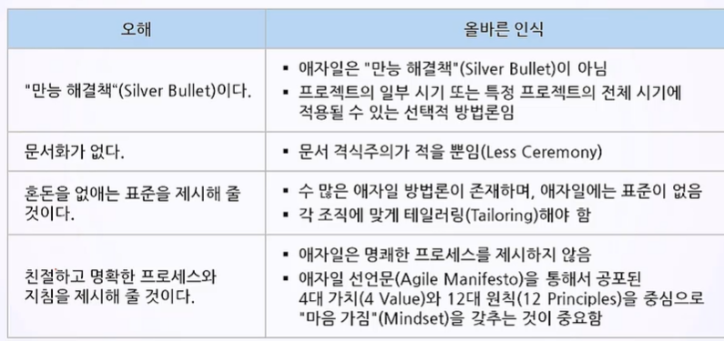
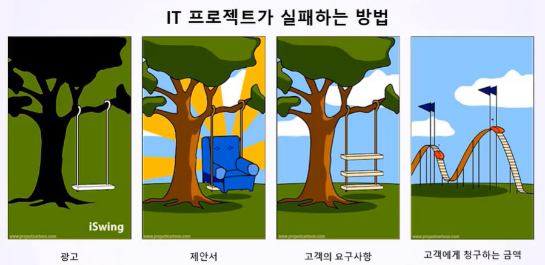
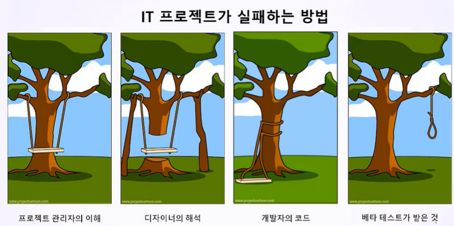
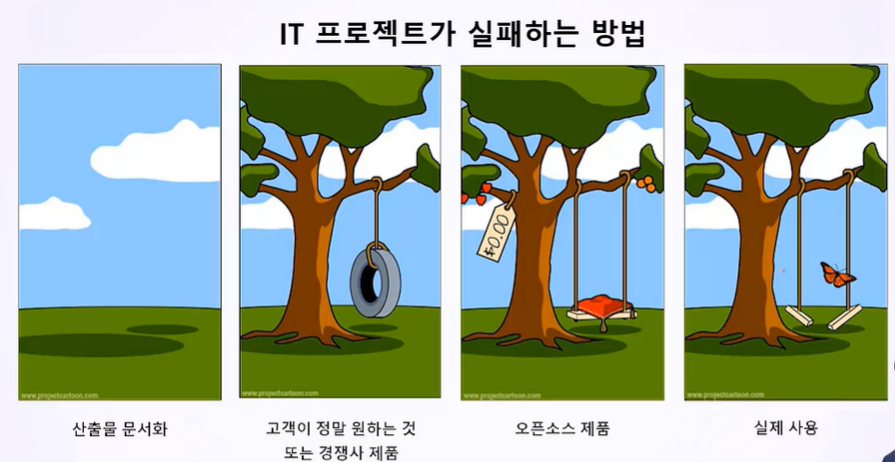
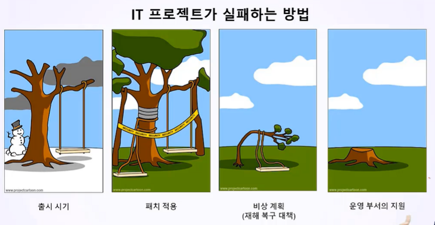

# 애자일 프로젝트 개요
## 목차
1. 애자일 소개(Introducing Agile)
2. 애자일 프로젝트의 특징
## 학습 목표
* 애자일 프로젝트의 의미를 이해할 수 있습니다.
* 애자일 프로젝트의 특징을 이해하고 애자일 프로젝트의 목표를 올바르게 설정할 수 있습니다.

# 1. 애자일 소개
* 신속하고(Fast) 변화에 유연하여(Flexible to Change) 적응적인(Adaptive) 개발을 목표로 하는 다양한 경량(Light) 개발 방법론 전체를 일컫는 종칭
* 증분(Increment)이라는 여러 하위 프로젝트를 통해서 점진적으로 프로젝트 범위와 일정을 개발하고 프로젝트 산출물을 빠르게 인도(Fast Delivery)
* 반복(Iteration)이라 불리는 단기 단위를 채용함으로써 리스크(Negative Risk)를 최소화

## 애자일의 오해

## 모든 애자일 방법론의 공통점
* **고객**이 프로젝트에 적극 참여함(Customer is an active participant)
* 프로젝트의 **리스크**를 관리함(Manage Project)
* 역동적인 일정 관리에 초점을 맞춤(Focus on Dynamic Schedule Management)
* 반복(Iteration)에 기반한 프로세스를 활용함(Follows Processes based on Iteration)
* 문서보다는 **대화**
* **개발팀의 협업**에 초점을 맞춤

## 애자일의 기대효과
* 요구사항의 추가
* 빠르고 지속적인 고객 피드백
* 권한을 강화(Empowering)
* 진척 상황에 대한 높은 가시성과 영향력으로 조기에 문제를 감지함
* 여러 번의 증분(Increment) 인도 방식으로 제품과 프로세스의 낭비를 감소시킴

# 2. 애자일 프로젝트의 특징

* ~~ht<area>tp://www.projectcartoon.com~~(없어짐)

## IT 프로젝트 실패의 교훈
* 고객은 자기가 진짜 원하는 것을 올바로 제시하지 못함
  * 요구사항(Requirements)과 기대사항(Expectations)을 구분해야 함
* IT 프로젝트 = **팀 플레이**
  * T자형 인재(1인 다역)들이 공통된 역량을 갖추어야 함
  * 자기 조직화 팀(Self Organiaing Team)이 되어야 함
* 산출물을 관리해야 함
  * 애자일에서도 산출물 문서는 매우 중요함
  * 상황을 정확하게 공유하고 시각화해야 함
* 요구사항 정의는 **프로젝트 팀이 주도**해야 함
  * 고객의 요구사항이 재미라고 주장했을 때 안전이라는 **교차 기능 요구사항(Cross Functional Requirements)**을 정의할 수 있어야 함
  * 핵심 요구사항을 프로젝트 전 단계에 걸쳐 발전시켜야 함
* IT 프로젝트에서 가장 중요한 것은 리스크 관리 역량
  * 프로젝트 목표에 영향을 주는 변수를 파악하고 관리해야 함
  * 리스크 관리의 명확한 원칙이 포함된 **프로젝트 리스크 관리 계획**을 수립함
  * 리스크 식별 정보, 정성적 분석, 정량적 분석, 예방 계획, 비상 계획이 포함된 **리스크 대응 계획**을 수립함
  * 리스크 보고서와 대시보드를 관리하고 예방 조치와 비상 조치를 실시함
# 99. 정리
* 신속하고(Fast) 변화에 유연하여(Flexible to Change) 적응적인(Adaptive) 개발을 목표로 하는 다양한 경량(Light) 개발 방법론 전체를 일컫는 종칭
* 증분(Increment)이라는 여러 하위 프로젝트를 통해서 점진적으로 프로젝트 범위와 일정을 개발하고 프로젝트 산출물을 빠르게 인도(Fast Delivery)
* 반복(Iteration)이라 불리는 단기 단위를 채용함으로써 리스크(Negative Risk)를 최소화
* 1차 목표는 "프로젝트 리스크 관리"(Project Risk Management)
* 2차 목표는 "프로젝트 일정 관리"(Project Schedule Management)

> 실패를 장려하고, 웃으면서 배우고, 서로 격려해주는 자기조직화 팀. 
> 함께 실패를 통해 익힌 노하우, 배운 교훈들을 공유해 나가는 T자형 인재. 
> 이런 인재들이 협업 프로세스를 통해서 리스트를 완화할 수 있는 Iteration 프로세스를 만들어 내고, 
> 이런 역동적인 프로세스를 통해서 약속된 시점에 결과물을 인도