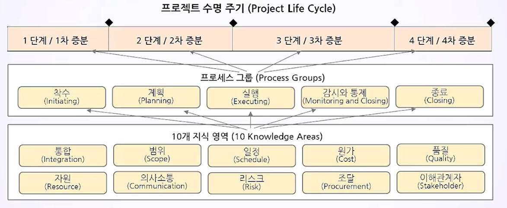
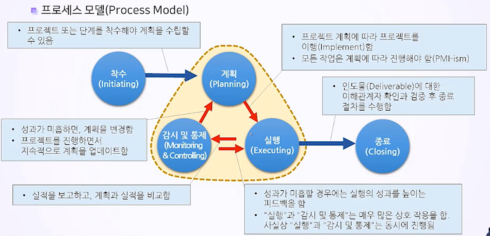

# 프로젝트 라이프 사이클의 이해
## 학습 내용
1. 프로젝트 라이프 사이클(Project Life Cycle)의 기초
2. 예측형 프로젝트 관리 vs 적응형 프로젝트 관리
3. 예측형 라이프 사이클(Predictive Life Cycle)
## 학습 목표
* 프로젝트 라이프 사이클의 개념을 이해합니다.
* 예측형과 비교하여 애자일(적응형) 라이프 사이클의 고유한 특징을 파악할 수 있습니다.
* 예측형 라이프 사이클이 유리한 경우를 설명할 수 있습니다.

# 1. 프로젝트 라이프 사이클(Project Life Cycle)의 기초
## PMBOK(Project Management Body of Knowledge)

## 프로세스 모델(Process Model)

## 프로젝트 라이프 사이클
* **프로젝트 라이프 사이클에서의 단계는 순차적일 수도 있고, 반복적일 수도 있고, 또는 중첩될 수도 있음**
* 프로젝트 수명 주기의 각 단계를 어떻게 구성할 것인가는 다음과 같은 요인에 따라 결정됨
  * 프로젝트 참여 조직이 프로젝트를 얼마나 통제할 의지가 있는가
  * 프로젝트의 성격
  * 적용 분야

## 프로젝트 단계(Project Phases)
* 의사소통의 기준 제공
* **논리적으로 연관된 프로젝트 활동들로 구성**되며, 한 개 이상의 **인도물**이 완성되면 끝남
* 프로젝트 단계는 필요한 자원의 종류와 역량을 구분하는 데 도움이 됨
* 프로젝트 단계의 종류
  순차적 관계 (Sequential Relationship) | 중첩 관계(Overlapping Relationship)  = 패스트 트래킹(Fast Tracking)
  :-:|:-:
  이전 단계가 완료되어야만 다음 단계를 시작할 수 있음 | 추가적인 노력과 비용(시간, 물량)이 필요할 수 있음
  불확실성이 감소하지만, 전체 일정이 늘어날 수 있음 | 재작업의 리스크가 증가할 수 있음

## 단계 게이트(Phase Gate)
* 단계 게이트 = 프로젝트 게이트(Project Gate) = 마일스톤(Milestone)
* **진행 중인 활동을 재평가하는 시점**(필요하면 프로젝트를 변경하거나 종료하는 시점)
  * 다음 단계로 계획대로 진행할 수도 있음
  * 계획의 수정 후 계속 진행할 수도 있음
  * 프로그램 또는 프로젝트를 종료할 수도 있음
* 각 단계의 끝에 마일스톤을 배치하여 선행 작업들의 완료(Complete, Done) 여부를 검증함
* 중간 산출물의 확정 여부에 대해서 고객 또는 경영진의 승인이 필요 시점에서 마일스톤을 배치함
* 마일스톤만 보면 프로젝트의 주요 체크 포인트를 한눈에 볼 수 있어야 함

## 일반 라이프 사이클(Generic Life Cycle)
* 특징
  * **진도율, 작업량, 비용은 누적으로 검토하여 관리해야 하며, 이를 <u>S Curve</u>라고 부름
  * 리스크, 이해관계자의 영향력, 변경 가능성은 프로젝트 후반부로 갈수록 줄어듦
  * 변경 비용, 프로젝트 성공 가능성은 프로젝트 후반부로 갈수록 높아짐

* 일반적 라이프 사이클 구조(Structure)의 단계 
  * 프로젝트 시작(Starting the project)
  * 구성 및 준비(Organizing and preparing)
  * 프로젝트 작업 수행(Carrying out the project work)
  * 프로젝트 종료(Closing the project)
<!--  -->
# Summery
* 일반적 라이프 사이클(Generic Life Cycle)
    1. 모든 프로젝트는 일반적 라이프 사이클 구조로 되어 있음
    2. 일반적 라이프 사이클에서 진도율, 작업량, 비용은 누적으로 검토하여 관리해야 하며, 이를 S Curve라고 부름
* 프로젝트 관리 방법론은 예측형 라이프 사이클(Predictive Life Cycle) 또는 적응형 라이프 사이클(Adaptive Life Cycle)에 기반
* 예측형 라이프 사이클(Predictive Life Cycle) = 완전 계획 주도식 라이프 사이클(Fully Plan-driven Life Cycle) = 확정적 라이프 사이클 = 폭포수 모델(Waterfall Model)
* 예측형 라이프 사이클의 특징
    1. 매우 체계적인 계획 수립
    2. 변경의 최소화