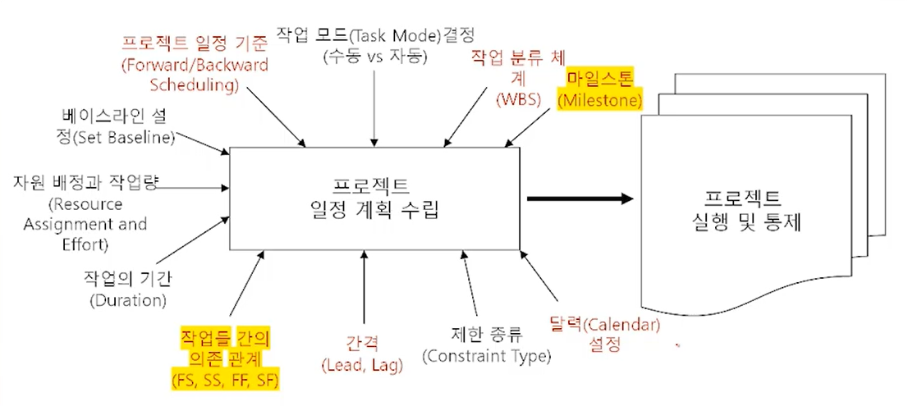
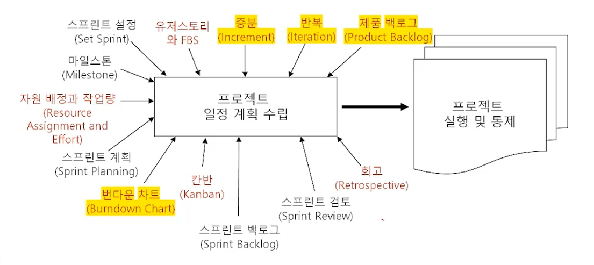

# 적응형 라이프 사이클(III)
## 학습 내용
1. 하이브리드 라이프 사이클(Hybrid Life Cycle)
2. 일정 모델: 예측형 vs 적응형
## 학습 목표
* 하이브리드 라이프 사이클(Hybrid Life Cycle)의 조합 방식을 이해합니다.
* 예측형과 적응형(애자일)에 관한 일정 모델의 키워드를 이해합니다.

# 1. 하이브리드 라이플 사이클(Hybrid Life Cycle)
* 혼합형 라이프 사이클
* 각 프로젝트마다 최고의 라이프 사이클을 선택하는 것은 프로젝트 관리팀에게 달려있음
* **프로젝트에 특성에 따라 적합한 최적의 프로젝트 라이프 사이클을 선택해야함**

## 1-1. 선 애자일 개발 후 예측형 진행 접근법
> Agile - Agile - Agile / Predictive - Predictive - Predictive
* 하이브리드 라이프 사이클의 가장 기본적이고 순수한 형태
* **프로젝트 개발 범위의 불확실성(Uncertainty), 복잡성(Complexity), 리스크(Risk)가 존재할 때 활용함**
* 예시
  * 초기에 신기술이 포함되는 제품 개발을 진행하고 후반부에 제품 배포와 수 천명의 사용자를 대상으로 교육을 진행하는 프로젝트

## 1-2. 애자일과 예측형 동시 진행 접근법
> Agile - Agile - Agile  
> Predictive - Predictive - Predictive
* 프로젝트 전 기간을 걸쳐서 애자일과 예측형을 병행
* 조직 구성원들을 나눔
* 애자일로 하는 작업
  * 짧은 반복(Short Iterations)
  * 일일 기립 회의(Daily Standups)
  * 회고(Retrospective)
* 예측형으로 하는 작업
  * 하향식 작업량 산정과 원가 산정(Upfont Estimation)
  * 작업 배정(Work Assignment)
  * 진행 상황 추적과 보고(Tracking)
* 동시 진행 하이브리드 방식은 프로젝트 팀이 점진적으로 애자일로 전환해 나가는데 도움되며, 매우 일반적인 시나리오임
* 예시
  * 고객의 상위 수준 요구사항을 만족하면서, 프로젝트 팀이 자율적으로 작업을 수행하는 프로젝트 팀
## 1-3. 부분적 애자일과 전체적 예측형 접근법
* Predominantly Predictive Approach with Some Agile Components
* 일부 범위 추가의 불확실성, 복잡성, 리스크가 존재하는 특정 시기에만 애자일 접근법으로 진행함
* 프로젝트 전 시기에 걸쳐 대부분의 작업들은 예측형 접근법으로 진행함
* 예시
  * 새로운 기능이 포함된 시설물 개발과 시공을 진행하는 엔지니어링 회사의 프로젝트
  * 프로젝트 대부분의 작업들은 과거에 수행해 본 적이 있는 일상적이고 반복적인 작업들로 진행함
  * 단열과 방수를 강화한 새로운 지분 공사 자재를 시공하기로 하고, 조기에 이슈를 발견하고 최상의 설치 공법을 결정하기 위하여 지상에서 일부 소규모 설치 시범을 애자일 접근법으로 진행함
  * 발견된 이슈를 해결하기 위한 실험 및 적용 작업을 진행한 후에 기존 프로세스를 개선하여 본 설치 공사 작업을 진행함

## 1-4. 부분적 예측형과 전체적 애자일 접근법
* Largely Agile Approach with Some Predictive Components
* 애자일 접근법으로만 진행하면, 협상 불가(Non-negotiable)이거나 실행 불가(Non-executable)인 프로젝트의 특정 구성 요소에 대해서만 이 접근법을 사용함
* 프로젝트의 전 시기에 걸쳐 대부분의 작업들은 애자일 접근법으로 진행함
* 외주로 진행하는 하위 프로젝트(sub-Project)는 발주자의 관점으로 예측형 접근법을 사용해야 함
* 예시
  * 상호협력적으로 또는 점진적으로 개발이 어려운 타 벤더 외주 제품이나 서비스를 프로젝트의 본 제품과 통합하는 프로젝트
  * 벤더로 부터 외주 제품이나 서비스를 인도 받은 후에 일회의 통합 작업을 진행함

# 2. 일정 모델
## 2-1. 예측형 일정 모델

## 2-2. 적응형 일정 모델

