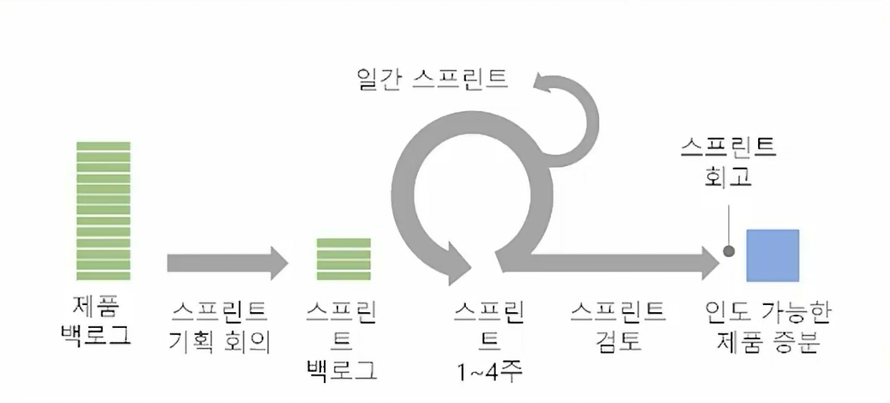
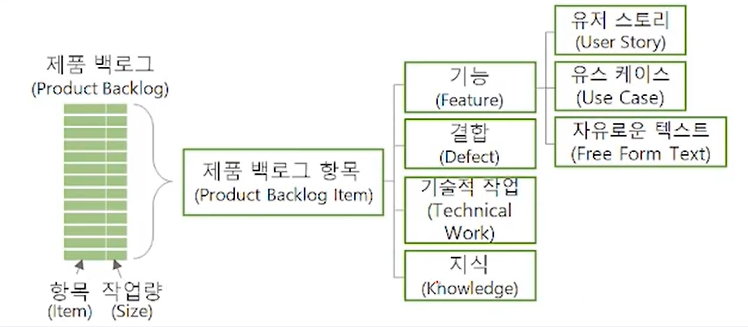

# 스크럼 개요
## 학습 내용
1. 스크럼 소개
2. 스크럼 프로세스
3. 스크럼 착수
## 학습 목표
* 스크럼을 정의할 수 있습니다.
* 스크럼의 핵심을 이해할 수 있습니다.

# 1. 스크럼 소개(Introduction to Scrum)
> "다른 사람이 잘 되도록 도와주면, 우리가 잘 됩니다." - 로버트 잉거솔(Robert Ingersol)
## 1-1. 스크럼(Scrum)
* 스크럼은 프로젝트를 위한 상호협력적이며(Collaborative), 점진적인(Incremental) 개발 방법론
* 스크럼은 자기 조직화 팀(Self Organizing Team)으로 진행
* 스크럼은 개발 팀(조직)을 효율적으로 관리하는 방법을 제공
## 1-2. 스크럼의 핵심
* 가장 많이 사용되는 애자일 기법
* 1~4주의 스프린트
* 세 가지 역할
  * 스크럼 팀 - 스크럼 프로젝트를 위하여 구성된 팀(3~9명)
    * 제품 책임자(Product Owner)
    * 개발팀(Development Team)
    * 스크럼 마스터(Scrum Master)
* 세 가지 아티팩트(Artifacts)
  * 증분(Increment)
  * 제품 백로그(Product Backlog)
  * 스프린트 백로그(Sprint Backlog)
* 5가지 이벤트
  1. 스프린트(Sprint)
      * 반복 주기, 짧은 프로젝트 관리 주기, 보고 주기
      * 스프린트는 1~4주의 타임박스에서 결정함. 일반적으로 **2주**가 스프린트의 적절한 기간
  2. 스프린트 계획(Sprint Planning)
  3. 일일 스크럼(Daily Scrum)
      * 개발팀 전원의 활동 현황을 공유함
  4. 스프린트 리뷰(Sprint Review)
      * 스프린트가 종료될 때 제품에 대한 관계자를 불러 모아 완성된 제품을 시연
      * **사용자 수용 테스트** (User Acceptance Test)
  5. 회고(Retrospective)
      * 스프린트 리뷰 후에 수행하는 행위로, 방금 수행한 스프린트를 되돌아보는 기회
      * 회고를 통해 스프린트에서 잘 수행한 것, 잘 수행하지 못한 것에 대해 이야기 하고, 궁극적으로 어떻게 하면 다음 스프린트에서 더 잘 수행할 수 있을지에 대한 의견을 같이 나눔
      * 이것이 "점검과 개선"의 기회가 되고 팀 학습, 팀 개선의 활동이 됨

# 2. 스크럼 프로세스
* 스크럼은 프로젝트 기간과 스프린트를 정한 후에 제품 백로그를 프로젝트 전반에 걸쳐 업데이트하고 제품을 개발하는 애자일 프로젝트 관리 방법론 중 하나

* 스크럼은 프로젝트 범위를 증분(Increment)과 반복(Iteration)으로 작게 정의하여 수 많은 작은 실패를 반복
  * 스크럼 팀에서는 실패를 두려워 하지 않고 사실대로 공유하고 함께 해결하고 함께 평가 받음
  * 계획대로 작업을 완료하는 것이 중요하지 않음 => **실제 작동하는 결과**를 보여주는 것이 중요함
* 각 스프린트의 후반부에는 스프린트 리뷰를 실시하여 작동 가능한 중간 산출물을 검토하고, 다음 스프린트에서 개선(Improvement)함
* 각 증분의 마지막 스프린트의 스프린트 리뷰에서는 UAT(User Acceptance Test, 사용자 인수 테스트)를 실시하고 산출물(Deliverable)을 인도함

# 3. 스크럼 착수
1. 제품 비전(Product Vision)을 작성
    * 차별화된 제품 개발의 슬로건을 표현
    * Target Group - 대상 사용자 또는 고객사 이름을 기술함
    * Needs - 고객의 니즈를 식별함
    * Product - 제품 성공을 위한 제품의 가장 중요한 속성을 결정함
    * Business Goals - ROI, 혜택, 개발 기간 등 사업적 목표를 설정함
2. 초기 제품 백로그(Product Backlog)를 준비
    
    * **제품 개발을 위하여 팀이 유지해 나가는 사용자 중심의 요구사항에 관한 지시 목록**
3. 프로젝트 전반에 걸친 제품 로드맵(Product Roadmap)에 증분(Increment)과 반복(Iteration) 계획을 반영
    * 제품의 불확실성(Uncertainty)을 줄이고 우선 순위(Priority)가 높은 증분(Increment)을 먼저 개발하는 방식의 단계를 제시해야 함
4. 스크럼 팀(Scrum team) 구성하고, 착수 회의(Kick-Off Meeting)와 제품 백로그 미팅(Product Backlog Meeting)을 수행
    * **이해관계자에 정보를 제공하고 참여를 유도함**(To inform and **engage stakeholders**)
    * **자발적 헌신을 확보함**(To gain **commitment**)
    * 진행
      1. 프로젝트의 목적과 개요 설명
      2. 프로젝트 팀원의 소개 와 인사: 인간 관계와 커뮤니케이션의 형성
      3. 프로젝트 현황 검토: 제품 비전, 제품 로드맵, 제품 백로그, 리스크 관리 대장, 이슈 로그
      4. 문제 영역 식별 -> 참여 유도 -> 팀원에게 신뢰 표명 -> 해결책 질문 -> 팀원의 답변 -> 토론 -> 공감대 형성
      5. 개인과 그룹의 **역할과 책임(R&B)** 정의
      6. 개인과 그룹의 **자발적 헌신 의지(Commitment)** 도출, 동기 부여(Motivation)
5. 팀 헌장(Team Charter)을 개발
  * 팀 헌장은 프로젝트 팀원에게 허용되는 행동에 대한 명확한 기대사항을 규정함
  * 행동강령, 의사소통, 의사결정 또는 회의 예절 등의 주제를 논의함으로써 팀원들이 **서로에게 중요한 기치를 발견**할 수 있음
  * **<u>팀원들이 직접 개발할 때 효과적임</u>**
  * 예시
    * "항상 더 즐겁게 일해요."(즐겁게 웃으면서 일할 수 있는 분위기)
    * "지식을 공유하는 것에 자부심을 가집시다."(많이 배우고 싶습니다. 서로 지식을 공유하고)
    * "상대방의 입장에서 이슈를 이야기합시다."
    * "우리 팀은 서로 돕고 비난하는 일이 없으면 좋겠어요."