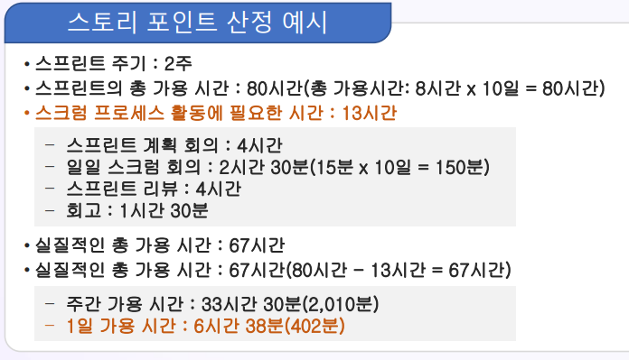
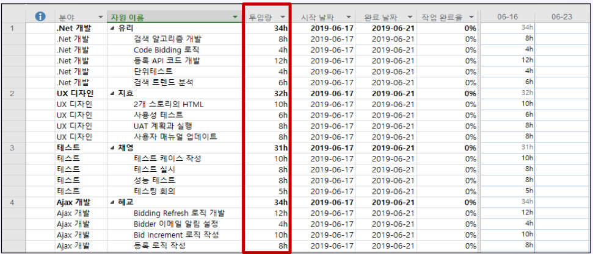
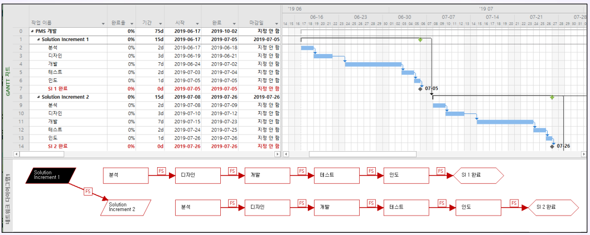
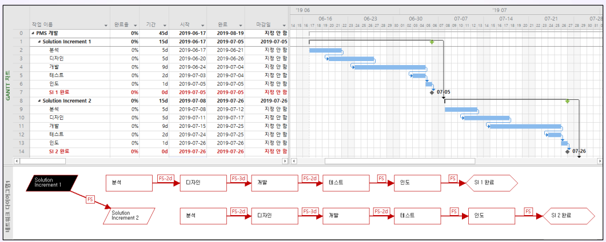
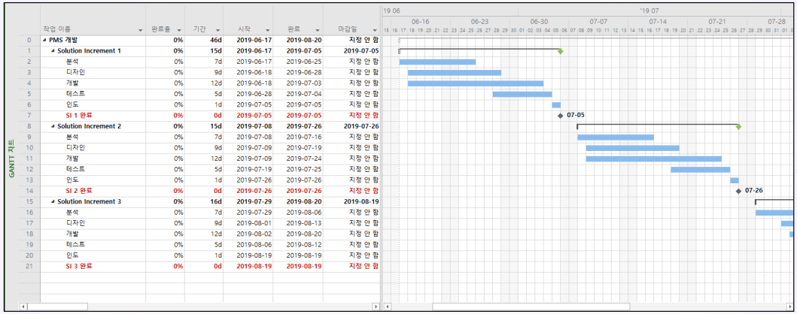
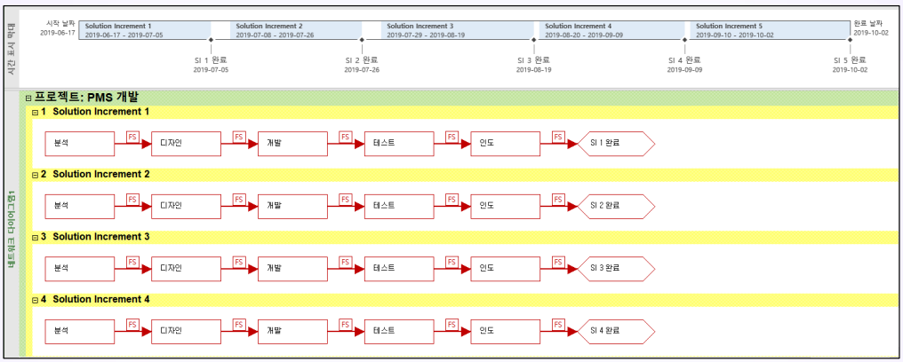
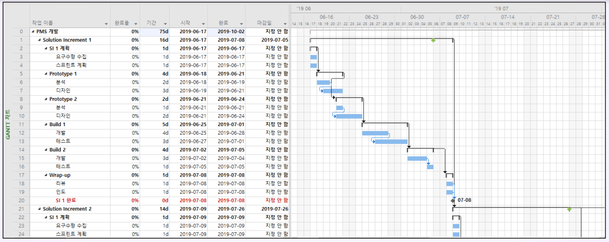
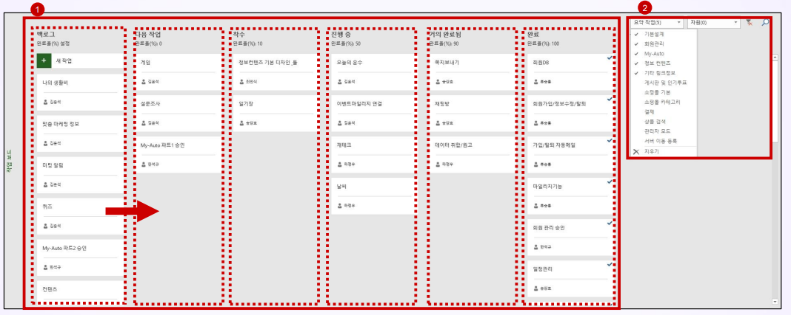

# 스크럼 계획 수립(III)
## 학습 내용
1. 산정(Estimation)
2. 스프린트 일정 계획(Sprint Schedule)
## 학습 목표
* 작업량과 스토리 포인트를 산정하는 방법을 이해합니다.
* 다양한 방식을 스프린트 일정 계획을 수립하는 방법을 이해합니다.

# 1. 산정(Estimation)
## 1-1. 스프린트 계획(Sprint Planning)
* 스토리 포인트(Story Point) = 작업량(Work) = 업무량(Effort, Time Needed) = 시간의 양 = 시수 = 공수 = 맨아워(맨데이, 맨먼스)
  * 스토리 포인트는 유저 스토리의 상대적인 작업량 크기
  * 유저 스토리의 작업량을 산정하기 위하여 애자일 팀이 사용하는 산정의 단위
  * 스프린트 백로그를 대상으로 개발팀은 예정 업무량을 산정
    * 스프린트 이내에 증분 인도, 프로젝트 진행율 시각화, 계획 대비 실적 비교, 리스크 식별(스토리 포인트가 클수록 리스크도 큼)
* 스토리 포인트는 시간 또는 점수 방식으로 산정할 수 있음
  * 시간(Time) 방식의 스토리 포인트 산정
    * Staff Hour(SH) = Person Hour = Man/Hour(M/H) (10 SH : 한 사람이 10시간 동안 수행하는 작업량)
    * Staff Day(SD) = Person Day = Man/Day(M/D) (10 SD : 한 사람이 10일 동안 수행하는 작업량)
    * Staff Month(SM) = Person Month = Man/Month(M/M) (10 SM : 한 사람이 10개월 동안 수행하는 작업량)
    * Staff Year = Person Year(M/Y) (2 SY : 한 사람이 2년 동안 수행하는 작업량)
  * 점수(Score) 방식의 스토리 포인트 산정
    * 스토리 포인트 1점 = 1명이 1일 동안 작업에 투입되는 시간 = 1 Staff/Day = 1 Man/Day
    * 스토리 포인트 2점 = 1명이 2일 동안 작업에 투입되는 시간 = 2명이 1일 동안 작업에 투입되는 시간 = 2 Staff/Day = 2 Man/Day
  * 풀 타임(Full Time)으로 참여하는 프로젝트 전담 조직(Projectized Organization)이라면, 1일(8시간)을 1 Story Point로 정의
  * 프로젝트 팀에서 운영 업무를 30% 참여하면, 하루 일과의 60~70%가 "1 Story Point"로 정의함
    * 8시간 일과에서 약 5시간만 프로젝트 작업에 참여한다는 의미임
* 유저 스토리(User Story)의 산정치(Estimates)는 스프린트(Sprint) 내에 완료할 수 있어야 함
* 팀원 별 작업의 한 주(One Week) 작업량은 30시간 내외로 작성
* 스프린트의 총 작업량을 산정할 때는 스크럼 프로세스 활동에 필요한 시간은 제외

  

  

* 개발팀 스스로 이번 스프린트 내에서 목표한 바를 수행할 수 있다는 자신감을 갖는 것이 제일 중요함

## 1-2. 플래닝 포커(Planning Poker)
* 스토리 포인트를 산정할 때 스크럼 팀원들의 합의가 쉽지 않음
* 자신의 각자 경험과 능력치에 따라서 생각이 많이 다름
* 피보나치수열로 시작하는 숫자의 조합 중에서 Point를 각자 예측한 후에 서로의 생각을 논의함
* 플래닝 포커 게임
  * 모든 팀원들이 카드를 한 벌씩 나누어 가짐
  * 작업(Task) 하나를 두고 자신이 생각하는 작업 시간 카드를 선택함
  * 모두가 동시에 카드를 뒤집어서 일치하는 시간이 나오면 시간을 확정함
  * 일치하지 않으면 가장 큰 것과 가장 작은 값을 선택한 멤버가 이유를 설명함
  * 충분한 토의를 거친 후 다시 카드를 선택함
  * 만장일치가 될 때까지 반복함
  * 철저하게 자발적으로 의견을 내고 합의에 이르는게 중요함

## 1-3. 산정과 유저 스토리 분해(User Story Breakdown)
* 스토리 포인트가 너무 큰 유저 스토리는 다시 분해(Breakdown)해야 함
* 너무 크다는 것은 한 스프린트 내에 개발하기 어려울 정도로 큰 것을 말함
* 이것은 **에픽(Epic)**이라고 부르고 여러 개의 작은 유저 스토리를 세분화해서 백로그에 등록함
* 측정
  * 작업 시간과 작업 개수에 대한 계획을 수립하고 결과를 계획과 비교함
  * 스프린트를 반복하면, 속도(Velocity)를 측정할 수 있으며 프로젝트 완료 날짜를 예상할 수 있음

## 1-4. 의사결정(Decision Making)
* 손가락 거수법(Fist of Five / Fist to Five)
  * 애자일 기반 프로젝트(agile-based projects)에서 손가락 거수법으로 불리는 투표(Voting) 방식의 의사결정이 주로 사용됨
* 진행 방법
  * 프로젝트 관리자가 팀에게 의사결정의 지지 정보를 물음
  * 전적으로 동의하면, 다섯 손가락을 모두 폄
  * 전혀 동의하지 않으면, 주먹을 쥠
  * 팀원이 세 개 미만의 손가락을 피면, 반대 토론을 할 기회를 제공함
  * 팀원이 세 개 이상의 손가락을 피면 공감대(Consensus)를 이룬 것으로 간주함
  * 프로젝트 관리자는 손가락 거수법으로 프로젝트 팀의 공감대(Consensus)를 계속 만들어 나감
* 기간을 산정할 때 팀 활동에 기반한 의사결정 기법을 사용하면
  * 산정의 정확대를 높이고
  * 팀원의 참여(Engagement)을 유도하며
  * 자발적 헌신에 관한 합의(Commitment)를 도출하는 데에 도움이 됨
* 각 활동의 기간 산정을 포로젝트 관리자나 스폰서의 빌반적인 판단으로 결덩하면 안됨

# 2. 스프린트 일정 계획(Sprint Schedule)
## 2-1. 스프린트 일정 계획 수립의 고려사항
* 표준 프로세스를 사용할 것인가? vs 프로토타입(Prototype) 모델을 적용할 것인가?
 * 표준 프로세스: 프로젝트의 리스크가 없을 때 사용
 * 프로토타입 모델: 프로젝트의 리스크가 있을 때 사용
* 순차(Sequence)로 진행할 것인가? vs 중첩(Fast-Tracking)할 것인가? vs 병렬 진행(Parallel Work)할 것인가?
  * 순차: 프로세스간 상호 조정과 협업이 필요 없을 때 사용
  * 중첩: 프로세스간 상호 조정과 협업이 필요할 때 사용
  * 병렬 진행: 프로세스를 정의하는 것이 무리일 때 사용
* 작업 일정과 프로세스를 통합 관리할 것인가? vs 프로세스만 관리할 것인가?
  * 작업 일정과 프로세스를 통합 관리: 프로젝트를 통제할 수 있을 때 사용
  * 프로세스만 관리: 프로젝트 팀에 자율성을 부여할 때 사용
* 일정 막대 차트(Bar Chart)를 활용할 것인가? vs 칸반(스크럼 보드)만을 활용한 일정 계획을 수립할 것인가?

### 표준 프로세스를 사용한 스프린트 일정 계획

### 중첩(Fast-Tracking)을 사용한 스프린트 일정 계획

### 병렬 진행(Parallel Work)을 사용한 스프린트 일정 계획

  * 프로세스 간의 경계가 불분명할 때 사용함

### 프로세스만을 사용한 스프린트 일정 계획

  * 스프린트 마감일(Sprint Deadline) 전에만 완료하는 것을 목표로 함

### 프로토타입(Prototype) 모델을 사용한 스프린트 일정 계획

  * 프로토타입(Prototype) 모델에서는 더 많은 중첩이 필요함

### 칸반(스크럼 보드)을 활용한 일정 계획
