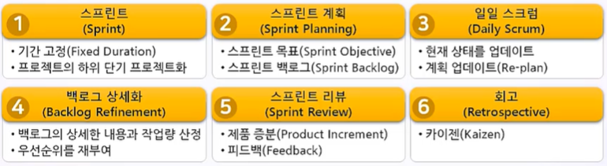
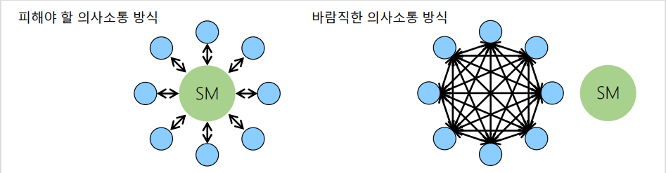
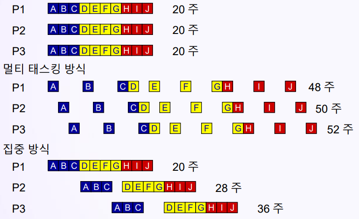
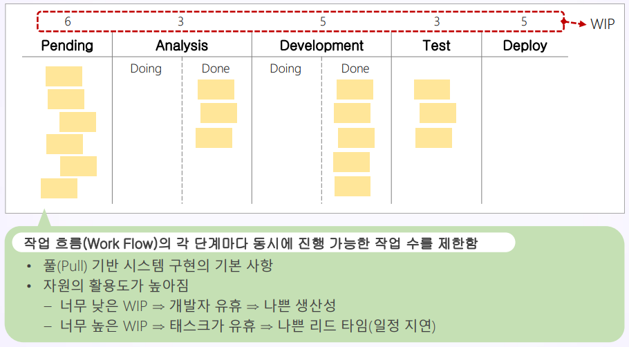

# 스크럼 실행
## 학습 내용
1. 스프린트 백로그(Sprint Backlog)
2. 일일 스크럼(Daily Scrum)
3. 칸반(Kanban) 활용
## 학습 목표
* 스프린트 백로그 항목을 스크럼 보드(Scrum Board)에 기록합니다.
* 일일 스크럼의 실천 방법을 이해합니다.
* 작업 보드(Task Board)와 구분되는 칸반(Kanban)의 특징을 이해합니다.

# 1. 스프린트 백로그(Sprint Backlog)
* 스크럼 보드(Scrum Board) = 작업 보드(Task Board) = 칸반(Kanban)
* **스프린트 백로그의 유저 스토리를 하위 작업들로 세분화한 후에 스크럼 보드에 기록됨**
* 각 스프린트가 끝날 때마다 스크럼 보드(Scrum Board)를 초기화 함
* 스크럼 보드의 상태(Status) 구분 예
  * 할 일(To Do, Not Started, Next Up) : 백로그에서 스프린트 백로그로 옯겨온 작업. 아직 시작하지 않은 작업
  * 진행 중(Doing, In Progress): 진행 중인 작업
  * 완료(Done) : 100% 완료된 작업. 완료 조건을 만족한 작업

# 2. 일일 스크럼(Daily Scrum)
> = 조회 = 개발팀 전원의 활동 현황을 매일 공유하는 회의
* XP 방법론에서도 일일 회의가 있으며, 스탠드업 미팅(Stand-up Meeting)이라고 부름
* 스프린트의 현재 상태와 계획을 업데이트 함

* 일일 스크럼의 목표
  * 스프린트 목표의 진행 상황을 검토함
  * 자기조직화 팀으로서 협력함
  * 다른 추가적인 미팅들을 제거함
  * 개발에 방해되는 요소들을 확인하여 없애 줌
  * 빠른 의사결정이 강화되고 촉진됨
  * 개발팀의 견문을 높여줌
* 일일 스크럼의 특징
  * 15분의 타임 박스를 정하여 짧게 진행함
  * 같은 장소, 같은 시간에 매일 모임
  * 스크럼 마스터(Scrum Master)가 회의를 촉진함
  * 스크럼 팀 전원이 참석함
  * 세 가지 질문에 초점을 맞춤
## 2-1. 일일 스크럼의 세 가지 주제
1. 개발팀의 스프린트 목표 달성을 위해 어제 하루 동안 나는 <u>**무엇을 했는가?**</u>
2. 개발팀의 스프린트 목표 달성을 위해 오늘 하루 동안 나는 <u>**무엇을 할 것인가?**</u>
3. 나 혹은 개발팀이 스프린트 목표 달성을 하는데 <u>**방해요소가 있는가?**</u>

## 2-2. 일일 스크럼의 이슈
* 데일리 스크럼을 하면 무슨 장점이 있는거지?
* 굳이 얼굴을 보면서 해야 하나?
* 원격 회의로 하면 안 되나?
* 일주일에 한 번씩 엑셀에 작업 내용을 기록하면 되지 않을까?
* => <u>**프로젝트는 혼자하는 것이 아니라 함께하는 것이고, 상호 협력적으로 진행하기 위해서는 상황을 올바로 공유하는 것**</u>

## 2-3. 대면 의사소통 vs 비대면 의사소통
* 대면 의사소통(Face-To-Face Communication)
  * 사람들은 음성과 함께 얼굴을 보면서 하는 소통이 편하고 익숙함
  * 얼굴을 보면서 소통하는 것이 신뢰를 만들기가 쉬움
  * 즉각적인 피드백을 통해서 학습을 더 많이, 더 빨리 할 수 있음
  * 기대사항 충족 여부를 확인할 수 있음
    * => 어느 부분에서 상대방의 마음에 안 드는지 바로 알 수 있음
  * 나의 말에 대한 반응을 바로 인지하여 피드백을 받을 수 있음
    * => 이를 통해 서로를 잘 이해할 수 있고 협력에 도움이 됨
* 비대면 의사소통(Texting Communication)
  * 텍스트를 활용한 문서 커뮤니케이션은 '비동기적인 커뮤니케이션'에 속함
  * 텍스트로 적으면 어느 부분에서 문제가 되는 것인지 알기가 어려움
  * 학습이 느리고 신뢰를 만들기 어려움
  * Text 작성을 위한 추가적인 노력이 필요함

# 3. 칸반(Kanban) 활용
* 스크럼(Scrum) vs 칸반(Kanban)
  * Time-box 형식의 반복(Iteration) 개발은 다음과 같은 문제점이 있음
    * 짧은 개발 주기 : 개발 항목을 작게 정의해야 함
    * 가치를 정의하기에는 너무 작거나, 정의하기 어려운 경우가 많음
    * 현실에서의 작업은 연속적인 경우가 많음
## 3-1. 작업 흐름 시각화(Work Flow Visualization)
* 작업 흐름의 시각화가 칸반의 핵심임
* 칸반을 통해서 사람들이 작업 흐름의 상태를 파악함
* 칸반에서 작업량, 우선순위, 역할, 반복 등은 필요하지 않으며, 작업 흐름의 진행 상황만을 중요하게 관리함
## 3-2. 병목(Bottleneck) 문제 해결

* 멀티 태스킹은 모든 프로젝트의 일정을 지연시킴
* 프로젝트의 우선 순위(Priority)를 부여하고 집중하여 관리하면, 모든 프로젝트의 일정이 단축됨
* 일부 작업 지연이 전체 프로젝트를 지연시킬 수 있음
  * 작업을 일찍 완료해도 후속 작업의 자원이 준비되어 있지 않으면 일정이 단축되지 못함
  * 따라서 일찍 완료해서 시간을 벌어도 그 시간이 낭비됨
  * 선행 작업과 후속 작업을 담당하는 자원 간 긴밀한 의사 소통이 필요함
* 칸반은 측정을 통해 시스템의 문제점(병목지점)을 찾아 냄
## 3-3. WIP 제한(Limit Work In Progress)
* 칸반에서는 **진행 중인 작업 개수(WIP, Work In Progress)를 제한(Limit)함**
* WIP(Work In Progress) Limit의 의미
  * 진행 중인 작업의 개수를 제한하는 것 => 할 수 있는 작업의 최대 개수
  * 우선순위가 높은 작업들을 먼저 Task Board(Kanban)에 등록함
  * WIP Limit 개수를 넘어서면, 해당 워크플로우에 작업을 추가할 수 없음
* WIP Limit의 목적
  * => Multi-tasking 지양
* WIP Limit의 예
  * Ready의 WIP Limit: 8개
  * Development and unit test의 WIP Limit: 3개
  * User Acceptance Test의 WIP Limit: 2개
