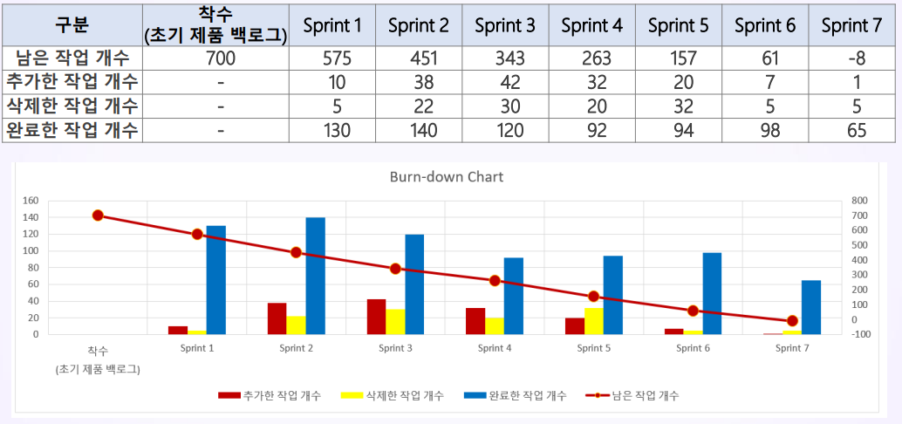

# 스크럼 감시와 통제
## 학습 내용
1. 예측형 라이프 사이클(Predictive Life Cycle)의 진도 관리
2. 적응형(Adaptive) 라이프 사이클의 진도 관리
3. 스프린트 리뷰(Sprint Review)
4. 스프린트 회고(Sprint Retrospective)

## 학습 목표
* 예측형 라이프 사이클(Predictive Life Cycle)과 적응형(Adaptive) 라이프 사이클의 진도 관리 차이점을 이해합니다.
* 스프린트 리뷰(Sprint Review)의 진행 방법을 이해합니다.
* 스프린트 회고(Sprint Retrospective)의 진행 방법을 이해합니다.

# 1. 예측형 라이프 사이클(Predictive Life Cycle)의 진도 관리

* 마일스톤(Milestone) 중심으로 목표 일정(Baseline Schedule)과 현재 일정(Current Schedule)을 비교함

* 프로젝트의 시기를 월 또는 주 등으로 나눠서, 각 시기 별로 누적의 목표 작업량, 실제 작업량, 누적의 목표 예산, 실제 예산등을 측정
* 시간대 별로 어디서 얼만큼 쳐졌는 지, 따라잡았는 지 계획과 실적을 누적하여 표현 => S Curve

* Bar Chart - 일정과 진도율

* MS Project는 실행해야 할 때가 지난 작업을 자동으로 찾아내어 그래픽 표시기로 표시함
* 현재 날짜(Current) 또는 상황 보고 날짜(Status Date) 기준으로 목표 완료율(Target Progress) 대비 현재 완료율(Current Progress)을 비교할 수 있음

* MS Project가 일정을 자동 편가하도록 설정할 수 있음(그래픽 표시기: 빨강, 노랑, 초록)
* **일정 상 중요한 작업(Critical Task)이 자동 분석되어 빨간 막대로 표시됨**
* Critical Task의 일정 지연이 발생하면, 반드시 시정 조치와 예방 조치를 실시해야 마감일과 중요 일정을 방어할 수 있음

* 조직별 또는 팀별 업무

* PV(계획 예산, Planned Value), AC(실적 원가, Actual Cost), EV(기성, Earned Value)을 분석하여 S Curve 보고서를 작성함

# 2. 적응형(Adaptive) 라이프 사이클의 진도 관리

* 스크럼(Scrum)에서는 스프린트(Sprint)를 사용하여 일정을 계획하고 실적을 입력함
* 점진적 인도

* 완료 여부에 초점을 맞춤

* 소진율(Burn-down)

* 현재 스프린트(보고 주기) 내의 작업 진행 상황을 자유로운 레이아웃의 보고서로 표현할 수 있음
* 각 작업에 대한 예정 일정과 실제 일정의 차이를 표현하지 않음 => 자율성, 유연성

# 3. 스프린트 리뷰(Sprint Review)
* **스프린트가 종료될 때 제품에 대한 관계자를 불러 모아 완성된 제품을 시연(Demo)하는 이벤트**
  * 개발팀에게는 자신들이 만든 백로그의 항목이 제대로 작동되는지에 대해 증명할 수 있는 기회가 됨
* 이 스프린트 리뷰는 비공식 미팅, 즉 경과보고 미팅이 아니고 완료된 제품 증분을 발표함으로 피드백을 얻고 서로 간의 협력을 촉진하기 위한 미팅임
* 스프린트 리뷰의 중요한 개념은 **"검토(Inspect)"**와 **"조정(Adapt)"**
  * 반복되는 주기 안에서 무엇이 진행되고 있는지 보고 배우며 피드백에 기반해서 발전시켜 나감
  * 개발 팀과 제품 책임자는 서로 배우고, 조언을 구하는 등 깊이 있는 대화를 진행해야 함

* 스프린트 리뷰 회의의 참석자
  * 제품 책임자(Product Owner)
  * 스크럼 마스터(Scrum Master)
  * 개발팀(Development Team)
  * 핵심 이해관계자(Key Stakeholders)
  * 고객(Customer) 등..

* 스프린트 리뷰에서 스크럼 팀과 제품 이해관계자들은 이번 스프린트에서 무엇이 완료되었는지에 대해 함께 확인함
* 스프린트 리뷰는 제품 증분을 검토하고, 필요에 따라 제품 백로그를 적합하게 수정하고자 매 스프린트의 끝에 수행함
* 이 스프린트 리뷰 결과와 스프린트 수행 중 변경된 제품 백로그를 고려하여, 미팅 참석자들은 제품 가치를 최적화하기 위해 다음에 무엇을 해야 할지 함께 의논함

## 3-1. 스프린트 리뷰 회의(Sprint Review Meeting)
1. 미팅에는 스크럼 팀과 제품 책임자가 초대한 핵심 제품 이해관계자들이 참석함
2. 제품 책임자가 완료된(Done) 제품 백로그 아이템과 완료되지 못한 아이템을 설명함
3. 개발팀은 스프린트 동안 무엇이 잘 진행되었는지, 무슨 문제가 있었는지, 어떻게 문제들을 해결했는지 논의함
4. 개발팀은 "완료"된 작업을 시연하고 그 제품 증분에 대한 질문에 답변함
5. 제품 책임자는 현재 남아있는 제품 백로그를 설명하고, (필요하다면) 현재까지의 진행상황을 바탕으로 가능한 예상 목표 및 제품 전달 날짜를 계획함
6. 전체 그룹이 다음에 무엇을 할지 함께 의논하여 스프린트 리뷰 미팅이 다음 스프린트 계획에 가치 있는 조언을 제공
7. 제품의 시장이나 잠재적 사용처가 어떻게 변했는지 그리고 다음에 해야 할 가장 가치있는 일들은 무엇인지 검토함
8. 다음 제품 출시 기능이나 성능에 대한 - 일정, 예산, 잠재적 기능, 그리고 시장에 대해 검토함
* 프로젝트의 스프린트 기간에 따라 스프린트 리뷰 회의 시간은 달라짐
  * 스크럼 마스터는 팀이 스프린트 리뷰 미팅을 했는지, 모든 참석자가 그 목적을 제대로 이해했는지 확인해야 함
  * 스크럼 마스터는 스프린트 리뷰 미팅이 주어진 시간 안에 끝나도록 스크럼 팀을 교육함
* 기능을 완료(Done)한 것으로 판단하거나 타임 박스 시간이 되면 회의를 종료함

# 4. 스프린트 회고(Sprint Retrospective)
* 스프린트 회고 미팅
  * **스크럼 팀이 자신을 스스로 되돌아보고,** 
  * **다음 스프린트 동안 무엇을 개선할 수 있을지 계획할 기회를 제공**
* 프로젝트의 스프린트 기간에 따라 스프린트 회고 회의 시간은 달라짐

* 스프린트 회고 회의의 참석자
  * 스크럼 마스터
  * 개발팀
  * 제품 책임자
* **스크럼 마스터는 팀이 스프린트 회고 미팅을 했는지, 모든 참석자가 그 목적을 제대로 이해했는지 확인해야 함**
* **스크럼 마스터는 회고 미팅이 긍정적이고 생산적으로 진행되도록 유지해야 함**
* 스크럼 마스터는 스크럼 프로세스에 대한 책임을 갖고 개발팀의 동료 멤버로서 회고 미팅에 참여함
* 스프린트 리뷰 후에 수행하는 행위로, 방금 수행한 스프린트를 되돌아보는 기회임
* 회고를 통해 스프린트에서 의견을 같이 나눔
  * 잘 수행한 것(What went well)
  * 잘 수행하지 못한 것(What did not go well)
  * 개선 방법에 관한 제안(Any Suggestions)
* => 이것이 "점검과 개선"의 기회가 되고 팀 학습, 팀 개선의 활동이 됨
* "회고(Retrospective)는 일종의 이슈(Issue) 관리 활동