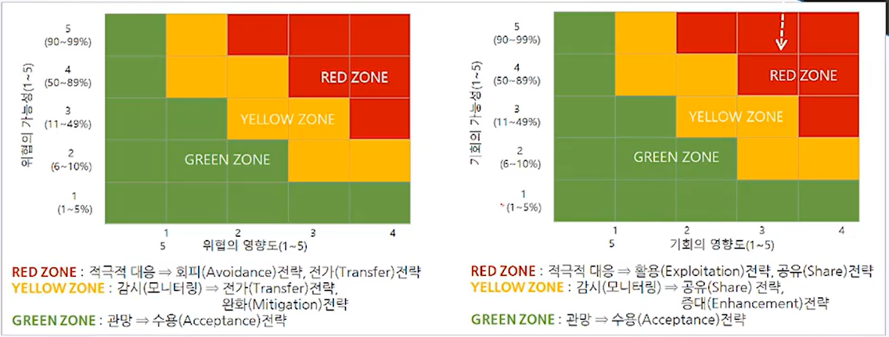

# 애자일 프로젝트 리스크 관리
## 학습 내용
1. 프로젝트 리스크 관리 개요
2. 리스크 관리 계획과 리스크 분석
3. 리스크 대응 계획 수립
## 학습 목표
* 애자일 프로젝트에서 리스크 관리의 필요성을 인식합니다.
* 리스크를 관리하기 위한 핵심 사항을 학습합니다.

# 1. 프로젝트 리스크 관리 개요
## 1-1. 리스크 관리 프로세스의 필요성
> If you can't visualize it, you can't manage it(시각화하지 않으면)  \
> If you can't measure it, you can't improve it(측정하지 않으면 개선할 수 없음)  \
> \- 피터 드러커(Peter Drucker) -
* 프로젝트 리스크 관리는 프로젝트의 성공의 핵심 성공 요인(Critical Success Factor)입니다.
* 문제
  * 리스크가 잘 안 보인다. (예측, 분석, 계획 및 통제의 어려움)
  * 주먹구구식(안 보이기 때문에 그렇게 못함, 이렇게 밖에 할 수 없음)
* Consensus => Visibility => Insight => Control
  * 공감대(Consensus) 형성 : 리스크 관리의 필요성을 조직 구성원 모두가 공유함
  * **시각화(Visibility) : 잠재적 리스크를 식별하고, 차트, 그래프, 다이어그램을 활용하여 리스크를 시각적으로 분석함**
  * 통찰력(Insight) : 리스크 분석 정보를 체계적으로 문서화(Documentation)하고, 선제적인(Proactive) 리스크 대응 전략을 실시함
  * 통제(Control) : 리스크 관리 프로세스(Risk Management Process)를 적용하여 리스크를 체계적으로 통제함

## 1-2. 프로젝트 리스크(Project Risk)란?
* 프로젝트의 **목표**에 **긍정적 또는 부정적** 영향을 미치는 **불확실한(Uncertain)** 변수나 상황
* 리스크는 단순히 불확실성이 아님(Risk != Uncertainty)
* 리스크는 중요한 역할을 하는 불확실성임 => 리스크는 목표에 영향을 미친다는 점에서 중요함

## 1-3. 왜 리스크를 관리해야하는가?
* 부정적 사건, 즉 위협의 가능성과 영향도를 낮춤(Decrease the probability and impact of
adverse events)
* 긍정적 사건, 즉 기회의 가능성과 영향도를 높임임(Increase the probability and impact of positive
events)
* 리스크에 대한 조기 경고를 제공함(Provide early warnings of risks)

## 1-4. Assumption vs Risk vs Issue

## 1-5. Risk
* 리스크의 구성 요소
  * <u>**리스크 사건**</u> : 프로젝트의 목표 달성에 영향을 주는 것 => 리스크 이름
  * **발생 가능성(Risk Probability of Occurrence) = 확률(Likelihood) = 빈도(Frequency)**
  * **영향의 정도(Amount at Stake) = 영향도(Impact) = 파급력(Consequence)**
* 리스크에 대한 우선 순위 부여
  * 리스크에 대한 우선 순위를 부여하고, 우선 순위가 높은 리스크를 집중 관리함
  * 리스크 우선 순위(Priority)의 핵심 지표 : 가능성(Probability), 영향도(Impact)
* Proactive Approach(선제적 조치)
  * 리스크가 발생하기 전에 대처하는 방식을 의미하며, 바람직한 리스크 관리 방식
  * 성공적인 프로젝트 관리는 이슈 해결에 있는 것이 아니라, 부정적 리스크의 **예방(Risk Privention)**에 있음
  * 선제적 조치의 목적
    * 부정적인 사건의 가능성과 영향도는 **최소화(Minimize the negative)**함
    * 긍정적인 사건의 발생 가능성과 파급 효과는 **극대화(Maximize the positive)**함
  * 유능한 프로젝트 관리자는 **위협 요인을 예측하며 대응 계획을 수립**하고, 모니터링하고 통제함
  * 유능한 프로젝트 관리자는 **기회를 적극적으로 찾으며 혜택을 극대화**하기 위하여 노력함
* Reactive Approach(사후 조치)
  * 사후 조치는 리스크가 발생한 후에 대처하는 방식이며, 바람직하지 않은 리스크 관리 방식임
  * 무능한 프로젝트 관리자는 현재 발생한 문제점을 해결하는 데만 급급함
  * 무능한 프로젝트 관리자는 기회를 찾지 않고, 우연을 바라는 소극적 태로 프로젝트에 임함
### 1-5-1. Risk Management
* 리스크를 관리하는 문서는 **"리스크 관리 대장(Risk Register)"**
* 프로젝트의 가정 목록(Assumption Log)에 기록된 가정들 중에서 가정이 프로젝트의 목표에 영향을 주고 프로젝트의 위협 요인 또는 기회 요인이 될 수 있으면, 가정을 리스크로 재정의하여 리스크 관리 대장(Risk Register)에 리스크를 입력함
* 리스크 관리 대장(Risk Register)의 정보
    1. **리스크 식별 정보(Identity Risk)** : ID, 식별된 리스크 목록, 잠정적 대응 방법 목록, 트리거(Trigger), 리스크 소유자(Risk Owner)
    2. **정성적 리스크 정보(Perform Qualitative Risk Analysis)** : 각 리스크의 가능성과 영향도 평가, 리스크 순위, 리스크 긴급성, 추가 분석과 대응이 필요한 리스크 목록, 리스크 종류 구분(RBS), 경계 대상 목록, 정성적 리스크 분석 결과의 추세, 가정 사항 관리 대장의 갱신
    3. **정량적 리스크 정보(Perform Quantitative Risk Analysis)** : 프로젝트의 확률론적 분석, 예비비(Cost Reserve), 여유 시간(Time Reserve), 원가와 일정 목표를 달성할 확률, 정량화된 리스크의 우선 순위 목록, 정량적 리스크 분석 결과의 추세
    4. **리스크 대응 계획 정보(Plan Risk Response)** : 프로젝트 관리 계획의 변경(WBS, 일정, 자원, 비용, 조직도, 조달 계획), 식별된 리스크의 특성(내용, 원인, 종류), 식별된 리스크의 조치 계획(책임자, 관련 작업, 일정), 리스크에 대응하기 위한 비상 계획, 대체 계획, 잔존 리스크와 파생 리스크, 여유 일정과 예비비
    5. **리스크 통제 정보(Implement Risk Responses)** : 리스크 재평가, 리스크 감사, 주기적 리스크 검토에 대한 결과, 프로젝트 리스크와 리스크 대응에 대한 실제 결과

  

## 1-6. Issue
> = 현안  \
> 분쟁 또는 질의 대상이 되는 쟁점이나 문제  \
> 또는 미해결 상태에서 논의 중이거나 상반되는 견해나 의견 차이를 보이는 쟁점 또는 문제

| 구분 | 리스크(Risk) | 이슈(Issue) |
|:-:|:-:|:-:|
| 의미 | 예출(발생할 수도 있음) | 결과(발생했음) |
| 관점 | 선제적 조치(Proactive Action) | 사후 조치(Reactive Action) |
| **긴급성** | **낮음 또는 중간** | **높음** |
| 영향도 | 높음 | 높음 |
| 구성요소 | 위험(Threat) 또는 기회(Opportunity) | 문제점(Problem) 또는 혜택(Benefit) |

* 리스크가 발전하면 이슈가 됨
* 리스크는 부정적 리스크와 긍정적 리스크로 발전할 수 있음
  * 부정적 이슈(Negative Issue) = 문제점(Problem) = 현실화된 위협
    * 리스크가 부정적으로 발전하여 즉각적으로 해결해야 하는 상황
  * 긍정적 이슈(Positive Issue) = 혜택(Benefit) = 현실화된 기회
    * 리스크가 긍정적으로 발전하여 실제로 혜택이 발생하게 된 상황
### 1-6-1. Issue Management
* 이슈 로그(Issue Log) = 이슈 관리 대장 = 이슈 목록 = 현안 로그
  * 이슈를 관리하는 문서
  * 긴급성(Urgency)과 영향도(Impact)를 기준으로 이슈의 점수를 관리
    * 이슈는 사후 조치이기 때문에 긴급성을 판단하는 것이 중요함
      * 지금 이것을 해결하지 않으면, 기회를 놓치는가?
      * 지금 이것을 해결하지 않으면, 문제가 악화되는가?
* 이슈 로그 보고 형식

  
* 이슈 로그의 정의
  * 프로젝트 이해관계자 사이에서 논의 또는 논쟁의 요소를 문서화하고 감시하는데 사용되는 프로젝트 문서

## 1-7. 프로젝트 리스크 관리 프로세스

  * 
* 프로젝트 착수 시에는 개략적인 리스크(High-level Risks)를 식별함
* 프로젝트 계획 수립 시에는 리스크 관리 계획(Risk Management Plan)을 수립하여 리스크 관리의 명확한 원칙과 방법론을 제시함
* 리스크 관리 계획에 따라 리스크를 식별 하고, 분석하고, 대응 계획을 수립하고, 통제 성과를 기록하여 리스크 관리 대장(Risk Register)를 작성함
* 리스크 식별(Identify Risks) 프로세스는 프로젝트 계획 수립 시 일회성으로 진행하는 프로세스가 아님
* 리스크 식별(Identify Risks) 프로세스는 프로젝트 관리 지식 영역(범위, 일정, 원가, 품질, 인적 자원, 조달 등) 별 계획 수립과 통제 관련 프로세스를 실행할 때 항상 필요한 프로세스임
* 리스크 감시(Monitor Risks) 프로세스도 리스크 식별 프로세스와 마찬가지로 프로젝트 전 단계에 걸쳐 실시함
# 2. 리스크 관리 계획과 리스크 분석
## 2-1. 리스크 관리 계획(Risk Management Plan)

* **가능성 영향도 매트릭스(Probability and Impact Matrix)** = 확률 영향 매트릭스 = P-I 매트릭스
* 리스크 목록 중에서 Top5 또는 Top10을 선별하여 관리할 수 있는 **P-I 매트릭스**를 제시함
* P-I 매트릭스는 가능성과 영향도를 기준으로 리스크의 **우선 순위**를 부여한 관리 서식임
  * 가능성(Probability, 확률) : 이 리스크(위협 또는 기회)가 발생할 가능성이 얼마나 되는가?
  * 영향도(Impact) : 이 리스크가 발생한다면, 어느 정도 파급 효과를 가져올 것인가?
* **리스크 수치 = 가능성(Probability) X 영향도(Impact)**
* 기회에 대응하지 못하면 위협이 현실화 될 수 있음
* 따라서 기회의 가능성(확률)과 영향도가 높으면 <u>리스크 사건(Risk Event)을 Red Zone에 배치함</u>
* 프로젝트의 리스크를 정성적으로 분석하기 위하여 P-I 매트릭스를 주 단위 또는 격 주 단위로 보고함

## 2-2. 리스크 관리 계획 수립
* 리스크 관리 계획에는 리스크에 대한 태도를 반영함
* 리스크에 대한 태도는 리스크 회피형과 리스크 선호형으로 구분함
* 프로젝트 성격에 따라 리스크 회피형 또는 리스크 선호형 태도를 취할 것인지 판단함

| 구분 | 리스크 회피형 Risk Avoider, Risk Averse | 리스크 선호형 Risk Taker, Gambler |
|:-:|:-:|:-:|
| 태도 | 리스크를 수용하지 않음 | 한계를 넘는 리스크를 받아들임 |
| 관리 | 실패 가능성을 제거하기 위하여 충분한 시간과 비용을 투입함 | 최소한의 리스크 관리 계획을 수립함 |
| P-I 매트릭스 | Red Zone을 크게 정의함 | Red Zone을 작게 정의함 |
| 예 | 전염병 환자를 관리하는 병원의 의료 설비를 구축하는 프로젝트는 삶과 죽음의 경계와 관련되어 있으므로 조금의 오류도 허용하지 않음 | 시내에 공원을 조성하는 프로젝트는 프로젝트의 예측성이 높기 때문에 리스크 관리를 상세하게 실행하지 않음 |

## 2-3. 리스크 분석
### 2-3-1. 리스크 가능성(Probability)의 척도

* 확신의 정도를 확인함
* 중간 지점은 프로젝트 기간 동안 최소 1회 이상 발생 가능성이 반반인 경우를 의미함
* 가능성은 매우 주관적이기 때문에 가능성의 척도를 균등하게 정하는 것은 잘못된 리스크 관리 계획임
  * 부정합한 척도의 예 : 1(20% 미만), 2(21~40%), 3(41%~60%), 4(61~80%), 5(81~99%)
  * 정합한 척도의 예 : 1(5% 미만), 2(5~25%), 3(25~65%), 4(65~95%), 5(95% 이상)
* **블랙 스완(Black Swan)**: 가능성이 매우 낮지만, 발생할 경우 엄청난 재앙을 초래할 수 있는 리스크

### 2-3-2. 리스크 영향도(Impact)의 척도

* [P-I 매트릭스](#2-1-리스크-관리-계획risk-management-plan)
* 리스크 노출도(Risk Exposure) = 가능성(Risk Probability) * 영향도(Impact)

### 2-3-3. 리스크 데이터 품질 평가(Risk Data Quality Assessment)
* **리스크 데이터 품질(Risk Data Quality) = 리스크 신뢰도(Risk Crediility) = 위험 자료 품질**
* 식별된 리스크 관련 데이터들이 믿을만한지(Credible) 확인함
  * 정확한 데이터에 근거하고 있는가?
  * 핵심 이해관계자 또는 전문가의 검증을 거쳤는가?
  * 관계자들이 리스크의 내용을 분명하게 이해하고 동의하는가?
  * 편견이 있는가?
  * 데이터에 논리적 일관성이 있는가?
* 프로젝트 관리자가 리스크 데이터의 신뢰성 문제가 있다고 판단하면, 보다 **정확한 관련 정보 수집을 지시하거나 핵심 이해 관계자의 검증**을 거쳐야 함

### 2-3-4. 리스크 신뢰도(Credibility)의 척도 예

### 2-3-5. 리스크 긴급성 평가(Risk Urgency Assessment)
* 위협 요인에 대해서 꼭 지금 대응해야 하는가? 나중에 처리하면, 상황이 더 악화되는가?
* 기회 요인에 대해서 꼭 지금 대응해야 하는가? 나중에 처리하면, 기회가 사라지는가?
* **단기적 대응이 필요한 리스크**는 즉각적인 실행 계획을 수립해야 함
  * 심각도(가능성*영향도)가 큰 리스크를 먼저 해결하기 위하여 노력해야 함
  * 심각도가 큰 리스크를 나중에 풀려고 방치하다가 해결하지 못하면 복구할 시간이 부족해짐
* **장기적 대응이 필요한 리스크**는 전략을 세우고 거시적인 계획을 수립함

### 2-3-6. 리스크 긴급성(Urgency)의 척도 예

## 2-4. 정리

* 리스크를 정성적으로 분석할 때는 PICU 순으로 분석을 해야 한다. 
* 가능성/확률(Probability), 영향도(Impact), 긴급성(Urgency), 신뢰도(Credibility) 순으로 분석한다. 

# 3. 리스크 대응 계획 수립
* 리스크 대응 계획 수립(Plan Risk Responses) 프로세스의 정의
  * 리스크 대응 계획 수립 프로세스는 프로젝트 목표에 대한 기회를 증대시키고 위협을 줄이기 위한 대안과 조치를 개발하는 프로세스임
* 리스크 대응 계획 수립 프로세스의 혜택(Benefit)
  * 필요한 예산, 일정 및 프로젝트 관리 계획에 자원과 활동을 추가하면서 우선순위에 따라 리스크에 대응함
## 3-1. 리스크 대응 계획 수립 프로세스

* 리스크 대응 계획 = 예방 조치 + 비상 대응 전략 + 여유(Reserve)
  * 예방 조치(Preventive Action) = 예방 계획 = 부정적 리스크의 대응 전략 + 긍정적 리스크의 대응 전략
  * 부정적 리스크, 즉 위협에 대한 전략(Strategies for Negative Risks or Threats)
  * 긍정적 리스크, 즉 기회에 대한 전략(Strategies for Positive Risks or Opportunities)
* 비상 대응 전략(Contingent Response Strategies): 비상 계획 + 대체 계획
  * 비상 계획(Contingency Plan): 리스크가 발생한 경우를 가정하여 개발하는 전략. 발생 시 필요한 사후 조치에 관한 계획
  * 대체 계획(Fallback Plan) = 복구 계획 = Plan B = Backup Plan = 비상 계획이 예상대로 되지 않을 경우의 계획

#### 정리
* 리스크의 발생 확률과 영향을 평가하여 통합함으로써, 추가적인 분석이나 조치에 유용하도록 리스크의 우선 순위를 지정합니다.
* 프로젝트 목표에 대한 기회를 증대시키고 위협을 줄이기 위한 대안과 조치를 개발합니다.