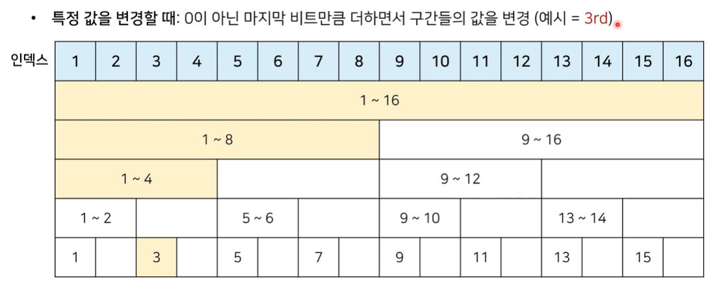
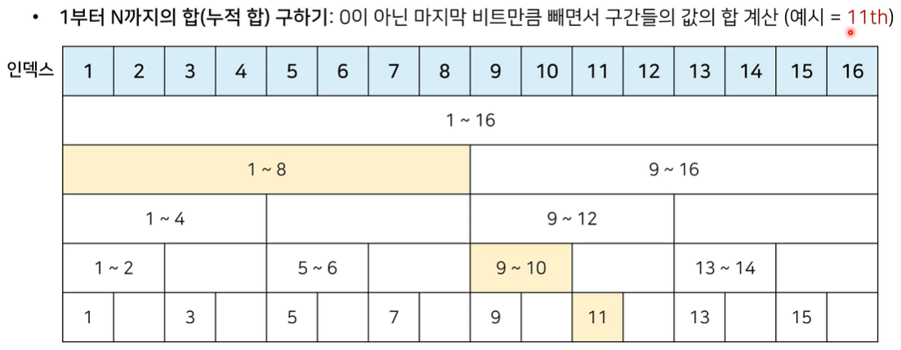
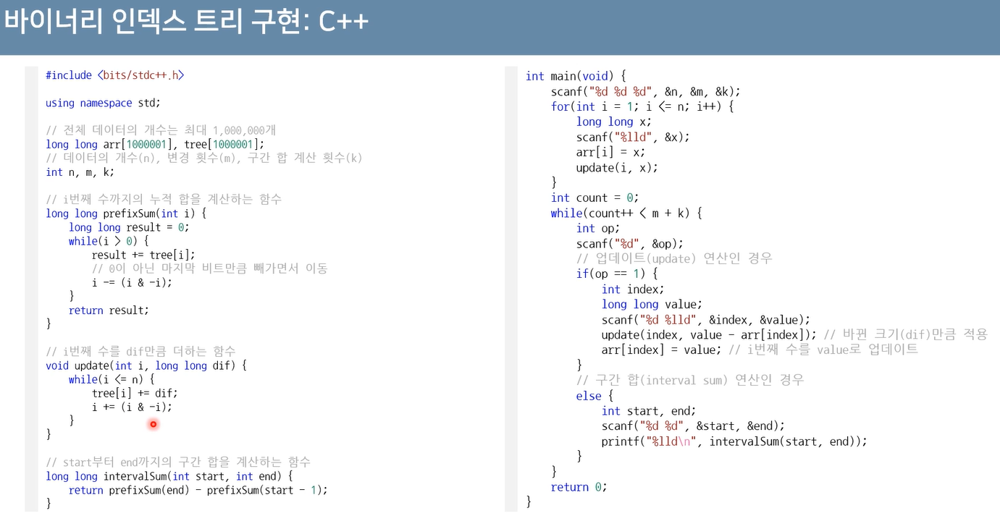

# 바이너리 인덱스 트리(Binary Index Tree - BIT)
> [구간 합 구하기](https://www.acmicpc.net/problem/2042)
* *데이터 업데이트가 가능한 상황에서의 구간 합(Interval Sum) 문제*
* 2진법 인덱스 구조를 활용해 구간 합 문제를 효과적으로 해결
    * **펜윅 트리(fenwick tree)**
* 정수에 따른 2진수 표기(2의 보수)

|정수|2진수 표기|
|:---:|:---:|
|7|00000000 00000000 00000000 0000111|
|-7|11111111 11111111 11111111 1111001|

* 0이 아닌 마지막 비트를 찾는 방법
    * 특정한 숫자 K의 0이 아닌 마지막 비트를 찾기 위해 **K & - K**를 계산

|정수 K|K & -K|
|:--:|:--:|
|0|0|
|1|1|
|2|2|
|3|1|
|4|4|
|5|1|
|6|2|
|7|1|
|8|8|

# 트리 구조 만들기
* 0이 아닌 마지막 비트 = 내가 저장하고 있는 값들의 개수

**~~*(무슨 소린지 모르겠다....)*~~**

## 업데이트(Update)
* **특정 값을 변경할 때:** 0이 아닌 마지막 비트만큼 더하면서 구간들의 값을 변경



## 누적 합(Prefix Sum)
* **1부터 N까지의 합(누적 합)** 구하기: 0이 아닌 마지막 비트만큼 빼면서 구간들의 값의 합 계산



## 구현 코드
```py
import sys
input = sys.stdin.readline

# 데이터의 개수(n), 변경 횟수(m), 구간 합 계수(k)
n, m, k = map(int, input().split())

# 전체 데이터의 개수는 최대 1,000,000개
arr = [0] * (n + 1)
tree = [0] * (n + 1)

# i번째 수까지의 누적 합을 계산하는 함수
def prefix_sum(i):
    result = 0
    while i > 0:
        result += tree[i]
        # 0이 아닌 마지막 비트만큼 빼가면서 이동
        i -= (i & -i)
    return result

# i번째 수를 dif만큼 더하는 함수
def update(i, dif):
    while i <= n:
        tree[i] += dif
        i += (i & -i)

# start부터 end까지의 구간 합을 계산하는 함수
def interval_sum(start, end):
    return prefix_sum(end) - prefix_sum(start - 1)

for i in range(1, n + 1):
    x = int(input())
    arr[i] = x
    update(i, x)

for i in range(m + k):
    a, b, c = map(int, input().split())
    # 업데이트(update) 연산인 경우
    if a == 1:
        update(b, c - arr[b]) # 바뀐 크기(dif)만큼 적용
        arr[b] = c
    # 구간 합(interval sum) 연산인 경우
    else:
        print(interval_sum(b, c))
'''
5 2 2
1
2
3
4
5
1 3 6
2 2 5
1 5 2
2 3 5

17
12
'''
```



> 참고 사이트(~~봐도 모르겠다...~~)
[펜윅트리](https://wondangcom.com/1582)