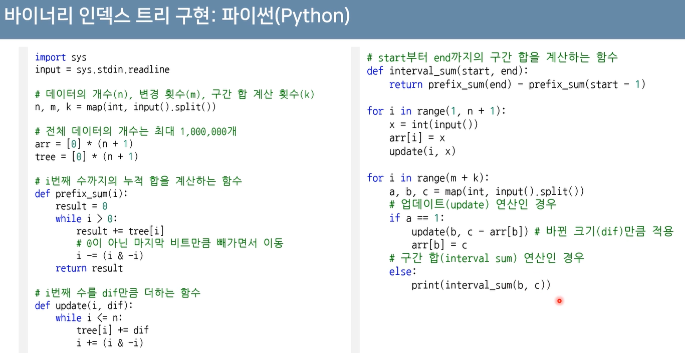
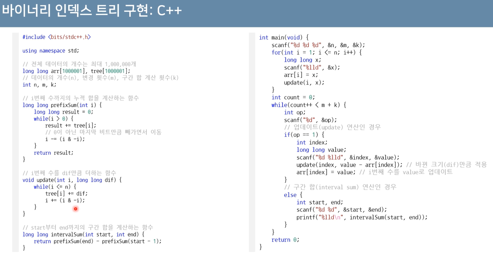

# 바이너리 인덱스 트리(Binary Index Tree - BIT)
> [구간 합 구하기](https://www.acmicpc.net/problem/2042)
* *데이터 업데이트가 가능한 상황에서의 구간 합(Interval Sum) 문제*
* 2진법 인덱스 구조를 활용해 구간 합 문제를 효과적으로 해결
    * **펜윅 트리(fenwick tree)**
* 정수에 따른 2진수 표기(2의 보수)

|정수|2진수 표기|
|:---:|:---:|
|7|00000000 00000000 00000000 0000111|
|-7|11111111 11111111 11111111 1111001|

* 0이 아닌 마지막 비트를 찾는 방법
    * 특정한 숫자 K의 0이 아닌 마지막 비트를 찾기 위해 **K & - K**를 계산

|정수 K|K & -K|
|:--:|:--:|
|0|0|
|1|1|
|2|2|
|3|1|
|4|4|
|5|1|
|6|2|
|7|1|
|8|8|

# 트리 구조 만들기
* 0이 아닌 마지막 비트 = 내가 저장하고 있는 값들의 개수

**~~*(무슨 소린지 모르겠다....)*~~**

## 업데이트(Update)
* **특정 값을 변경할 때:** 0이 아닌 마지막 비트만큼 더하면서 구간들의 값을 변경

## 누적 합(Prefix Sum)
* **1부터 N까지의 합(누적 합)** 구하기: 0이 아닌 마지막 비트만큼 빼면서 구간들의 값의 합 계산

