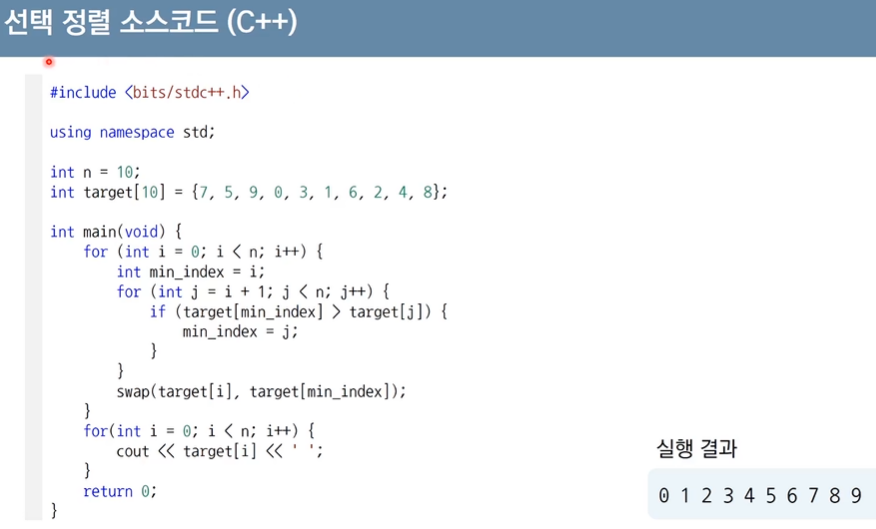
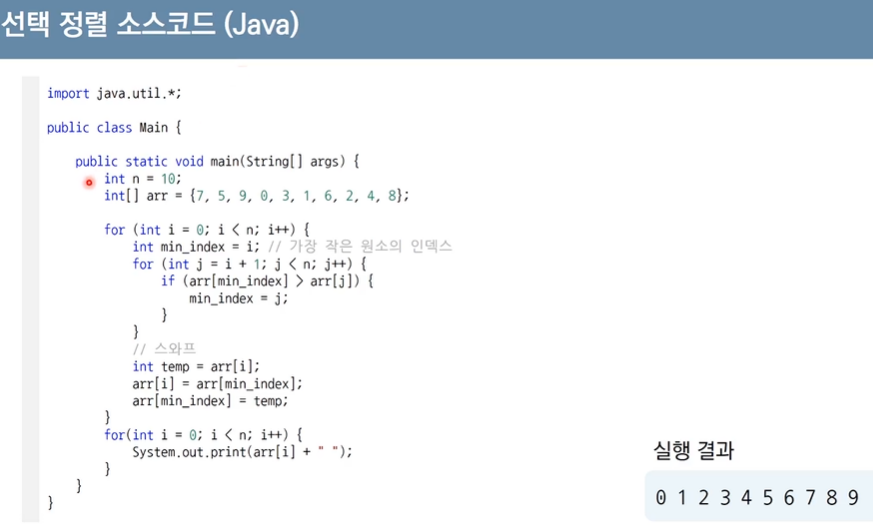
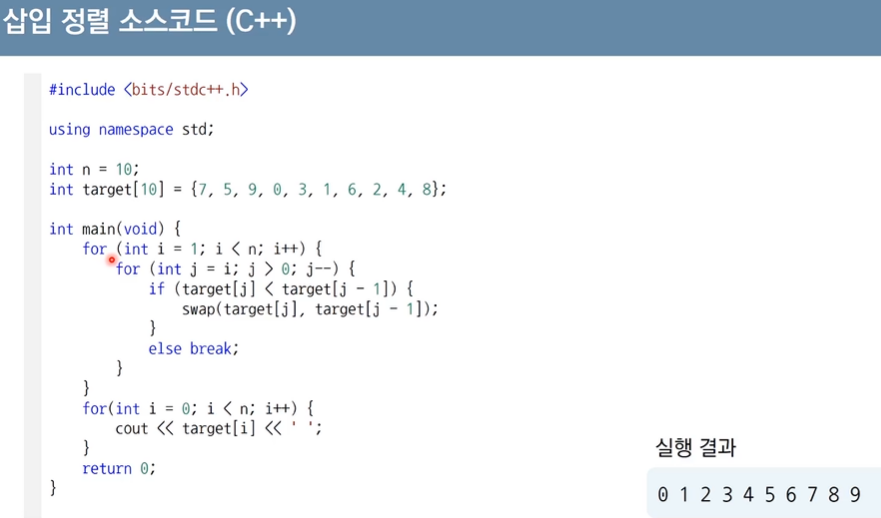
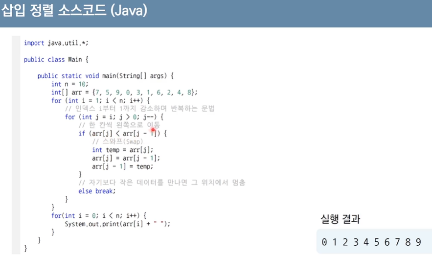

# 선택 정렬과 삽입 정렬
# 정렬(Sorting) 알고리즘
* **데이터를 특정한 기준에 따라 순서대로 나열**
* 일반적으로 문제 상황에 따라서 적절한 정렬 알고리즘이 공식처럼 사용

# 선택 정렬(Seletion Sort)
* 처리되지 않은 데이터 중에서 **가장 작은 데이터를 선택해서 맨 앞에 있는 데이터와 바꾸는 것을 반복**
  * [7, 5, 9, **0**, 3, 1, 6, 2, 4, 8]
  * [*0*, 5, 9, 7, 3, **1**, 6, 2, 4, 8]
  * [*0*, *1*, 7, 9, 3, 5, 6, **2**, 4, 8]
  * ...
  * [*0*, *1*, *2*, *3*, *4*, *5*, *6*, *7*, 9, **8**]
  * [*0*, *1*, *2*, *3*, *4*, *5*, *6*, *7*, *8*, *9*]
## 선택 정렬 구현 코드
* Python
```py
# 6-1 159
array = [7, 5, 9, 0, 3, 1, 6, 2, 4, 8]

for i in range(len(array)):
  min_index = i # 가장 작은 원소의 인덱스
  for j in range(i + 1, len(array)):
    if array[min_index] > array[j]:
      min_index = j
  array[i], array[min_index] = array[min_index], array[i] # 스와프

print(array)
# [0, 1, 2, 3, 4, 5, 6, 7, 8, 9]
```
* C++



* Java



## 선택 정렬의 시간 복잡도
* 선택 정렬은 N번 만큼 가장 작은 수를 찾아서 맨 앞으로 보내야 함

  > N + (N - 1) + (N - 2) + ... + 2
  > <br/>= (N<sup>2</sup> + N - 2) / 2
* **O(N<sup>2</sup>)**

# 삽입 정렬(Insertion Sort)
* 처리되지 않은 데이터를 하나씩 골라 **적절한 위치에 삽입**
* 선택 정렬에 비해 구현 난이도가 높은 편이지만, 일반적으로 더 효율적으로 동작

## 삽입 정렬 구현 코드
* Python

```py
# 6-3 164
array = [7, 5, 9, 0, 3, 1, 6, 2, 4, 8]

for i in range(1, len(array)):
  for j in range(i, 0, -1): # 인덱스 i부터 1씩 감소하며 반복하는 문법
    if array[j] < array[j - 1]: # 한 칸씩 왼쪽으로 이동
        array[j], array[j - 1] = array[j - 1], array[j]
    else: # 자기보다 작은 데이터를 만나면 그 위치에서 멈춤
        break

print(array)
# [0, 1, 2, 3, 4, 5, 6, 7, 8, 9]
```

* C++



* Java



## 삽입 정렬의 시간 복잡도
* 삽입 정렬의 시간 복잡도는 **O(N<sup>2</sup>)** 이며, 선택 정렬과 마찬가지로 반복문이 두 번 중첩되어 사용됨
* 현재 리스트의 데이터가 *거의 정렬되어 있는 상태라면 매우 빠르게 동작*
  * 최선의 경우 *O(N)*의 시간 복잡도를 가짐
    * *이미 정렬된 상태*