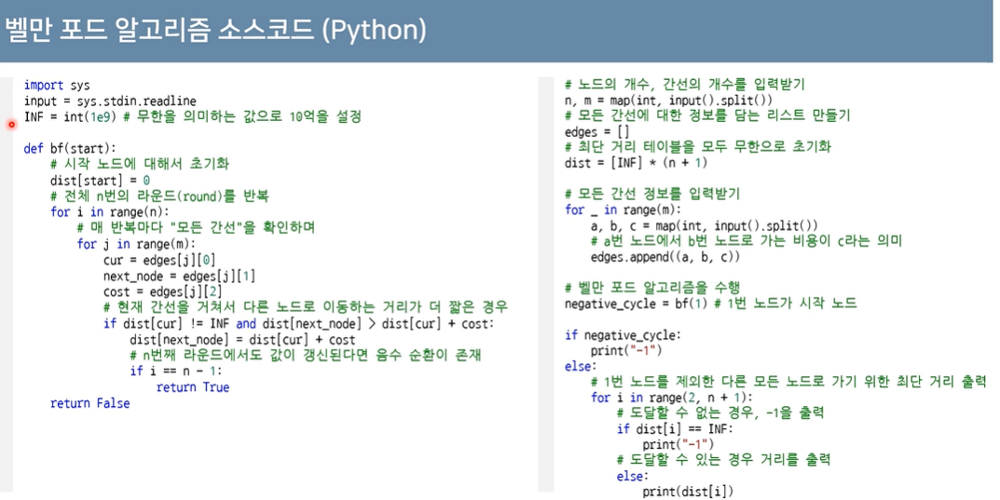

## 음수의 간선 문제 
[11657. 타임머신](https://www.acmicpc.net/problem/11657)

# 벨만 포드 (Bellman-Ford)
* 음수 간선에 관하여 최단 경로 문제 분류
1. 모든 간선이 양수인 경우
2. 음수 간선이 있는 경우
  1. 음수 간선 순환은 없는 경우
  2. 음수 간선 순환이 있는 경우
* **벨만 포드 최단 경로 알고리즘**은 <u>음의 간선이 포함된 상황에서도 사용</u>할 수 있음
  * 또한 <u>음수 간선의 순환을 감지</u>할 수 있음
  * 벨만 포드의 기본 시간 복잡도는 **O(VE)**로 다익스트라 알고리즘에 비해 느림
* 동작 원리
  1. 출발 노드를 설정
  2. 최단 거리 테이블을 초기화
  3. 다음의 과정을 N-1번 반복
    1. 전체 간선 E개를 하나씩 확인
    2. 각 간선을 거쳐 다른 노드로 가는 비용을 계산하여 최단 거리 테이블 갱신
* 만약 <u>음수 간선 순환이 발생하는지 체크하고 싶다면</u> **3번의 과정을 한 번 더 수행**
  * 이때 최단 거리 테이블이 갱신된다면 음수 간선 순환이 존재하는 것!

## 벨만 포드 VS 다익스트라
* 다익스트라
  * <u>매번 방문하지 않은 노드 중에서 최단 거리가 가장 짧은 노드를 선택</u>
  * 음수 간선이 없다면 최적의 해를 찾을 수 있음
* 벨만 포드
  * <u>매번 모든 간선을 전부 확인</u>
    * 따라서 **다익스트라 알고리즘에서의 최적의 해를 항상 포함**
  * 다익스트라 알고리즘에 비해서 시간이 오래 걸리지만 **음수 간선 순환을 탐지**할 수 있음

## 벨만 포드 구현

