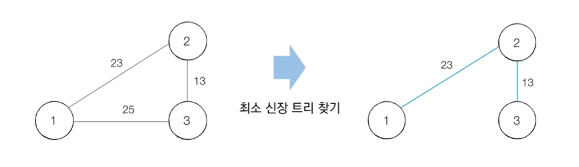

# 신장 트리(Spanning Tree)
* <u>그래프에서 모든 노드를 포함하면서 사이클이 존재하지 않는 부분 그래프</u>
  * 모든 노드가 포함되어 서로 연결되면서 사이클이 존재하지 않는다는 조건은 **트리**의 조건이기도 함
## 최소 신장 트리
* <u>최소한의 비용으로 구성되는 신장 트리를 찾아야 할 때</u>
* N개의 도시가 존재하는 상황에서 두 도시 사이에 도로를 놓아 **전체 도시가 서로 연결**될 수 있게 도로를 설치하는 경우



# 크루스칼(Kruskal) 알고리즘
* 대표적인 **최소 신장 트리 알고리즘**
* **그리디 알고리즘**으로 분류
* 동작 과정
  1. 간선 데이터를 비용에 따라 **오름차순으로 정렬**
  2. 간선을 하나씩 확인하며 <u>현재의 간선이 사이클을 발생시키는지 확인</u>
      1. 사이클이 발생하지 않는 경우 최소 신장 트리에 포함
      2. 사이클이 발생하는 경우 최소 신장트리에 포함시키지 않음
  3. 모든 간선에 대하여 2번의 과정을 반복

## 동작 과정
* ...
## 구현
```py
# 10-5 288
# 특정 원소가 속한 집합을 찾기
def find_parent(parent, x):
    # 루트 노드가 아니라면, 루트 노드를 찾을 때까지 재귀적으로 호출
    if parent[x] != x:
        parent[x] = find_parent(parent, parent[x])
    return parent[x]

# 두 원소가 속한 집합을 합치기
def union_parent(parent, a, b):
    a = find_parent(parent, a)
    b = find_parent(parent, b)
    if a < b:
        parent[b] = a
    else:
        parent[a] = b

# 노드의 개수와 간선(Union 연산)의 개수 입력 받기
v, e = map(int, input().split())
parent = [0] * (v + 1) # 부모 테이블 초기화하기

# 모든 간선을 담을 리스트와, 최종 비용을 담을 변수
edges = []
result = 0

# 부모 테이블상에서, 부모를 자기 자신으로 초기화
for i in range(1, v + 1):
    parent[i] = i

# 모든 간선에 대한 정보를 입력 받기
for _ in range(e):
    a, b, cost = map(int, input().split())
    # 비용순으로 정렬하기 위해서 튜플의 첫 번째 원소를 비용으로 설정
    edges.append((cost, a, b))

# 간선을 비용순으로 정렬
edges.sort()

# 간선을 하나씩 확인하며
for edge in edges:
    cost, a, b = edge
    # 사이클이 발생하지 않는 경우에만 집합에 포함
    if find_parent(parent, a) != find_parent(parent, b):
        union_parent(parent, a, b)
        result += cost

print(result)
'''
7 9
1 2 29
1 5 75
2 3 35
2 6 34
3 4 7
4 6 23
4 7 13
5 6 53
6 7 25

159
'''
```

## 크루스칼 알고리즘 성능 분석
* 간선의 개수가 E개일 때, 시간 복잡도는 **$O(ElogE)$**
* 가장 많은 시간을 요구하는 곳은 간선을 정렬을 수행하는 부분
  * 표준 라이브러리를 이용해 E개의 데이터를 정렬하기 위한 시간 복잡도는 $O(ElogE)$