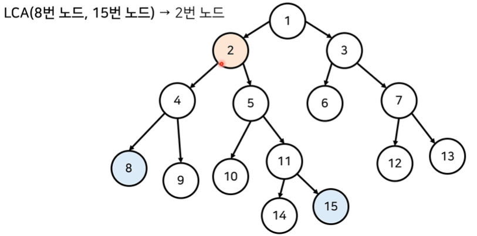
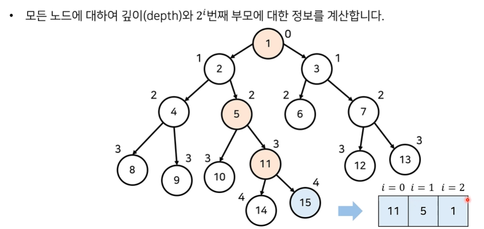

# 최소 공통 조상(Lowest Common Ancestor)
* BOJ 문제 [11437. LCA](https://www.acmicpc.net/problem/11437)
* **최소 공통 조상(LCA)** 문제는 <u>두 노드의 공통된 조상 중에서 가장 가까운 조상을 찾는 문제</u>



# 기본적인 LCA 알고리즘
1. 모든 노드에 대한 깊이(depth)를 계산
2. 최소 공통 조상을 찾을 두 노드를 확인
  1. 먼저 두 노드의 깊이(depth)가 동일하도록 거슬러 올라감
  2. 이후에 부모가 같아질 때까지 반복적으로 두 노드의 부모 방향으로 거슬러 올라감
3. 모든 LCA(a, b) 연산에 대하여 2번의 과정을 반복
# LCA 구현
```py
# 21-5
import sys
sys.setrecursionlimit(int(1e5)) # 런타임 오류를 피하기 위한 재귀 깊이 제한 설정

n = int(input())

parent = [0] * (n + 1) # 부모 노드 정보
d = [0] * (n + 1) # 각 노드까지의 깊이
c = [0] * (n + 1) # 각 노드의 깊이가 계산되었는지 여부
graph = [[] for _ in range(n + 1)] # 그래프 (graph) 정보

for _ in range(n - 1):
    a, b = map(int, input().split())
    graph[a].append(b)
    graph[b].append(a)

# 루트 노드부터 시작하여 깊이(depth)를 구하는 함수
def dfs(x, depth):
    c[x] = True
    d[x] = depth
    for y in graph[x]:
        if c[y]:
            continue
        parent[y] = x
        dfs(y, depth + 1)

# A와 B의 최소 공통 조상을 찾는 함수
def lca(a, b):
    # 먼저 깊이(depth)가 동일하도록
    while d[a] != d[b]:
        if d[a] > d[b]:
            a = parent[a]
        else:
            b = parent[b]
    # 노드가 같아지도록
    while a != b:
        a = parent[a]
        b = parent[b]
    return a

dfs(1, 0) # 루트 노드는 1번 노드

m = int(input())

for i in range(m):
    a, b = map(int, input().split())
    print(lca(a, b))
```

# LCA 시간 복잡도
* 매 쿼리마다 부모 방향으로 거슬러 올라가기 위해 최악의 경우 시간 복잡도는 **O(N)**
  * 따라서 모든 쿼리를 처리할 때의 시간 복잡도는 **O(NM)**

## 심화 문제
* BOJ 문제 [11438. LCA 2](https://www.acmicpc.net/problem/11438)
* 각 노드가 <u>거슬러 올라가는 속도를 빠르게 만드는 방법</u>에 대하여 고민
  * 만약 총 **15칸** 거슬러 올라가야 한다면?
    * 8칸 -> 4칸 -> 2칸 -> 1칸
* 2의 제곱 형태로 거슬러 올라가도록 하면 **O(logN)**의 시간 복잡도를 보장
* 메모리를 조금 더 사용하여 각 노드에 대하여 $2^i$번째 부모에 대한 정보를 기록



* 다이나믹 프로그래밍(dynamic programming)을 이용해 시간 복잡도를 개선
  * 세그먼트 트리를 이용하는 방법도 존재
* 매 쿼리마다 부모를 거슬러 올라가기 위해 **O(logN)**의 복잡도가 필요
  * 따라서 모든 쿼리를 처리할 때의 시간 복잡도는 **O(MlogN)**

## 개선된 LCA 구현
```py
# 21-6
import sys
input = sys.stdin.readline # 시간 초과를 피하기 위한 빠른 입력 함수
sys.setrecursionlimit(int(1e5)) # 런타임 오류를 피하기 위한 재귀 깊이 제한 설정
LOG = 21 # 2^20 = 1,000,000

n = int(input())
parent = [[0] * LOG for _ in range(n + 1)] # 부모 노드 정보
d = [0] * (n + 1) # 각 노드까지의 깊이
c = [0] * (n + 1) # 각 노드의 깊이가 계산되었는지 여부
graph = [[] for _ in range(n + 1)] # 그래프(graph) 정보

for _ in range(n - 1):
    a, b = map(int, input().split())
    graph[a].append(b)
    graph[b].append(a)

# 루트 노드부터 시작하여 깊이(depth)를 구하는 함수
def dfs(x, depth):
    c[x] = True
    d[x] = depth
    for y in graph[x]:
        if c[y]: # 이미 깊이를 구했다면 넘기기
            continue
        parent[y][0] = x
        dfs(y, depth + 1)

# 전체 부모 관계를 설정하는 함수
def set_parent():
    dfs(1, 0) # 루트 노드는 1번 노드
    for i in range(1, LOG):
        for j in range(1, n + 1):
            parent[j][i] = parent[parent[j][i - 1]][i - 1]

# A와 B의 최소 공통 조상을 찾는 함수
def lca(a, b):
    # b가 더 깊도록 설정
    if d[a] > d[b]:
        a, b = b, a
    # 먼저 깊이(depth)가 동일하도록
    for i in range(LOG - 1, -1, -1):
        if d[b] - d[a] >= (1 << i):
            b = parent[b][i]
    # 부모가 같아지도록
    if a == b:
        return a;
    for i in range(LOG - 1, -1, -1):
        # 조상을 향해 거슬러 올라가기
        if parent[a][i] != parent[b][i]:
            a = parent[a][i]
            b = parent[b][i]
    # 이후에 부모가 찾고자 하는 조상
    return parent[a][0]

set_parent()

m = int(input())

for i in range(m):
    a, b = map(int, input().split())
    print(lca(a, b))
```