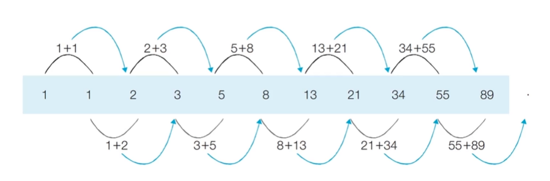

# 다이나믹 프로그래밍(Dynamic Programming)
* **메모리를 적절히 사용하여 수행 시간 효율성을 비약적으로 향상시키는 방법**
  * **동적 계획법**
* <u>이미 계산된 결과(작은 문제)는 별도의 메모리 영역에 저장</u>하여 다시 계산하지 않도록 함
* 다이나믹 프로그래밍의 구현은 일반적으로 두 가지 방식(탑다운과 보텀업)으로 구성

## 다이나믹 프로그래밍의 조건
1. **최적 부분 구조(Optimal Substructure)**
    * 큰 문제를 작은 문제로 나눌 수 있으며 작은 문제의 답을 모아서 큰 문제를 해결할 수 있음
2. **중복되는 부분 문제(Overlappint Subproblem)**
    * 동일한 작은 문제를 반복적으로 해결해야 함

## 피보나치 수열
* 다음과 같은 형태의 수열이며, 다이나믹 프로그래밍으로 효과적으로 계산할 수 있음.
> 1, 1, 2, 3, 5, 8, 13, 21, 34, 55, 89

* **점화식**: <u>인접한 항들 사이의 관계식</u>
* 피보나치 수열의 점화식
> $$a_n=a_{n-1}+a_{n-2}, a_1=1,a_2=1$$



* 프로그래밍에서는 이러한 수열을 배열이나 리스트를 이용해 표현

### 피보나치 수열: 단순 재귀 소스코드
```py
# 8-1 210
# 피보나치 함수(Fibonacci Function)을 재귀함수로 구현
def fibo(x):
    if x == 1 or x == 2:
        return 1
    return fibo(x - 1) + fibo(x - 2)
  
print(fibo(4))
# 3
```
* 시간 복잡도 분석
  * 단순 재귀 함수로 피보나치 수열을 해결하면 *지수 시간 복잡도*를 가지게 됨
  * f(2)가 <u>여러 번 호출</u>되는 것을 확인(**중복되는 부분 문제**)
  * O(2<sup>N</sup>)
    * *N이 30이면 약 10억가량의 연산을 수행*

## 피보나치 수열의 효율적인 해법: 다이나믹 프로그래밍
* 다이나믹 프로그래밍의 사용 **조건**을 만족하는지 확인
  1. **최적 부분 구조**: 큰 문제를 작은 문제로 나눌 수 있음
  2. **중복되는 부분 문제**: 동일한 작은 문제를 반복적으로 해결

## 메모이제이션(Memoization)
* <u>한 번 계산한 결과를 메모리 공간에 메모</u>하는 기법
  * 같은 문제를 다시 호출하면 메모했던 결과를 그래도 가져옴
  * 값을 기록해 놓는다는 점에서 **캐싱(Caching)**이라고도 함
