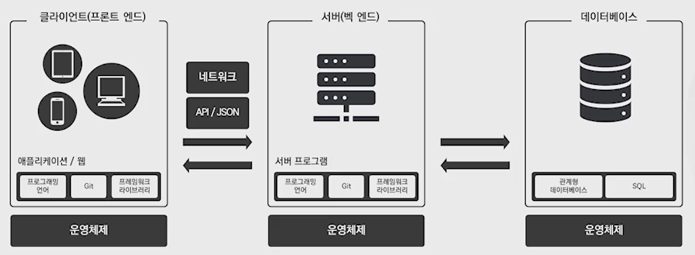

# 비 개발자를 위한 IT지식

  
[IT 개발 구조]

> # 🌈*IT 기초*

# 1. IT를 이해하는 법
* 용어에 대한 이해
* 커뮤니케이션

# 2. 프로그래밍 언어
* 사람의 언어를 컴퓨터가 이해할 수 있는 언어로

# 3. 컴퓨터의 구성요소

# 4. OS

# 5. 네트워크

> # 🌈*클라이언트(Frontend)*

# 6. 애플리케이션, 웹, 웹 브라우저

# 7. 웹 사이드 이슈들

> # 🌈*서버(Backend)*

# 8. 리눅스

# 9. 클라우드

> # 🌈*프레임워크와 라이브러리*

> # 🌈*데이터베이스*

> # 🌈*정리*
