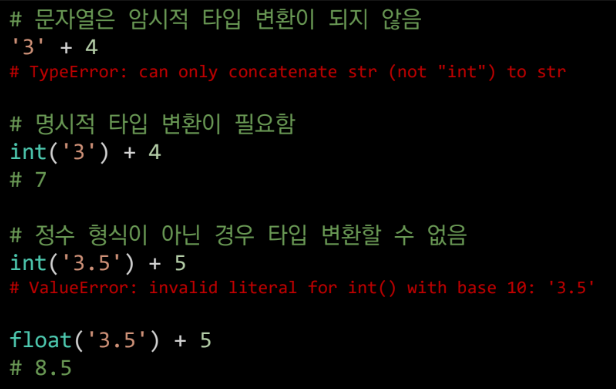

# Python 02

# String Formatting
## String Interpolation
* 문자열을 변수를 활용하여 만드는 법
  * %-formatting
    ```py
    name = 'Kim'
    score = 4.5

    print('Hello, %s' % name) # Hello, Kim
    print('내 성적은 %d' % score) # 내 성적은 4
    print('내 성적은 %f' % score) # 내 성적은 4.500000
    ```
  * f-string
    ```py
    name = 'Kim'
    score = 4.5
    age = 19.9
    print(f'Hello, {name}! 성적은 {score}')
    # Hello, Kim! 성적은 4.5
    print('{}은 {}살입니다.'.format(name, age))
    # Kim는 19.9살입니다.
    
    pi = 3.141592
    print(f'원주율은 {pi:.3}. 반지름이 2일때 원의 넒이는 {pi*2*2}')
    # 원주율은 3.14. 반지름이 2일때 원의 넓이는 12.566368
    ```

# 자료형 변환(Typecasting)
* 파이썬에서 데이터 형태는 서로 변환할 수 있음
  * 암시적(Implicit) 형 변환
    ```py
    # bool
    True + 3 # 4
    
    # Numeric type(int, float, complex)
    3 + 5.0 # 8.0
    3 + 4j + 5 # (8+4j)
    ```
  * 명시적(Explicit) 형 변환
  

  *형식에 맞는 문자열만 가능*
  * int
    * str*, float   \
    ==> int
  * float
    * str*, int  \
    ==> float
  * str
    * int, float, list, *tuple*, *dict*   \
    ==> str

# 제어문(Control)
## 학습 목표
* **조건문**을 활용한 코드를 작성하고 문제 풀이에 적용할 수 있다.
* **반복문**을 활용한 코드를 작성하고 문제 풀이에 적용할 수 있다.
* **for 반복문**과 **while 반복문**의 차이를 비교하고 사용할 수 있다.
* **중첩된 조건문과 반복문**의 결과를 판단할 수 있다.
* **반복문 제어**를 활용하여 원하는 조건의 **반복 종료를 실행**시킬 수 있다.

## 조건문
* **참/거짓**을 판단할 수 있는 조건식과 함께 사용
* \<expression\>에는 참/거짓에 대한 조건식
  ```py
  if < expression >:
      # Run this Code block
  else: # else는 생략가능
      # Run this Code block
  ```
### 복수 조건문
* elif
  ```py
  if < expression >:
      # Code block
  elif < expression >:
      # Code block
  elif < expression >:
      # Code block
  else:
      # Code block
  ```
### 중첩 조건문
* 조건문은 다른 조건문에 중첩되어 사용될 수 있음
  ```py
  if < expression >:
      # Code block
      if < expression >:
          # Code block
  else:
    # Code block
  ```

## 레인지(Range)
* 숫자의 시퀀스를 나타내기 위해 사용
  * 기본 : `range(n)`
    * 0부터 n-1까지 숫자의 시퀀스
  * 범위 : `range(n, m)`
    * n부터 m-1까지 숫자의 시퀀스
  * 스텝 : `range(n, m, s)
    * n부터 m-1까지 s만큰 증가시키며 숫자의 스퀀스
* 변경 불가능하며(immutable), 반복 가능함(iterable)
  ```py
  range(4)
  # range(0, 4)
  list(range(4))
  # [0, 1, 2, 3]
  type(range(4))
  # <class 'range'>
  ```
  ```py
  # 역순
  list(range(6, 1, -1))
  # [6, 5, 4, 3, 2]
  ```

# 반복문
* 특정 조건을 도달할 때까지, 계속 반복되는 일련의 문장
## while 문
* 조건식이 참인 경우 반복적으로 코드를 실행
* 무한 루프를 하지 않도록 종료조건이 반드시 필요
  * *종료조건에 해당하는 코드를 통해 반복문을 종료시켜야 함*
```py
while <조건식>:
  # Code block
```

## for 문
* 반복가능한 객체를 모두 순회하면 종료(별도의 종료조건이 필요 없음)
* 시퀀스(string, tuple, list, range)를 포함한 **순회가능한 객체**(iterable)요소를 모두 순회함
  * 끝에 도착하면 종료
  * *순회 가능한 객체 : 컨테이너형(문자열, 리스트, 튜플, range, set, dictionary)등*
```py
for <변수명> in <iterable>:
  # Code block
```
## 반복제어
* break
  * 반복문을 종료
* continue
  * continue 이후의 코드 블록은 수행하지 않고, 다음 반복을 수행
* for-else
  * 끝까지 반복문을 실행한 이후에 else문 실행
    * *break를 통해 중간에 종료되는 경우 else 문은 실행되지 않음*
  ```py
  # for-else

  # ex1
  for char in 'apple':
      if char == 'b':
          print('b!')
          break
  else:
      pirnt('b가 없습니다.') # for반복문이 완료후 출력
  # b가 없습니다.
  
  # ex2
  for char in 'banana':
      if char == 'b':
          print('b!')
          break
  else:
      print('b가 없습니다.') # break 때문에 출력되지 않음
  # b!
  ```
> [python tutor](https://pythontutor.com/visualize.html#mode=edit)(코드를 시각화해주는 사이트)