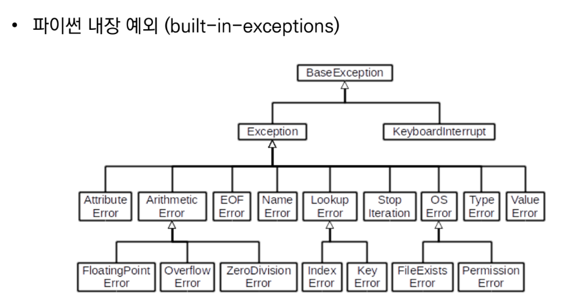
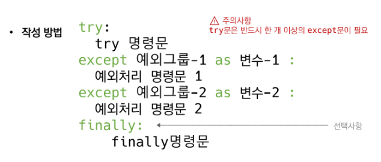
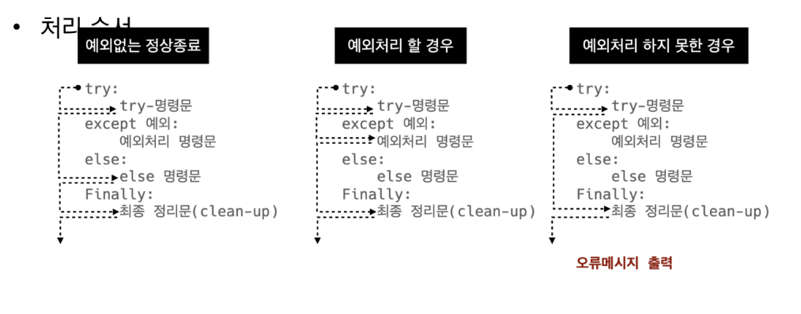

# 모듈
## 학습 목표
* 파이썬 내장 라이브러리 문서를 읽고 활용할 수 있다.
* radom, datetime 모듈을 활용하여 코드를 작성할 수 있다.
* 패키지를 설치하고 패키지 목록을 관리할 수 있다.

# 모듈(module)
* 특정 **기능을** 하는 코드를 파이썬 **파일(.py) 단위로** 작성한 것

# 패키지(Package)
* 특정 기능과 관련된 **여러 모듈의 집합**
* 패키지 안에는 또 다른 서브 패키지를 포함
* *~~내용 그냥 읽어보기 (django 때 활용)~~*

# 라이브러리(Library)
* 다양한 패키지를 하나의 묶음으로
* 이 것을 관리하는 관리자는 pip
[파이썬 표준 라이브러리](https://docs.python.org/ko/3/library/index.html)

* random - 난수 생성
  * random.randint(a, b)
    * a 이상 b 이하의 임의의 정수 N을 반환
  * random.choise(seq)
    * 비어 있지 않은 시퀀스에서 임의의 요소를 반환
    * seq가 비어있으면 IndexError를 발생 시킴
  * random.sample(population, k)
    * population에서 k개 만큼의 요소를 무작위 비복원 추출하여 리스트로 반환
  * random.shuffle(seq)
    * 시퀀스를 제자리에서 섞음
* datetime - 날짜와 시간을 조작하는 객체를 제공
  * datetime.date(year, month, day)
    * 모든 인자가 필수, 인자는 특정 범위에 있는 정수
    * 범위를 벗어나면 ValueError가 발생
  * datetime.data.today()
    * 현재 지역 날짜를 반환
  * datetime.datetime.today()
    * 현재 지역 datetime을 반환
    * now()를 활용하면 타임존 설정 가능 
* os - OS를 조작하기 위한 인터페이스 제공
  * os.listdir(path='.')
    * path에 의해 주어진 디렉터리에 있는 항목들의 이름을 담고 있는 리스트를 반환
    * 리스트는 임의의 순서로 나열, 특수 항목은 포함하지 않음
  * os.mkdir(path)
    * path라는 디렉터리 생성
  * os.chdir(path)
    * path를 변경

# 에러 / 예외 처리 (Error / Exception Handling)
## 학습 목표
* 파이썬에서 발생하는 에러메시지를 읽고 해석할 수 있다.
* 에러메세지를 읽고 디버깅을 하여 코드의 문제를 해결할 수 있다.
* SW개발자 관점에서 예외를 처리하고 에러를 발생시키는 방법을 익힐 수 있다.

# 디버깅(debugging)
* print()
* 개발 환경 - breakpoint, 변수 조회
* python tutor
* 뇌컴파일, 눈디버깅

# 에러
* 문법 에러(Syntax Error) - 실행을 멈춤
 * EOL
 * EOF
 * invalid syntax
 * assign to literal

## 예외(Exception)
* 실행 도중 예상치 못한 상황을 맞이하면, 프로그램 실행을 멈춤
* 실행 중에 감지되는 에러들을 예외라고 부름
* 여러 타입(type)으로 나타나고, 타입이 출력됨
* 모든 내장 예외는 Exception Class를 상속받아 이뤄짐
* **사용자 정의 예외**를 만들어 관리할 수 있음
### 예외의 종류

* [예외 공식 문서](https://docs.python.org/ko/3/library/exceptions.html)
* ZeroDividionError
  * 0으로 나누려는 경우
* NameError
  * 변수 이름을 찾을 수 없는 경우
* TypeError
  * 잘못된 타입을 전달 했을 때
  * arguments 부족 / 초과(파라미터 인자 부족 / 초과)
* ValueError
  * 타입은 올바르나 값이 적절하지 않거나 없는 경우
  * 형변환할 때, 참조값이 없을때
* IndexError
  * 인덱스 범위를 벗어나는 경우
* KeyError
  * 딕셔너리에서 접근하려는 키 값이 없을 때
* ModuleNotFoundError
  * 존재하지 않은 module을 import한 경우
* ImportError
  * module은 있으나 존재하지 않는 클래스/ 함수를 가져오는 경우
* IndentationError(문단)
  * 문단을 잘못 들여쓰기 했을 때,(해야하는데) 안했을 때
* KeyboardInterrupt
  * 임의로 프로그램을 종료했을 때(Win: Crtl + C, Delete)
* 그 외 ...

## 예외 처리

* try문 / except절을 이용하여 예외 처리를 할 수 있음
* try문(statement)
  * 오류가 발생할 가능성이 있는 코드를 실행
  * 예외가 발생되지 않으면, except 없이 샐행 종료
* except절(clause)
  * 예외가 발생하면, except절이 실행
  * 예외 상황을 처리하는 코드를 받아서 적절한 조치를 취함
* else
  * try 문에서 예외가 발생하지 않으면 실행함
* finally
  * 예외 발생 여부와 관계없이 항상 실행함
```py
try:
  num = int(input('값을 입력하세요: '))
  a = 100/num
except ValueError: 
  print('숫자를 넣어주세요.') # 숫자가 아닌 값을 입력했을 때
except ZeroDivisionError: 
  print('0으로 나눌 수 없습니다.') # 0을 입력했을때
except: 
  print('에러는 모르겠지만 에러가 발생하였습니다.') # 그 외 에러
else: 
  print(a) # 에러가 없을때
finally: 
  print('코드 끝') # 에러 상관없이 실행
```


## 예외 발생 시키기
* raise
  * raise \<표현식\>(메시지)
  * 표현식에는 예외 타입 지정
  * 실제 프로덕션 코드에서 활용
  * try/except문과 함께 사용해서 예외 상황에 대한 **별도의 처리**를 하도록 한다.
  * ***예외를 발생시키기 위해 항상 지정한 예외를 발생***
* assert
  * assert \<표현식\>, \<메시지\>
  * 표현식이 False면 AssertionError 발생
  * 특정 조건이 거짓이면 발생. **디버깅 및 테스트**에서 활용
  * 값이 어떠한 조건을 만족해야 한다는 것을 보장하기 위해 사용한다.  \
  (조건을 만족하지 못할 경우 **강제 종료**시킨다.)*
  * ***상태를 검증하기 위해 표현식이 False일 때만 AssertionError를 발생***