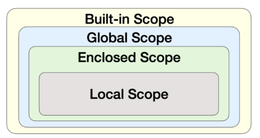

# 사용자 정의 함수
## 학습 목표
* 함수를 직접 정의하고 활용할 수 있다
* 함수 정의에 맞춰 함수를 호출하고 실행시킬 수 있다.
* 함수의 스코프를 이해하고 설명할 수 있다.
* 파이썬의 이름 검색 규칙을 설명할 수 있다.

# 함수 기본 구조
* 선언과 호출(define & call)
* 입력(Input)
* 범위(Scope)
* 결과값(Output)

# 선언과 호출
* 함수의 선언은 def 키워드를 활용함
* 들여쓰기를 통해 Function body(실행될 코드 블록)를 작성함
  * Docstring은 함수 body 앞에 선택적으로 작성 가능
    * 작성시에는 반드시 첫 번째 문장에 문자열 ''''''
* 함수는 parameter를 넘겨줄 수 있음
* 함수는 동작 후에 return을 통해 결과값을 전달함
* 함수는 함수명()으로 호출
  * parameter가 있는 경우, 함수명(값1, 값2, ...)로 호출
```py
num1 = 0
num2 = 1

def func1(a, b):
  return a + b

def func2(a, b):
  return a - b

def func3(a, b):
  return fun1(a, 5) + func(5, b)

result = func3(num1, num2)
print(result)
# 9
```

# 함수의 결과값(Output)
* `return`
* 함수는 반드시 값을 하나만 return한다.
  * 명시적인 return이 없는 경우에도 None을 반환한다.
* 함수는 return과 동시에 실행이 **종료**된다.

* return vs print
  * return은 함수 안에서 값을 반환하기 위해 사용되는 키워드
  * print는 출력을 위해 사용되는 함수

# 함수의 입력(Input)
  ```py
  def function(ham): # parameter : ham
      return ham
  function('spam') # argument : 'spam'
  ```

* Parameter : 함수를 실행할 때, 함수 내부에서 사용되는 식별자
* Argument : 함수를 호출 할 때, 넣어주는 값
  * 필수 Argument
  * 선택 Argument
  * positional arguments
    * 기본적으로 함수 호출 시 Argument는 **위치**에 따라 함수 내에 전달됨
  * keyword arguments
    * 직접 변수의 이름으로 특정 Argument를 전달할 수 있음
    * Keyword Argument 다음에 Positional Argument를 활용할 수 없음
  * Default Arguments Values
    * 기본값을 지정하여 함수 호출 시 argument 값을 설정하지 않아도 됨
      * *정의된 것 보다 더 적은 개수의 argument들로 호출 될 수 있음*
      * *argument 생략 가능*
  * 정해지지 않은 개수의 arguments
    * 여러 개의 Positional Argument를 하나의 필수 parameter로 받아서 사용
      * 몇 개의 Positional Argument를 받을지 모르는 함수를 정의할 때 유용
    * Argument들은 **튜플**로 묶여 처리되며, parameter에 `*`를 붙여 표현
    ```py
    def add(*args): # 
        print(args) # (2, 3, 4, 5)
        print(type(args)) # <class 'tuple'>
        for arg in args:
            print(arg, end=' ') # 2 3 4 5 

    add(2, 3, 4, 5)
    ```
  * 정해지지 않은 개수의 keyword arguments
    * 함수가 임의의 개수 argument를 Keyword Argument로 호출될 수 있도록 지정
    * Argument들은 **딕셔너리**로 묶여 처리되며, parameterm에 `**`를 붙여 표현
    ```py
    def family(**kwargs):
        for key, value in kwargs:
            print(key, ':', value)
    
    family(father='John', mother='Jane', me='John Jr.')
    ```

# 함수의 범위(Scope)
* 함수는 코드 내부에 local scope를 생성하며, 그 외의 공간인 global scope로 구분
* scope
  * global scope : 코드 어디에서든 참조할 수 있는 공간
  * local scope : 함수가 만든 scope. 함수 내부에서만 참조 가능
* variable
  * global variable : global scope에 정의된 변수
  * local variable : local scope에 정의된 변수

# 객체 수명주기
* 객체는 각자의 수명주기(lifecycle)가 존재
  * built-in scope
    * 파이썬이 실행된 이후부터 영원히 유지
  * global scope
    * 모듈이 호출된 시점 이후 혹은 인터프리터가 끝날 때까지 유지
  * local scope
    * 함수가 호출될 때 생성되고, 함수가 종료될 때까지 유지

# 이름 검색 규칙(Name Resolution)


* 파이썬에서 사용되는 이름(식별자)들은 이름공간(namespace)에 저장되어 있음
* LEGB Rule
  * Local scope : 함수
  * Enclosed scope : 특정 함수의 상위 함수
  * Global scope : 함수 밖의 변수, Import 모듈
  * Built-in scope : 파이썬 안에 내장되어 있는 함수 또는 속성
* 즉, 함수 내에서는 바깥 Scope의 변수에 접근 가능하나 수정은 할 수 없음

## global 문
* 현재 코드 블록 전체에 적용되며, 나열된 식별자(이름)이 global variable임을 나타냄
  * `global`에 나열된 이름은 같은 코드 블록에서 global 앞에 등장할 수 없음
  * global에 나열된 이름은 parameter, for 루프 대상, 클래스/함수 정의 등으로 정의되지 않아야 함
```py
# 함수 내부에서 글로벌 변수 변경하기
a = 10
def func1():
  global a # 
  a = 3

print(a) # 10
func1()
print(a) # 3
```