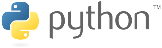

# Python 기초

## 목차
* 컴퓨터 프로그래밍 언어
* 파이썬
* 파이썬 시작하기
* 객체와 변수
* 자료형과 연산자
## 학습목표
* 컴퓨터 프로그래밍 언어를 정의할 수 있다.
* VS Code를 활용하여 파이썬 코드를 작성하고 실행할 수 있다.
* 변수를 정의하고 활용할 수 있다.
* 파이썬 주요 객체(타입)의 특징을 비교하고 설명할 수 있다.
* 객체에 맞춰 연산자를 활용할 수 있다.
## 컴퓨터 프로그래밍 언어
* 컴퓨터에게 명령하기 위한 약속
* 컴퓨터
  * Caculation(조작)
  * Remember(저장)
* 프로그래밍(programming)
  * 명령어의 모음(집합)
* 언어
  * 자신의 **생각을 나타내고 전달**하기 위해 사용하는 체계
  * **문법적**으로 맞는 말의 집합
* 선언적 지식(declarative knowledge)
  * 사실에 대한 내용
* 명령적 지식(imperative kcowledge)
  * How-to

[🔝](#python-기초)
## 파이썬
* Easy to learn
  * 다른 프로그래밍 언어보다 문법이 간단하면서도 엄격하지 않음
    * 변수에 별도의 타입 지정이 필요 없음
  * 문법 표현이 매우 간결하여 프로그래밍 경험이 없어도 짧은 시간 내에 마스터할 수 있음
    * 문장을 구분할 때 중괄호({,}) 대신 들여쓰기를 사용
* Expressive Language
  * 같은 작업에 대해서도 C나 자바로 작성할 때 보다 더간결하게 작성 가능
* 크로스 플랫폼 언어
  * 윈도우즈(Windows), MacOS, 리눅스(Linux), 유닉스(Unix)등 다양한 운영체제에서 실행가능
* 인터프리터 언어(Interpreter)
  * 소스코드를 기계어로 변환하는 컴파일 과정 없이 바로 실행 가능
  * 코드를 대화하듯 한 줄 입력하고 실행한 후, 바로 확인할 수 있음
* 객체 지향 프로그래밍(Object Oriented Programming)
  * 파이썬은 객체지향 언어이며, 모든 것이 객체로 구현되어 있음

[🔝](#python-기초)
## 객체와 변수
* 객체(Object)
  * 숫자, 문자, 클래스 등 값을 가지고 있는 모든 것
* 변수(Variable)
  * 컴퓨터 메모리 어딘가에 저장되어 있는 객체를 참조하기 위해 사용되는 이름
  * 동일 이름에 다른 객체를 언제든 할당할 수 있기 때문에 '변수'라고 불림
  * 변수는 항당 연산자(=)를 통해 값을 할당(assignment)
  * type()
    * 변수에 할당된 값의 타입
  * id()
    * 변수에 할당된 값(객체)의 고유한 아이덴티티(identity)값이며, 메모리주소(* 이후, 자세히 다룰 예정)
  * 같은 값을 동시에 할당할 수 있음
    ```python
    x = y = 1004
    ```
  * 다른 값을 동시에 할당 할 수 있음(multiple assignment)
    ```python
    x, y = 1, 2
    
    # 다르면 오류남
    x = 1, 2
    x, y = 1, 2, 3

    # 스와핑 가능
    x, y = y, x
    ```

[🔝](#python-기초)
## 식별자(Identfiers)
* 파이썬 객체(변수, 함수, 모듈, 클래스 등)를 식별하는데 사용하는 이름(name)
* 규칙
  * 식별자의 이름은 영문 알파벳, 언더스코어( _ ), 숫자로 구성
  * 첫 글자에 숫자가 올 수 없음
  * 길이제한이 없고, 대소문자를 구별
  * 예약어(reserved word)는 식별자로 사용할 수 없음
    * False, None, True, and, break, class, continue,  \
    finally, for, from, global, if, import, in, is, lambda  \
    not, or, pass, reture, try, while, with, yield 등...

[🔝](#python-기초)
## 자료형(Data Type)과 연산자(Operator)
### 자료형
  * 숫자
    * 수치형(Numeric Type)
      * int (정수, integer)
      * float (부동소수점, 실수, floating point number)
      * complex (복소수, complex number)
    * 불린형(Boolean Type)
  * 시퀀스(Sequence)
    * 문자열(String)
    * 리스트(List)
    * 튜플(Tuple)
    * 레인지(Range)
  * 컬렉션(Collection)
    * 집합(Set)
    * 딕셔너리(Dictionary)
  * None

#### 수치형(Numeric Type)
* 정수(Int)
  * 모든 정수의 타입은 int
  * 매우 큰 수를 나타낼 때 오버플로우가 발생하지 않음
    * 오버플로우(overflow) : 데이터 타입별로 사용할 수 있는 메모리의 크기를 넘어서는 상황

# **수정중!!!!**
```py
import sys
sys.maxsize
```
* 실수(Flaot)
floating point rounding error
  부동소수점에서 실수 연산 과정에서 발생 가능
    값 비교하는 과정에서 정수가 아닌 실수인 경우 주의할 것
    매우 작은 수보다 작은지를 확인하거나 math 모듈 활용
복소수(Complex)

불린(Boolean)
True/False
1/0
비교/논리 연산

### 연산자(Operator)
* 산술 연산자(Arithmetic Operator)
  +, -, *, %, /, //, **
복합 연산자
  +=, -=, *=, ...
비교 연산자
  <, <=, >, >=, ==, !=, is, is not
논리 연산자
  and, or, Not

## 컨테이너
* 시퀀스
  * 문자열(문자들의 나열)
    * 모든 문자는 str타입
    * `' '`, `" "`
    * 중첩
    * 삼중
    * 인덱싱
      * 인덱스를 통해 특정 값에 접근할 수 있음
      ```py
      s = 'abcdefg'
      print(s[1]) # b
      print(s[2:5]) # cde
      print(s[2:5:2]) # ce
      ```

    * 결합()
    ```
    ```
    * 반복
    ```
    ```
    * 포함
    ```
    ```
    * 이스케이프
      * 문자열 내에서 특정 문자나 조작을 위해서 역슬래시( \\ )를 활용하여 구분
        * \\n, \\t, \\r, \\0, \\\\, \\', \\"
    * ~~변경 불가능함~~
    * ~~반복 가능함~~(나중에..)
  * 리스트
    * ` [ ]`
    * 
    * 생성과 접근
      * 
    * 변경 가능
    * 반복 가능
  * ~~튜플~~
  * ~~레인지~~
* 컬렉션/비시퀀스
  * ~~세트~~
  * ~~딕셔너리~~ (나중에..)
* None
  * 파이썬 자료형 중 하나
  * 파이썬에서는 값이 없음을 표현하기 위해 None 타입이 존재함.
  * 일반적으로 반환 값이 없는 함수에서 사용하기도 함.


# 시작하기 

##### 스타일 가이드
[🔝](#python-기초)
> ## [🏠HOME](../README.md)