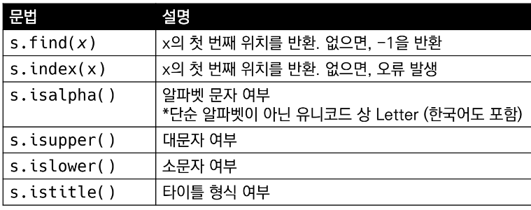
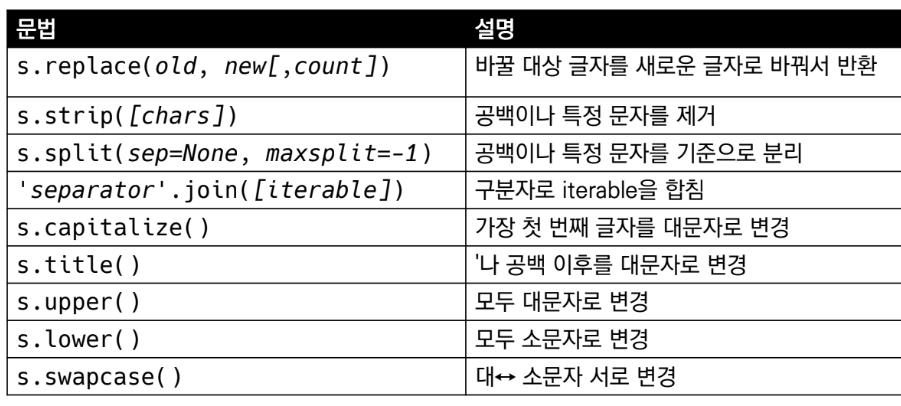
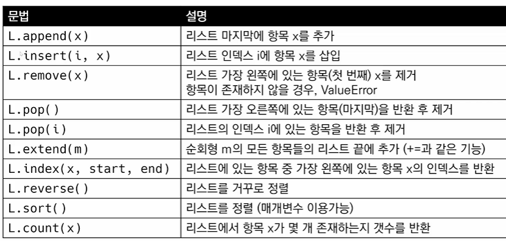
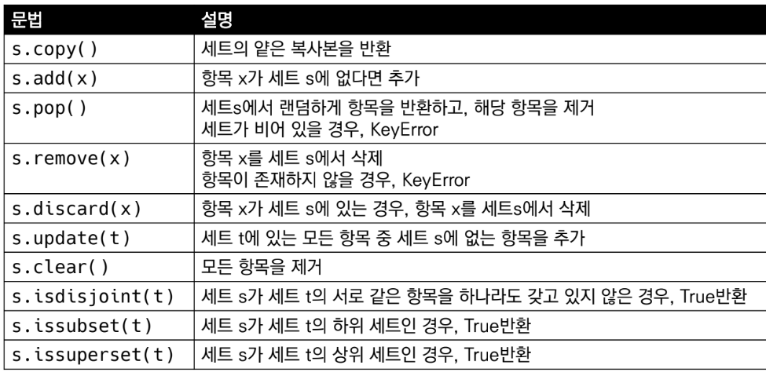
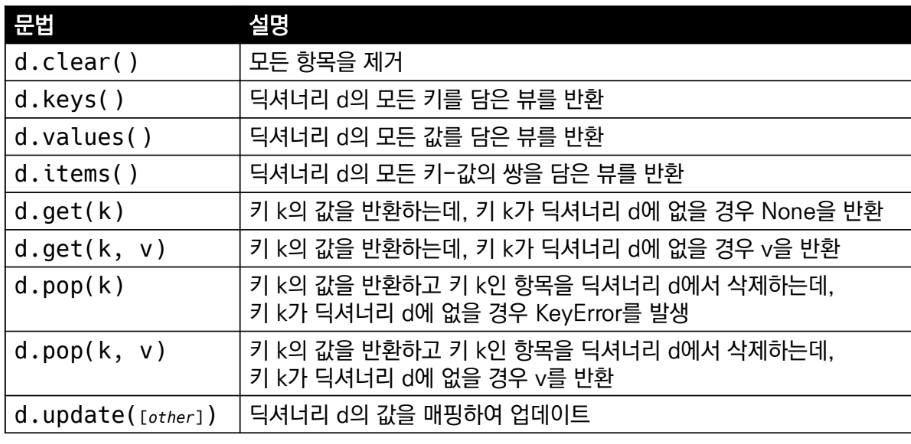
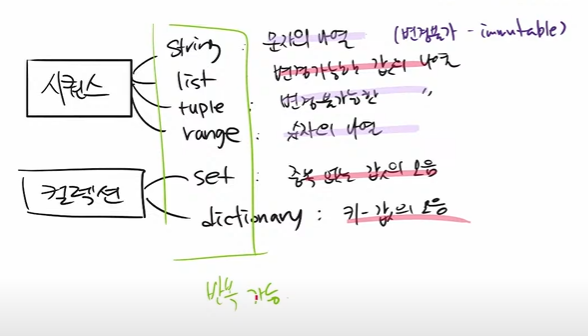

# 튜플(Tuple)
* 불변한 값들의 나열
* **순서**를 가지며, 서로 다른 타입의 요소를 가질 수 있음
* **변경 불가능**하며(immutable), **반복 가능**함(iterable)
* 항상 소괄호 형태로 정의하며, 요소는 콤마로 구분
* 소괄호(`( )`) 혹은 `tuple()`을 통해 생성
* **인덱스로 접근** 가능
  * 값 변경은 불가능하여 추가/삭제도 불가능


# 세트(Set)
* **유일한 값들의 모음**(collection)
* **순서가 없고 중복된 값이 없음**
  * 수학에서의 집합과 동일한 구조를 가지며, **집합 연산**도 가능
* **변경 가능**하며(mutable), **반복 가능**함(iterable)
  * 단, 세트는 순서가 없어 반복의 결과가 정의한 순서와 다를 수 있음
* 중괄호(`{ }`) 혹은 `set()`을 통해 생성
  * 빈 Set를 만들기 위해서는 set()을 반드시 활용해야 함
* 순서가 없어 별도의 값에 접근할 수 없음(**인덱스 불가**)
* 값 추가는 `.add()`, 값 삭제는 `.remove()`를 활용

# 데이터 타입과 메서드(Methods)
# 학습 목표
* 메서드와 함수의 차이점을 설명할 수 있다.
* 파이썬 주요 객체(타입)의 메서드를 비교하고 활용할 수 있다.
* 메서드별 필수 인자와 결과값을 예측할 수 있다.

# 메서드
* 객체를 조작할 수 있게 해줌

## 문자열(String)
* 탐색/검증

  

  * `.find(x)`와 `.index(x)` 구분


* 문자열 변경

  

## 리스트(List)


  * `.sort()`와 `sorted()` 구분

## 세트(Set)

* `a | b`, `a & b`, `a - b`, `a ^ b`
  * *합집합, 교집합, 차집합, 여집합?*


## 딕셔너리(Dictionary)

* `d.get(k[,v])`
  * 키 k가 딕셔너리에 없어도 KeyError가 발생하지 않음
  * 키 k가 딕셔너리에 없으면 v를 반환(v생략시 None을 반환)
  ```py
  locations = ['서울', '서울', '대전', '부산', '대전']
  result = {}

  for location in locations:
      result[location] = result.get(location, 0) + 1

  print(result)
  # {'서울': 2, '대전': 2, '부산': 1}
  ```
* [딕셔너리 응용](https://dojang.io/mod/page/view.php?id%3D2307)

> 참고



[자료구조 공식문서](https://docs.python.org/ko/3/tutorial/datastructures.html)

[Method 정리(Code-Sloth님 GitHub)](https://github.com/Code-Sloth/TIL/tree/master/kdt_week2)