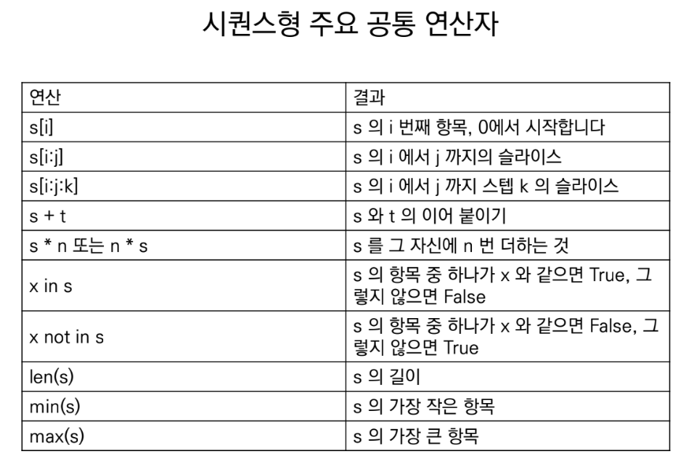
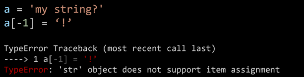
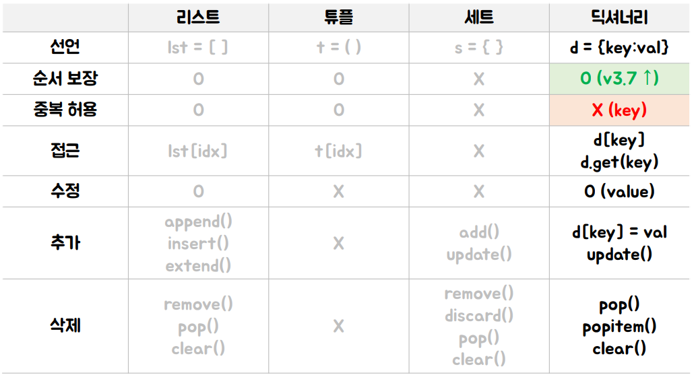

# Python 기초

## 목차
* [컴퓨터 프로그래밍 언어](#컴퓨터-프로그래밍-언어)
* [파이썬](#파이썬)
* [객체와 변수](#객체와-변수)
* [자료형과 연산자](#자료형data-type과-연산자operator)
* [컨테이너](#컨테이너container)
* [Python 시작하기](#python-시작하기)

## 학습목표
* 컴퓨터 프로그래밍 언어를 정의할 수 있다.
* VS Code를 활용하여 파이썬 코드를 작성하고 실행할 수 있다.
* 변수를 정의하고 활용할 수 있다.
* 파이썬 주요 객체(타입)의 특징을 비교하고 설명할 수 있다.
* 객체에 맞춰 연산자를 활용할 수 있다.

## 컴퓨터 프로그래밍 언어
* 컴퓨터에게 명령하기 위한 약속
* 컴퓨터
  * Caculation(조작)
  * Remember(저장)
* 프로그래밍(programming)
  * 명령어의 모음(집합)
* 언어
  * 자신의 **생각을 나타내고 전달**하기 위해 사용하는 체계
  * **문법적**으로 맞는 말의 집합
* 선언적 지식(declarative knowledge)
  * 사실에 대한 내용
* 명령적 지식(imperative kcowledge)
  * How-to

[🔝](#python-기초)
## 파이썬
* Easy to learn
  * 다른 프로그래밍 언어보다 문법이 간단하면서도 엄격하지 않음
    * 변수에 별도의 타입 지정이 필요 없음
  * 문법 표현이 매우 간결하여 프로그래밍 경험이 없어도 짧은 시간 내에 마스터할 수 있음
    * 문장을 구분할 때 중괄호({,}) 대신 들여쓰기를 사용
* Expressive Language
  * 같은 작업에 대해서도 C나 자바로 작성할 때 보다 더간결하게 작성 가능
* 크로스 플랫폼 언어
  * 윈도우즈(Windows), MacOS, 리눅스(Linux), 유닉스(Unix)등 다양한 운영체제에서 실행가능
* 인터프리터 언어(Interpreter)
  * 소스코드를 기계어로 변환하는 컴파일 과정 없이 바로 실행 가능
  * 코드를 대화하듯 한 줄 입력하고 실행한 후, 바로 확인할 수 있음
* 객체 지향 프로그래밍(Object Oriented Programming)
  * 파이썬은 객체지향 언어이며, 모든 것이 객체로 구현되어 있음

[🔝](#python-기초)
## 객체와 변수
* 객체(Object)
  * 숫자, 문자, 클래스 등 값을 가지고 있는 모든 것
* 변수(Variable)
  * 컴퓨터 메모리 어딘가에 저장되어 있는 객체를 참조하기 위해 사용되는 이름
  * 동일 이름에 다른 객체를 언제든 할당할 수 있기 때문에 '변수'라고 불림
  * 변수는 항당 연산자(=)를 통해 값을 할당(assignment)
  * type()
    * 변수에 할당된 값의 타입
  * id()
    * 변수에 할당된 값(객체)의 고유한 아이덴티티(identity)값이며, 메모리주소(* 이후, 자세히 다룰 예정)
  * 같은 값을 동시에 할당할 수 있음
    ```python
    x = y = 1004
    ```
  * 다른 값을 동시에 할당 할 수 있음(multiple assignment)
    ```python
    x, y = 1, 2
    
    # 다르면 오류남
    x = 1, 2
    x, y = 1, 2, 3

    # 스와핑 가능
    x, y = y, x
    ```

[🔝](#python-기초)
## 식별자(Identfiers)
* 파이썬 객체(변수, 함수, 모듈, 클래스 등)를 식별하는데 사용하는 이름(name)
* 규칙
  * 식별자의 이름은 영문 알파벳, 언더스코어( _ ), 숫자로 구성
  * 첫 글자에 숫자가 올 수 없음
  * 길이제한이 없고, 대소문자를 구별
  * 예약어(reserved word)는 식별자로 사용할 수 없음
    * False, None, True, and, break, class, continue,  \
    finally, for, from, global, if, import, in, is, lambda  \
    not, or, pass, reture, try, while, with, yield 등...

[🔝](#python-기초)
## 자료형(Data Type)과 연산자(Operator)
### 자료형
  * 숫자
    * 수치형(Numeric Type)
      * int (정수, integer)
      * float (부동소수점, 실수, floating point number)
      * complex (복소수, complex number)
    * 불린형(Boolean Type)
  * 시퀀스(Sequence)
    * 문자열(String)
    * 리스트(List)
    * 튜플(Tuple)
    * 레인지(Range)
  * 컬렉션(Collection)
    * 집합(Set)
    * 딕셔너리(Dictionary)
  * None

#### 수치형(Numeric Type)
* 정수(Int)
  * 모든 정수의 타입은 int
  * 매우 큰 수를 나타낼 때 오버플로우가 발생하지 않음
    * *오버플로우(overflow) : 데이터 타입별로 사용할 수 있는 메모리의 크기를 넘어서는 상황*

* 실수(Flaot)
  * 정수가 아닌 모든 실수는 float 타입
  * 부동소수점
    * 컴퓨터는 2진수로 실수를 저장함
    * 이 과정에서 floating point rounding error가 발생하여, 예상치 못한 결과가 발생
      * *값 비교하는 과정에서 정수가 아닌 실수인 경우 주의할 것!*
      ```py
      # 아래의 결과는?
      3.14 - 3.02 == 0.12 # False
      3.14 - 3.02 # 0.1200000000000001
      ```
      * 부동소수점에서 실수 연산 과정에서 발생 가능
        * 값 비교하는 과정에서 정수가 아닌 실수인 경우 주의할 것
        * 매우 작은 수보다 작은지를 확인하거나 math 모듈 활용
        ```py
        # 1. 임의의 작은 수
        abs(a - b) <= 1e-10

        # 2. math 모듈 활용
        import math
        math.isclose(a, b)
        ```

* 복소수(Complex)
  * 허수부를 j로 표현
  ```py
  a = 3+4j
  print(type(a))
  # <class 'complex'>
  a.real
  # 3.0
  a.imag
  # 4.0
  ```

#### 불린형(Boolean)
* True / False 값을 가진 타입은 bool
  * True는 1, False는 0에 해당함
* 비교/논리 연산에 활용
* 다음은 모두 False로 변환
  * `0`, `[]`, `0.0`, `()`,  `{}`, `"`, `None`

### 연산자(Operator)
* 산술 연산자(Arithmetic Operator)
  * 기본적인 사칙연산 및 수식 계산
  * +, -, *, %, /, //, **
* 복합 연산자(In-place Operator)
  * 연산과 할당이 함께 이뤄짐
  * +=, -=, *=, ...
* 비교 연산자(Comparison Operator)
  * 값을 비교하며, True / False 값을 리턴함
  * <, <=, >, >=, ==, !=, is, is not
* 논리 연산자(Logical Operator)
  * 논리식을 판단하여 참(True)와 거짓(False)를 반환함
  * and, or, Not
```py
# ex

num = 100
num >= 100 and num % 3 == 1
# True
```

## 컨테이너(Container)
* 여러 개의 값을 담을 수 있는 것(객체)
* 컨테이너의 분류
  * 순서가 있는 데이터 (Ordered) vs. 순서가 없는 데이터 (Unordered)
  * *순서가 있다 != 정렬되어 있다.*
* 시퀀스


  * 문자열(String Type)
    * 변경불가능한 문자들의 나열(immutable)
    * 모든 문자는 str타입
    * 작은 따옴표 `' '`나 큰 따옴표`" "`를 활용하여 표기
    * 중첩(Nested Quotes)
      * 따옴표 안에 따옴표를 표현할 경우
    * 삼중따옴표(Triple Quotes)
      * 작은 따옴표나 큰 따옴표를 삼중으로 사용
      * `''' '''`, `""" """`
      * 여러줄을 나눠 입력할 때 편리
    * 인덱싱
      * 인덱스를 통해 특정 값에 접근할 수 있음
      ```py
      s = 'abcdefg'
      print(s[1]) # b
      print(s[2:5]) # cde # 슬라이싱(Slicing)
      print(s[2:5:2]) # ce # 스텝(step)
      ```
    * 결합(Concatenation)
    ```py
    'hello, ' + 'python!'
    # 'hello, python!'
    ```
    * 반복(Repetition)
    ```py
    'hi' * 3
    # hihihi
    ```
    * 포함(Membership)
    ```py
    'a' in 'apple'
    # True
    'app' in 'apple'
    # True
    'b' in 'apple'
    # False
    ```
    * 이스케이프(Escape sequence)
      * 문자열 내에서 특정 문자나 조작을 위해서 역슬래시( \\ )를 활용하여 구분
        | 예약문자 | 내용(의미) |
        |:---:|:---:|
        | \\n | 줄 바꿈 |
        | \\t | 탭 |
        | \\r | 캐리지리턴 |
        | \\0 | 널(Null) |
        | \\\\ | \\ |
        | \\' | 단일인용부호( \' ) |
        | \\" | 이중인용부호( \" ) |
        ```py
        print('철수 \'안녕\'')
        # 철수 '안녕'
        print('이 다음은 엔터.\n그리고 탭\t탭')
        # 이 다음은 엔터.
        # 그리고 탭   탭
        ```
    * ~~Immutable : 변경 불가능함~~*(나중에..)*
    
    * ~~반복 가능함~~
    ```py
    a = '123'
    for char in a:
      print(char, sep=' ')
    # 1 2 3
    ```
  * 리스트(List)
    * 변경 가능한 값들의 나열(mutable)
    * 순서를 가지며, 서로 다른 타입의 요소를 가질 수 있음
    * 변경 가능, 반복 가능
    * 항상 대괄호 `[ ]`를 활용하여 정의,표기
    * 요소는 콤마 `,`로 구분
    * 순서가 있는 시퀀스로 인덱스를 통해 접근 가능
    * 생성과 접근
      * 대괄호 혹은 list() 를 통해 생성
    ```py
    # 생성
    my_list = []
    another_list = list()
    print(type(my_list))
    # <class 'list'>
    print(type(another_list))
    # <class 'list'>

    # 값 접근
    a = [1, 2, 3]
    print(a[0])
    # 1

    # 값 변경
    a[0] = '1'
    print(a)
    #['1', 2, 3]
    ```
    * 리스트 값 추가/삭제
      * 값 추가는 .append()를 활용하여 추가하고자 하는 값을 전달
      ```py
      even_numbers = [2, 4, 6, 8]
      even_numbers.append(10)
      print(even_numbers)
      # [2, 4, 6, 8, 10]
      ```
      * 값 삭제는 .pop()을 활용하여 삭제하고자 하는 인덱스를 전달
      ```py
      even_numbers = [2, 4, 6, 8]
      even_numbers.pop(0)
      print(even_numbers)
      # [4, 6, 8]
      ```
    * 예제
    ```py
    # ex

    boxes = ['apple', 'banana']

    len(boxes)
    # 2
    boxes[1]
    # 'banana'
    boxes[1][0]
    # 'b'
    ```
  * ~~튜플(변경 불가능한 값들의 나열)~~
  * ~~레인지(숫자의 나열) - immutable~~
* 컬렉션/비시퀀스
  * ~~세트(유일한 값들의 모음) - mutable~~
  * ~~딕셔너리(키-값들의 모음) - mutable~~
* None
  * 파이썬 자료형 중 하나
  * 파이썬에서는 값이 없음을 표현하기 위해 None 타입이 존재함.
  * 일반적으로 반환 값이 없는 함수에서 사용하기도 함.
  ```py
  print(type(None))
  # <class 'NoneType'>
  a = None
  print(a)
  # None
  ```
  
[출처 : Youtube 나도코딩]
  
[🔝](#python-기초)

> # Python 시작하기 
* IDLE(Intergrated Development and Learning Environment)
* IDE
## 코드 스타일 가이드
  * 코드를 '어떻게 작성할지'에 대한 가이드라인
  * 파이썬에서 제안하는 스타일 가이드
    * [PEP8](https://peps.python.org/pep-0008/)
  * 기업, 오픈소스 등에서 사용되는 스타일 가이드
    * [Google Style guide](https://google.github.io/styleguide/pyguide.html)
## 주의사항
* 대소문자 구분
* 띄어쓰기, 문장부호 등 주의 깊게 활용
* 들여쓰기(Identation)
* 주석(Comment)
  * 코드에 대한 설명
  * 주석으로 처리될 내용 앞에 `#`을 입력
* 사용자 입출력
  * input(\[prompt\])
    * **반환값은 항상 문자열의 형태로 반환**
  * print()
    * 모니터 화면에 결과물을 출력
    * 변수의 경우 변수의 값을 출력하며, 객체별 표현 방식에 따라 출력하게 됨

[🔝](#python-기초)
> ## [🏠HOME](../README.md)