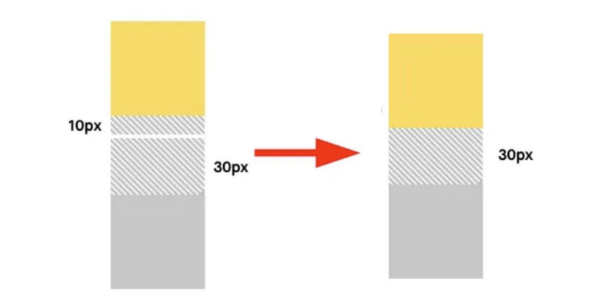

# Web - The box model
## 목차
1. 개요
2. 구성요소
3. 박스 타입
## 학습 목표
* 박스 모델의 구성 요소와 각각의 역할을 이해하여 웹 요소의 크기, 위치, 여백, 배치를 조절할 수 있다.

# 1. 개요
* CSS Box Model
  * 모든 HTML 요소를 (사각형) 박스로 표현

# 2. 구성 요소
* CSS Box Model
  * 모든 HTML 요소를 (사각형) 박스로 표현
  * **박스에 대한 크기, 여백, 테두리 등의 스타일을 지정하는 디자인 개념**


* ex)
```html
<body>
  <div class="box1">box1</div>
  <div class="box2">box2</div>
</body>
```
```css
.box1{
  width: 300px;
  padding-left: 25px;
  padding-bottom: 25px;
  margin-left: 25px;
  margin-top: 50px;
  border-width: 3px;
  border-color: black;
  border-style: solid;
}

.box2 {
  width: 300px;
  padding: 25px 50px;
  margin: 25px auto;
  border: 2px black dashed;
}
```
* width & height 속성
  * 요소의 너비와 높이 지정
  * 이때 지정되는 요소의 너비와 높이는 콘텐츠 영역을 대상으로 함
* box-sizing
  * 요소의 너비와 높이를 계산하는 방법을 지정
* ex)
```html
<body>
  <div class="box content-box">content-box</div>
  <div class="box border-box">border-box</div>
</body>
```
```css
.box {
  width: 100px;
  border: 2px solid black;
  padding: 10px;
  margin: 20px;
  background-color: lightgray;
}

.content-box {
  box-sizing: content-box;
}

.border-box {
  box-sizing: border-box;
}
```

# 3. 박스 타입
* Block & Inline
```css
.index1 {
  display: block;
}

.index2 {
  display: inline
}
```
* Normal flow
  * CSS를 적용하지 않았을 경우 Block 및 Inline 요소가 기본적으로 배치되는 방향
## block 타입 특징
* 항상 새로운 행으로 나뉨
* width와 height 속성을 사용하여 너비와 높이를 지정할 수 있음
* 기본적으로 width 속성을 지정하지 않으면 박스는 inline 방향으로 사용가능한 공간을 모두 차지함(너비를 사용가능한 공간의 100%로 채우는 것)
* 대표적인 block 타입 태그
  * `h1`~`h6`, `p`, `div`

## inline 타입 특징
* 새로운 행으로 나뉘지 않음
* width와 height 속성을 사용할 수 없음
* 수직 방향
  * padding, margins, borders가 적용되지만 다른 요소를 밀어낼 수는 없음
* 수평 방향
  * padding, margins, borders가 적용되어 다른 요소를 밀어낼 수 있음
* 대표적인 inline 타입 태그
  * `a`, `img`, `span`

## 박스 타입 예시
```css
a, 
span, 
img {
  border: 1px solid red;
  /* inline 요소는 padding height가 적용되지 않음 (상하는 밀어 낼 수 없음)*/
  padding-top: 50px;
  /* 좌우는 밀어 낼 수 있음 */
  padding-right: 50px;
}

h1, 
p, 
div {
  border: 1px solid blue;
}
```


# 99. 참고
## shorthand 속성 - border
* border-width, border-style, border-color를 한 번에 설정하기 위한 속성
```css
/* 순서는 영향을 주지 않음 */
border: 1px solid black;
```

## shortand 속성 - margin & padding
* 4방향의 속성을 각각 지정하지 않고 한 번에 지정할 수 있는 속성
```css
/* 4개 - 상우하좌 */
margin: 10px 20px 30px 40px;
/* 3개 - 상/좌우/하 */
/* 2개 - 상하/좌우 */
/* 1개 - 공통 */
```

## display: inline-block
* inline과 block 요소 사이의 중간 지점을 제공하는 display 값
* 요소가 줄 바꿈 되는 것을 원하지 않으면서 너비와 높이를 적용하고 싶은 경우에 사용
* block 요소의 특정을 가짐
  * 너비 및 높이 속성이 준수
  * 패딩, 여백 및 테두리로 인해 다른 요소가 상자에서 밀려납니다.

## Margin collapsing(마진 상쇄)
* 두 block 타입 요소의 margin top 과 bottom이 만나 큰 margin으로 결합되는 현상
* 웹 개발자가 레이아웃을 더욱 쉽게 관리할 수 있도록 함
  * 각 요소에 대한 상/하 margin을 각각 설정하지 않고 한 요소에 대해서만 설정할 수 있음
