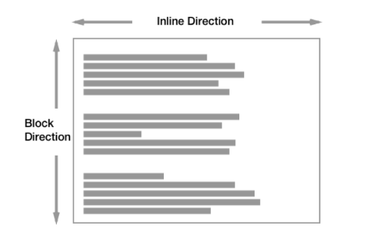
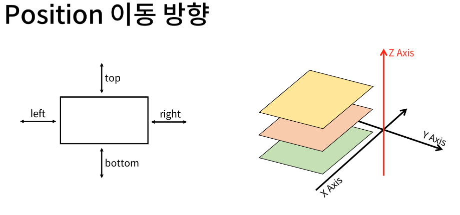

# Web - Positioning for CSS layout
## 목차
1. 개요
2. 포지션
## 학습 목표
* position 속성을 이용해 HTML 요소의 위치와 레이아웃을 조작할 수 있다.
* static, relative, absolute, fixed, sticky의 특징과 사용 방법을 이해하고 상황에 맞게 적용할 수 있다.
* z-index 속성을 이용해 요소의 쌓임 순서를 변경할 수 있다.

# 1. 개요
* 박스 움직이기
* CSS Layout
  * 각 요소의 위치와 크기를 조정하여 웹 페이지의 디자인을 결정하는 것
  * Display, **Position**, Floats, Flexbox ...

# 2. 포지션
* CSS Position
  * Normal Flow에서 요소를 끄집어내서 다른 위치로 배치하는 것
  * 다른 요소 위에 놓기, 화면 특정 위치에 고정시키기 등
* Normal flow
  * CSS를 적용하지 않았을 경우 웹페이지 요소가 기본적으로 배치되는 방향

  

* Position 이동 방향

## Position 유형
* static
  * 기본값
  * 요소를 Normal Flow에 따라 배치
- relative
  * 요소를 Normal Flow에 따라 배치
  * 자기 자신을 기준으로 이동
  * 요소가 차지하는 공간은 static일 때와 같음
* absolute
  * 요소를 Normal Flow에서 제거
  * 가장 가까운 relative 부모 요소를 기준으로 이동
  * 문서에서 요소가 차지하는 공간이 없어짐
- fixed
  * 요소를 Normal Flow에서 제거
  * 현재 화면영역(viewport)을 기준으로 이동
  * 문서에서 요소가 차지하는 공간이 없어짐
* sticky
  * 요소를 Normal Flow에 따라 배치
  * 가장 가까운 block 부모 요소를 기준으로 이동
  * 요소가 특정 임계점(ex. viewport의 상단으로부터 10px)에 스크롤될 때 그 위치에서 고정됨(fixed)
  * 만약 다음 sticky 요소가 나오면 다음 sticky 요소가 이전 sticky 요소의 자리를 대체
    * 이전 sticky 요소가 고정되어 있던 위치와 다음 sticky 요소가 고정되어야 할 위치가 겹치게 되기 때문
* 실습 #1, 2, 4
* 사용 예시
  * absolute, fixed, sticky, ...

## z-index
* 요소가 겹쳤을 때 어떤 요소 순으로 위에 나타낼 지 결정
  * z축 기준 정렬
* z-index 특징
  * 정수 값을 사용해 Z축 순서를 지정
  * 더 큰 값을 가진 요소가 작은 값의 요소를 덮음
* 실습 #3

# 99. 참고
* Position의 역할
  * CSS Position은 전체 페이지에 대한 레이아웃을 구성하는 것이 아닌 페이지의 특정 항목의 위치를 조정하는 것에 관한 것
  
## 추가 학습 링크
* [MDN Box Model](https://developer.mozilla.org/ko/docs/Learn/CSS/Building_blocks/The_box_model)
* [MDN Background & Border](https://developer.mozilla.org/ko/docs/Learn/CSS/Building_blocks/Backgrounds_and_borders)