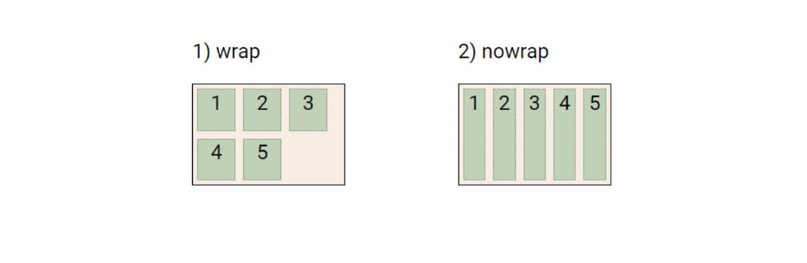

# Web - Flexible box for CSS layout
## 목차
1. 개요
2. Flexbox 레이아웃 구성
3. Flexbox 반응형 레이아웃
## 학습 목표
* Flexbox 속성들의 상호작용을 이해하고, 필요한 속성들을 적절하게 사용해 레이아웃을 조정할 수 있다.
* Flexbox 레이아웃을 만드는 방법을 이해하고, 다양한 레이아웃을 구현할 수 있다.
* Flexbox를 활용한 반응형 레이아웃을 구현할 수 있다.

# 1. 개요
* CSS Flexbox
  * 요소를 행과 열 형태로 배치하는 1차원 레이아웃 방식
    * 요소 간 '공간 배열'과 '정렬'
## Flexbox 기본 사항


* main axis(주 축)
  * flex item들이 배치되는 기본 축
  * main start에서 시작하여 main end 방향으로 배치 
* cross axis(교차 축)
  * main axis에 수직인 축
  * cross start에서 시작하여 cross end 방향으로 배치
* Flex Container
  * display: flex; 혹은 display: inline-flex; 가 설정된 부모 요소
  * 이 컨테이너의 1차 자식 요소들이 Flex Item이 됨
  * flexbox 속성 값들을 사용하여 자식 요소 Flex Item들을 배치
* Flex Item
  * Flex Container 내부에 레이아웃 되는 항목

# 2. Flexbox 레이아웃 구성
## Flexbox 속성
* Flex Container 관련 속성
  * display, flex-direction, flex-wrap, justify-content, align-items, align-content
* Flex Item 관련 속성
  * align-self, flex-grow, flex-shrink, flex-basis, order

## 1. Flex Container 지정

* flex item은 행으로 나열
* flex item은 주축의 시작 선에서 시작
* flex item은 교차축의 크기를 채우기 위해 늘어남

## 2. flex-direction 지정

* flex item이 나열되는 방향을 지정
* column으로 지정할 경우 주 축이 변경됨
* -reverse로 지정하면 시작 선과 끝 선이 서로 바뀜

## 3. flex-wrap

* flex item 목록이 flex container의 하나의 행에 들어가지 않을 경우 다른행에 배치할지 여부 설정

## 4. justify-content

* 주 축을 따라 flex item과 주위에 공간을 분배

## 5. align-content

* 교차 축을 따라 flex item과 주위에 공간을 분배
  * flex-wrap이 wrap 또는 wrap-reverse로 설정된 여러 행에만 적용됨
  * 한 줄 짜리 행에는 (flex-wrap이 nowrap으로 설정된 경우) 효과 없음

## 6. align-items

* 교차 축을 따라 flex item 행을 정렬

## 7. align-self

* 교차 축을 따라 개별 flex item을 정렬

## 목적에 따른 분류
* 배치 설정
  * flex-direction
  * flex-wrap
* 공간 분배
  * justify-content
  * align-content
* 정렬
  * align-items
  * align-self

## 8. flex-grow

* 남는 행 여백을 비율에 따라 각 flex item에 분배
* flex-grow의 반대는 flex-shrink
  * 넘치는 너비를 분배해서 줄임
* 예시 코드

## 9. flex-basis

* flex-item의 초기 크기 값을 지정
* flex-basis와 width값을 동시에 적용한 경우 flex-basis가 우선
* 예시 코드

# 3. Flexbox 반응형 레이아웃
* 실습

# 99. 참고
## flex-direction

## flex-wrap

## justify-content

## align-content

## align-items

## align-self

## justify-items 및 justify-self 속성이 없는 이유
  * "필요 없기 때문"
  * margin auto를 통해 정렬 및 배치가 가능

## Shorthand - flex-flow
* flex-flow
```css
/* flex-direction flex-wrap */
.container {
  flex-flow: row wrap;
}
```

## Shorthand - flex
```css
/* One value, unitless number: flex-grow */
flex: 2;
/* One value, length or percentage: flex-basis */
flex: 10rem;
flex: 30%;
/* Two values: flex-grow | flex-basis */
flex: 1 30px;
/* Two values: flex-grow | flex-shrink */
flex: 2 2;
/* Three values: flex-grow | flex-shrink | flex-basis */
flex: 2 2 10%;
```
## 추가 학습 링크
* [Flex 연습 게임](https://flexboxfroggy.com/#ko)
* [MDN Flex](https://developer.mozilla.org/ko/docs/Web/CSS/flex)
* [D2-flexbox로 만들 수 있는 10가지 레이아웃](https://d2.naver.com/helloworld/8540176)
- 더미 데이터
  * [lipsum](https://www.lipsum.com/)
  * [한글입숨](http://hangul.thefron.me/)