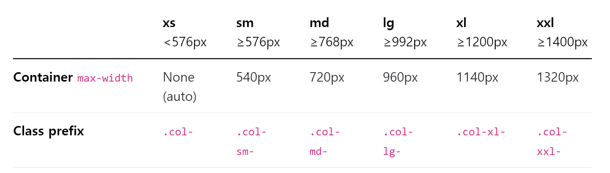

# Web - Grid system for responsive web design
## 목차
1. 개요
2. Grid system Breakpoints
3. Summary
## 학습 목표
* Mobile First 디자인을 이해하고 설계할 수 있다.
* Grid system breakpoints를 사용하여 다양한 기기의 크기에 대해 반응형 웹 페이지를 구성할 수 있다.

# 1. 개요
## Responsive Web Design
* 디바이스 종류나 화면 크기에 상관없이, 어디에서든 일관된 레이아웃 및 사용자 경험을 제공하는 디자인 기술
* Bootstrap grid system의 12개 column과 6개 breakpoints를 사용하여 반응형 웹 디자인을 구현

# 2. Grid system Breakpoints
* 웹 페이지를 다양한 화면 크기에서 적절하게 배치하기 위한 분기점
  * 화면 너비에 따라 6개의 분기점 제공
    * (xs, sm, md, lg, xl, xxl)
    

* 각 breakpoints 마다 설정된 최대 너비 값 "**이상으로**" 화면이 커지면 grid system 동작이 변경됨
* 실습

# 3. Summary
* 어떤 레이아웃 기술이 사용됐는지 구성해보기
* Grid System, Flexbox, Position
* 각각의 기술은 용도와 장단점이 있음
* 어떤 기술도 독립적인 용도를 가지지 않으며, 어떤 기술이 적합한 도구가 될지는 특정 상황에 따라 다름
* 이를 파악하기 위해서는 충분한 경험이 필요

# 99. 참고
## Grid crads
* row-cols 클래스를 사용하여 행당 표시할 열(카드) 수를 손쉽게 제어할 수 있음