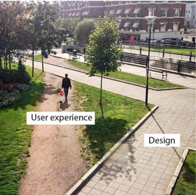

# Web - UX & UI
# 1. UX & UI
## UX (User Experience)
* 제품이나 서비스를 사용하는 사람들이 느끼는 전체적인 경험과 만족도를 개선하고 최적화하기 위한 디자인과 개발 분야
* UX 예시
* UX 설계
  * 사람들의 마음과 생각을 이해하고 정리해서 제품에 녹여내는 과정이 필요
  * 유저 리서치, 데이터 설계 및 정제, 유저 시나리오, 프로토타입 설계 등이 필요
## UI (User Interface)
* 서비스와 사용자 간의 상호작용을 가능하게 하는 디자이니 요소들을 개발하고 구현하는 분야
* UI 예시
* UI 설계
  * 예쁜 디자인보다는 사용자가 더 쉽고 편리하게 사용할 수 있도록 고려
  * 이를 위해서는 디자인 시스템, 중간 산출물, 프로토타입 등이 필요

# 디자이너와 기획자 그리고 개발자
* 많은 회사에서 UX/UI 디자인을 함께하는 디자이너를 채용하거나 UX는 기획자, UI는 디자이너의 역할로 채용하기도 함
* UX (직무 : UX researcher, User Researcher)
  * (구글) 사용자의 경험을 이해하기 위한 통계 모델을 설계
  * (MS) 리서치를 기획하고 사용자에 대한 지표를 정의
  * (Meta) 정상적인 방법과 정량적인 방법을 사용해서 사용자 조사를 실시
* UI (직무 : Product Designer, Interaction Designer)
  * (구글) 다양한 디자인 프로토타이핑 툴을 사용해서 개발 가이드를 제공
  * (MS) 리서치를 기획하고 사용자에 대한 지표를 정의
  * (Meta) 제품을 이해하고 더 나은 UI Flow와 사용자 경험을 디자인
* 만약 기능만을 생각한다면..

* UI 디자인은 매우 깔끔하게 되었지만, 사용자 경험(UX)을 고려하지 않아서 사용자들은 잔디밭 위로 지름길을 만들어서 이용
* 이로 인해 너무 많은 사용으로 인해 잔디마저 모두 사라져버린 상황이 발생

### Apple의 UI 디자인 원칙
* [https://developer.apple.com/kr/design/tips/](https://developer.apple.com/kr/design/tips/)