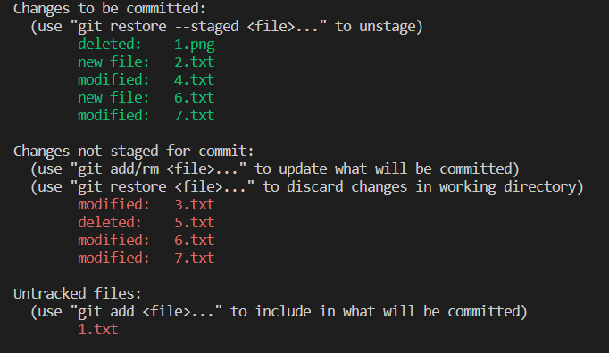

# Git/Git Hub
## 개요
* Git은 분산버전관리스스템으로 코드의 버전을 관리하는 도구  
* 2005년 리눅스 커널을 위한 도구로 리누스 토르발스가 개발  
* 컴퓨터 파일의 변경사항을 추적하고 여러 명의 사용자들 간에 해당 파일들의 작업을 조율

> **1. 작업을 하고 >**  
> **2. 변경된 파일을 모아(add) >**  
> **3. 버전으로 남긴다.(commmit)**  

---
## 환경 설정
* 사용자 정보(commit author) : 커밋을 하기 위해 반드시 필요
  * git config --global user.name "username"
    * Github에서 설정한 username으로 설정
  * git config --global user.email "my@email.com"
    * Github에서 설정한 email로 설정
- 설정 확인
  * git config -l
  * git config --global -l
  * git config user.name
* --system
  * /etc/gitconfig
  * 시스템의 모든 사용자와 모든 저장소에 적용(관리자 권한)
- --global
  * ~/.gitconfig
  * 현재 사용자에게 적용되는 설정
* --local
  * .git/config
  * 특정 저장소에만 적용되는 설정

---

## 명령어

| 명령어 | 내용 |
|---|---|
| git init | 로컬 저장소 생성 |
| git add <파일명> | 특정 파일/폴더의 변경사항 추가 |
| git commit - m '<커밋메시지>' | 커밋 (버전 기록) |
| git status | 상태 확인 |
| git log | 버전 확인 |

* git add
  * working directory상의 변경 내용을 staging area에 추가 하기 위해 사용.
  * $ git add .
  * $ git add -all
  * $ git add '\<filename\>'
- git commit
  * staged 상태의 파일들을 커밋을 통해 버전으로 기록.
  * 커밋 메시지는 변경 사항을 나타낼 수 있도록 명확하게 작성하면 좋음.
  * $ git commit -m '<커밋메시지>'
* git status
  * Git 저장소에 있는 파일의 상태를 확인하기 위하여 활용
  * Tracked : 이전부터 버전으로 관리되고 있는 파일
    * Unmodified : git status에 나타나지 않음
    * Modified : Changes not staged for commit
    * Staged : Changes to be committed
  * Untracked : 버전으로 관리된 적 없는파일(새로운 파일)
- git log
  * 현재 저장소에 기록된 커밋을 조회
  * $ git log -2 --oneline
    * 최근 2개의 커밋을 한줄로 보여줌

---

## 상태(Status)

[git status 출력 화면]

* `1.txt` 는 새로운 파일. (Untracked)
* `2.txt` 는 새로운 파일을 staging area에 add. (new file)
* `6.txt` 는 새로운 파일을 staging area에 add 후에 수정. (new file, modified)
* `3.txt` 는 기존 파일을 수정. (modified)
* `4.txt` 는 기존 파일 수정한 것을 add. (modified)
* `7.txt` 는 기존 파일 수정한 것을 add 후에 다시 수정. (modified)
* `5.txt` 는 기존 파일을 삭제. (deleted)
* `1.png` 는 기존 파일을 삭제하고 add. (deleted)

- `1.png` , `2.txt` , `4.txt` , `6.txt` , `7.txt`
  - staging area 에 staged 된 상태.
  - git commit 하면 repository 에 commited. (버전관리)
* `3.txt` , `5.txt` , `6.txt` , `7.txt` 
  * working directory(tree) 에 있음
  * git add 하면 staging area 에 staged.
- `6.txt` , `7.txt`
  - working directory 와 staging area 두 위치에 존재.
* `1.txt`
  * 버전으로 관리된 적 없는파일(새로운 파일)

더 자세한 내용은 [여기](https://search.naver.com/search.naver?sm%3Dtab_hty.top%26where%3Dnexearch%26query%3Dstaged%26oquery%3Dstaging%2Barea%26tqi%3DhIrFVdprvxZssMQ7HQsssssssa4-199023)참고.

